과거 학과에서 DB 개론 수업을 들으면서 복잡한 쿼리문 작성에 항상 머리가 아팠습니다. 😫  
이후 자연어로된 문장을 쿼리문으로 쉽게 만들어주는 서비스는 없는지 고민했고, EverSQL과 ChatGPT을 떠올렸습니다. 그래서 정말로 이 두 서비스가 쿼리문을 잘 만들어주는지 테스트 했었던 결과를 정리해 봅니다.

## 1. 데이터 및 자연어 쿼리 문제 선정
저의 DB 개론 교과서였던 『Database System Concepts』의 데이터를 활용합니다.  
[https://www.db-book.com/university-lab-dir/sample_tables-dir/index.html](https://www.db-book.com/university-lab-dir/sample_tables-dir/index.html)

쿼리 문제는 교재의 연습문제를 활용합니다.

- A. Find all instructors earning the highest salary (there may be more than one with the same salary)  
- B. Find the enrollment of each section that was offered in Fall 2017.  
- C. Display a list of all instructors, showing each instructor’s ID and the number of sections taught. Make sure to show the number of sections as 0 for instructors who have not taught any section. Your query should use an outer join, and should not use subqueries.  
- D. Find the department that have the highest average salary.  
- E. Find all courses taught in both the Fall 2017 semester and in the Spring 2018 semester.  
- F. Find all courses that were offered at most once in 2017.  

## 2. 환경 셋팅

실제 쿼리문의 검증은 DB는 Oracle 19c를 사용했습니다.

### EverSQL
text-to-sql 기능을 통해 자연어 질문을 쿼리문으로 바꿀수 있습니다.  
[https://www.eversql.com/text-to-sql/](https://www.eversql.com/text-to-sql/)
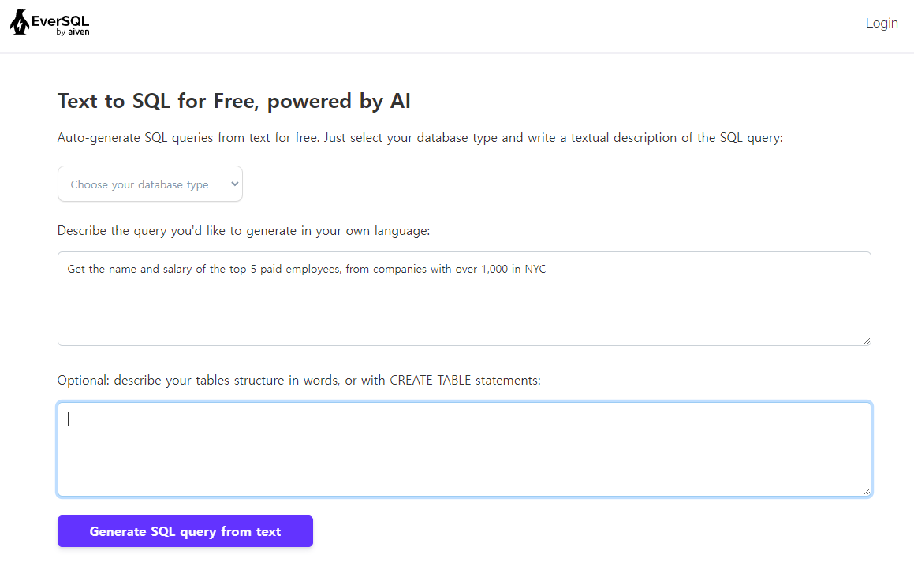  

### ChatGpt
프롬프트 질문을 다음과 같이 설정했습니다.
> generate oracle sql query from text [hw질문 내용] and follow ddl [DDL 파일]

## 3. 생성된 쿼리문 분석

#### A. Find all instructors earning the highest salary (there may be more than one with the same salary)  
\
**실제 정답**  
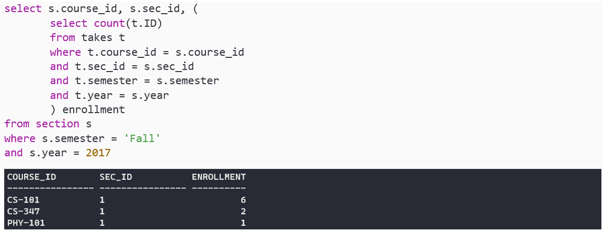 

\
**EverSQL의 생성된 쿼리문 및 결과**  
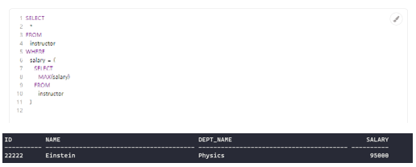  
select에서 보여주는 instructor내 column 차이는 다소 있지만, 전체적으로 거의 비슷한 쿼리문 구조를 보여주며, 결과도 동일하다.

\
**ChatGpt의 생성된 쿼리문 및 결과**  
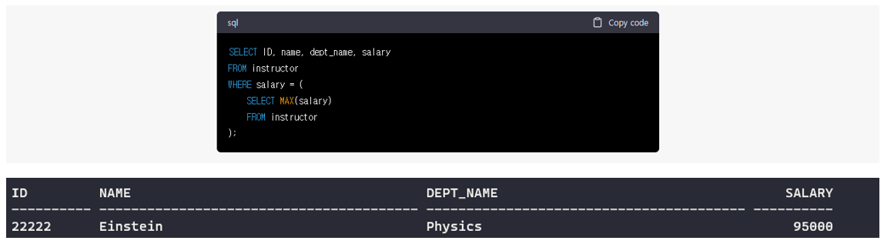  
select에서 보여주는 instructor내 column 차이는 다소 있지만, 전체적으로 거의 비슷한 쿼리문 구조를 보여주며, 결과도 동일하다.

#### B. Find the enrollment of each section that was offered in Fall 2017.
\
**실제 정답**  
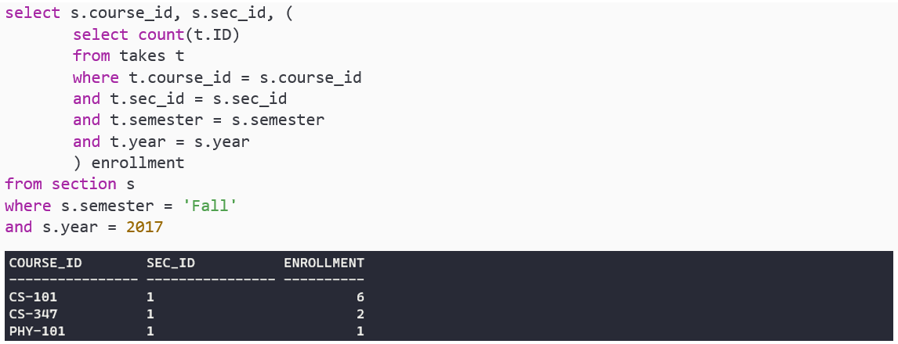 

\
**EverSQL의 생성된 쿼리문 및 결과**  
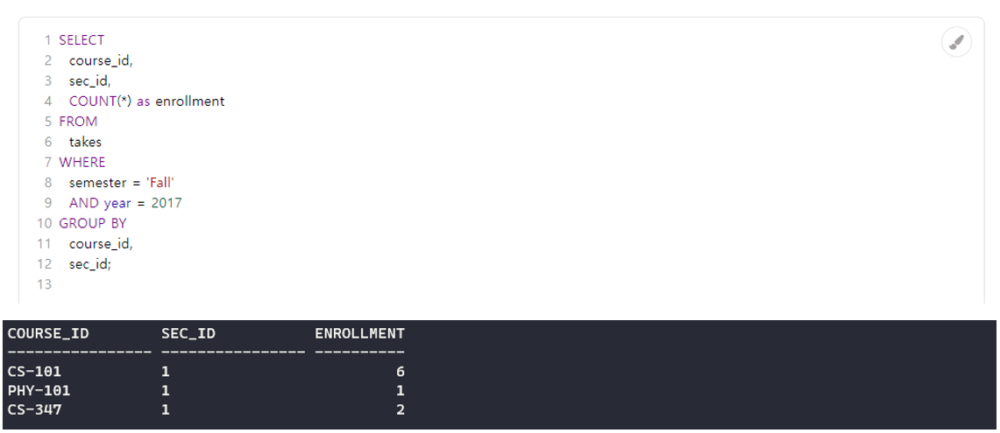  
순서의 차이는 있지만, 결과는 동일하게 나온다. 쿼리문의 경우, 차이점은 section 테이블에 접근하지 않고 오로지 takes 테이블로만 결과를 도출한다는 것이다. 물론 takes 테이블에 course_id, sec_id	, semester 등 구분에 필요한 최소한의 정보는 있다. 하지만 each section에 대한 추가적인 정보를 출력해야 한다면 (ex.room_number) 전체적인 쿼리문 구조를 변경해야 한다는 한계점이 있다.

\
**ChatGpt의 생성된 쿼리문 및 결과**  
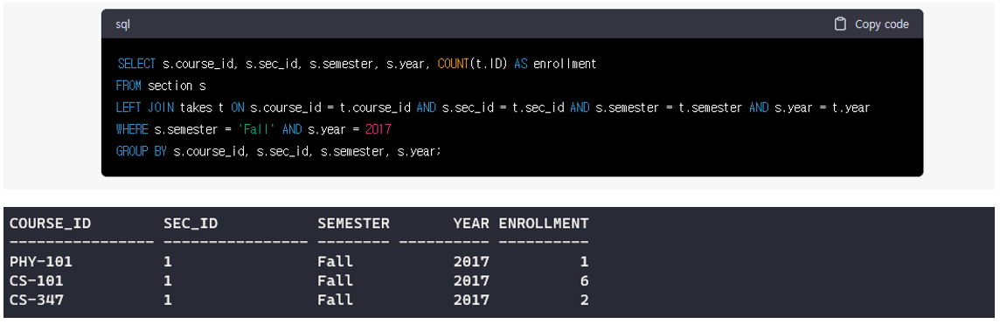  
순서의 차이와 select에서 보여주는 section 내 column 차이는 다소 있지만, 결과는 동일하게 나온다. 쿼리문의 경우 takes 와 section 모두 활용하는 모습을 보이며, 차이점으로는 서브 쿼리 대신 left join 과 group by로 문제를 해결한다는 점이 있다.

#### C. Display a list of all instructors, showing each instructor’s ID and the number of sections taught. Make sure to show the number of sections as 0 for instructors who have not taught any section. Your query should use an outer join, and should not use subqueries.

\
**실제 정답**  
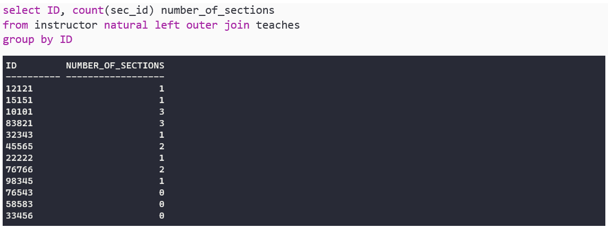 

\
**EverSQL의 생성된 쿼리문 및 결과**  
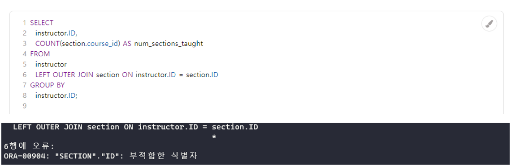  
결과 쿼리문을 실행하면 오류가 발생한다. 그 원인은 section에 ID라는 column가 없음에도 접근하려 하기 때문이다.(ID는 instructor에 있다.) DDL 파일을 주었음에도 이와 같이 잘못된 쿼리문을 생성하는 것은 EverSQL의 한계로 생각된다. 이러한 문제가 발생한 이유는, 질문에서 꼭 사용해야 하는 teaches 테이블을 언급하지 않아서로 생각된다. 
즉, EverSQL 입장에서는 instructor ID와 teaches ID를 join 한다는 판단을 하지 못한 것으로 생각된다.
section 단어 대신 sec_id를 넣고 use teaches 등 설명을 추가해봤지만 아쉽게도 원하는 답을 얻지는 못했다.

\
**ChatGpt의 생성된 쿼리문 및 결과**  
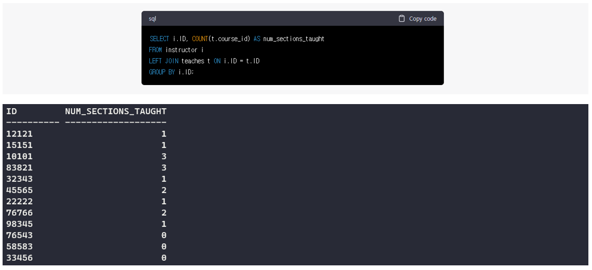  

결과가 동일하며, 쿼리문도 실제 정답과 비슷하게 작성되었다. 다만, count()에서 sec_id 대신 course_id를 쓴다는 차이점이 있다. 문제의 요구사항이 "showing each instructor’s ID and the number of sections" 인 점을 고려하면, sec_id를 사용하는 것이 바람직하다고 생각된다.

#### D. Find the department that have the highest average salary.
\
**실제 정답**  
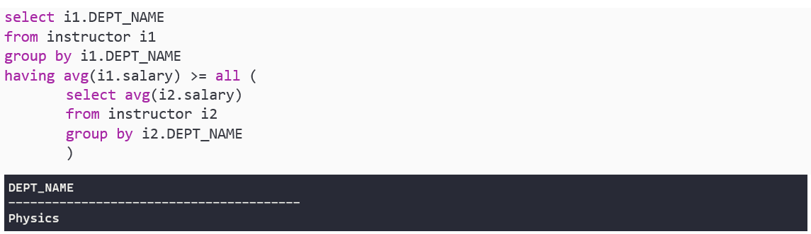 

\
**EverSQL의 생성된 쿼리문 및 결과**  
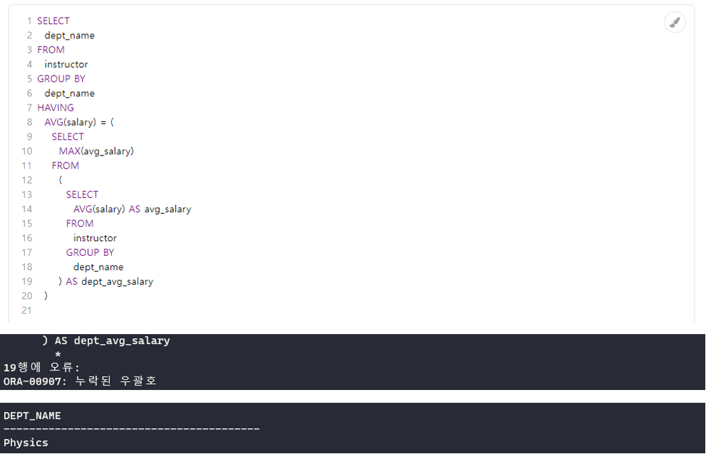  
우선 처음 쿼리문에서는 괄호 뒤 as 구문으로 인해 오류가 발생한다. 이는 오라클에서 허용되지 않는 부분이다. EverSQL 옵션을 oracle 19c로 주었음에도 이러한 문제가 발생하는 것은 한계점으로 생각된다. 
해당 오류를 고친 후 실행해보면 결과는 동일하게 나온다. 쿼리문에서는 all 대신 max()를 사용하여 avg(salary)의 최댓값을 한번 구하고, 다시 이 최댓값과 동일한 avg(salary)의 dept_name을 찾는 방법으로 문제를 해결한다. 이로 인해 having 속 서브 쿼리, 그 서브 쿼리의 from 속 서브 쿼리로 총 2중 서브 쿼리가 생기게 된다.

\
**ChatGpt의 생성된 쿼리문 및 결과**  
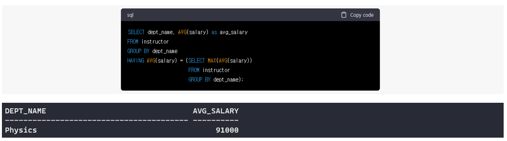  
avg_salary column이 추가된 차이는 있지만, 결과는 동일하다. 해당 쿼리문에서는 max(avg(salary)) 를 통해 한번에 최댓값을 구하고, 해당 값을 가지는 dept_name을 찾는 방식으로 문제를 해결한다. 깔끔하고 좋은 방법인 것 같다.

#### E. Find all courses taught in both the Fall 2017 semester and in the Spring 2018 semester.
\
**실제 정답**  
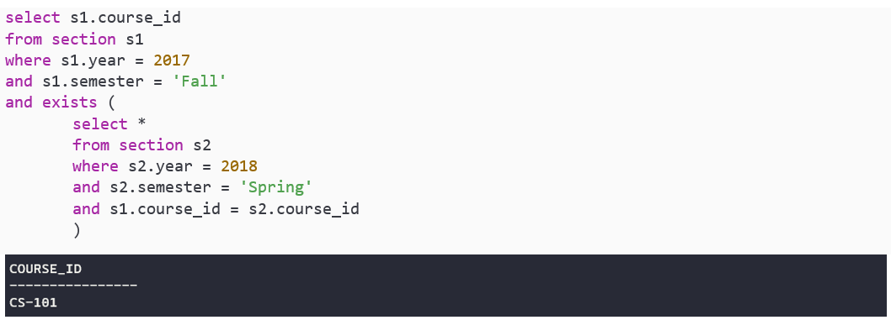 

\
**EverSQL의 생성된 쿼리문 및 결과**  
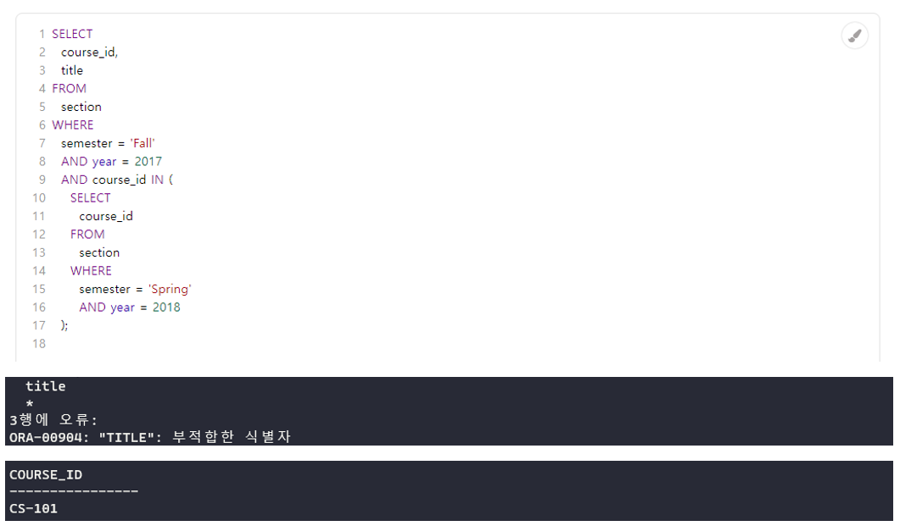  
우선 처음 쿼리문에서는 위와 같이 오류가 발생한다. section 에는 title 이라는 column가 없음에도 접근하려 하기 때문이다. (title은 course에 있다.) DDL 파일을 주었음에도 이와 같이 잘못된 쿼리문을 생성하는 것은 EverSQL의 한계로 생각된다. 해당 title 부분을 지워주고 나면 결과가 잘 출력된다. 본인 쿼리문과 차이점은 exist() 대신 in()을 사용하였다는 점이다.

\
**ChatGpt의 생성된 쿼리문 및 결과**  
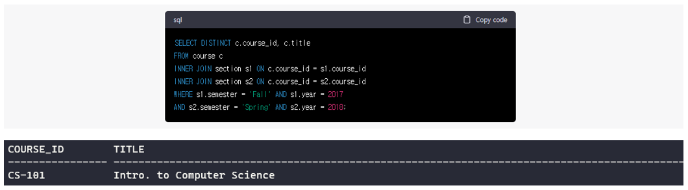  
title column 차이점은 있지만, 결과는 동일하다. 본 쿼리문의 경우 exist() 나 in()을 사용하지 않고 join을 두 번 하여 2017 Fall 과 2018 spring semester 를 둘 다 가진 row를 찾아내는 방법으로 문제를 해결한다.

#### F. Find all courses that were offered at most once in 2017.
\
**실제 정답**  
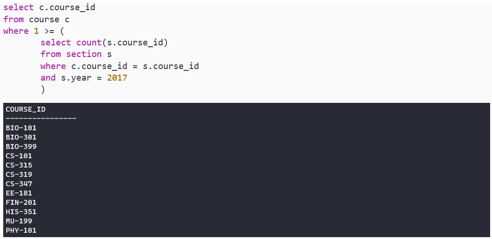 

\
**EverSQL의 생성된 쿼리문 및 결과**  
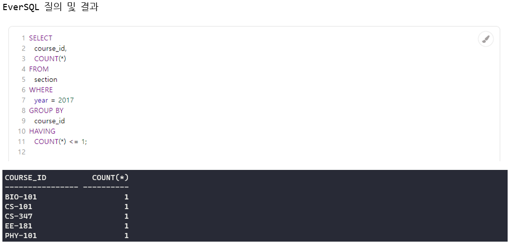  
결과가 다르게 출력된다. 가장 큰 차이점은 "offered at most once"를 도출해야 하는데 한 번도 열리지 않은 수업은 출력하지 못하는 모습을 보인다. 그 이유는 section 테이블만 활용해서 인데, section 테이블에는 없는 열리지 않은 수업들이 course 테이블에 존재하기 때문이다. 이는 EverSQL의 한계점으로 보인다.
즉, EverSQL가 이러한 판단을 내린 이유는 'course 에는 있지만 section 에는 없는 수업'을 생각하지 못하고 section 테이블 속 year=2017 라는 조건만 생각했기 때문이라고 예상된다.

\
**ChatGpt의 생성된 쿼리문 및 결과**  
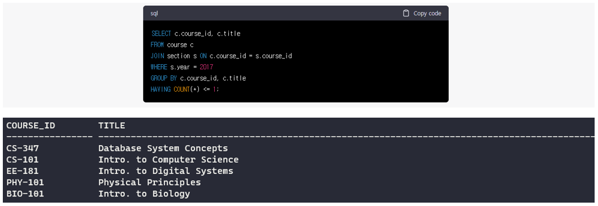  
결과가 다르게 출력된다. 문제점은 EverSQL과 동일하게 "offered at most once"를 도출해야 하는데 한번도 열리지 않은 수업은 출력하지 못하는 모습을 보인다. 단, EverSQL과 다르게 section 테이블과 course 테이블 모두 활용하지만, join 연산자로 인해 결국 section에 없는 course 수업들이 전부 사라지기 때문이다. 이는 ChatGPT의 한계점으로 보인다.
즉, ChatGPT가 이러한 판단을 내린 이유는 해당 join 연산자를 사용하면 'course에는 있지만 section에는 없는 수업'이 사라지는 것을 생각하지 못했기 때문이라고 예상된다.

## 결론
총 6개의 질의에 대하여, EverSQL는 2개를 맞추고 ChatGpt는 5개를 맞췄습니다.
물론 단순히 답 뿐만 아니라 효율성도 고려해야 하지만, 그럼에도 ChatGpt의 성능이 상당히 좋습니다. ㄷㄷ

## Source

- 『Database System Concepts』 *Avi Silberschatz - 지음*  
  [https://www.db-book.com/university-lab-dir/sample_tables-dir/index.html](https://www.db-book.com/university-lab-dir/sample_tables-dir/index.html)
