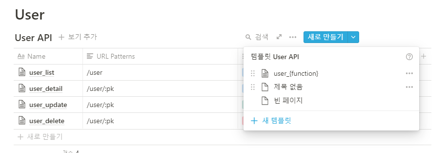

*해당 글은 과거 **velog**에 쓴 글을 다듬어서 이전한 글입니다. 원본은 [**링크**](https://velog.io/@hdyang0686/NotionMarkdown-%EC%9C%BC%EB%A1%9C-%EA%B0%84%EB%8B%A8%ED%95%9C-API-Docs-%EC%9E%91%EC%84%B1%ED%95%98%EA%B8%B0)를 참조하시기 바랍니다.*  
## 1. 갑자기 API Docs 작성법?
이번 국방오픈소스아카데미의 해커톤 대회를 진행하면서 API Docs를 작성할 기회가 생겼습니다. API의 개념은 처음 접해봐서 생소하지만, 기왕 배우는 김에 API Docs 작성을 맡아서 해보았습니다. 이 글은 그 과정에서 겪은 시행착오와 알게 된 여러 팁들이 누군가에게 도움이 되길 바라며 작성했습니다.

## 2. Notion이 뭔가요?

노션은 메모, 데이터베이스, 알림과 같은 기능을 지원하는 소프트웨어로, 프로젝트를 진행하면서 필요한 관리 공간을 만들어 줍니다. 이번 국방오픈소스 아카데미에서 우리 팀의 공식 프로젝트 관리 및 정리 프로그램이 되었습니다.

## 3. Markdown은 또 뭔가요?

텍스트 기반의 마크업 언어로, 매우 간단한 구조의 문법을 사용하여 직관적이고 효율적인 문서작성을 도와줍니다. 바로 위의 노션에서 markdown 언어로 문서를 작성할 수 있습니다.

## 4. 그래서 저 둘이 API Docs랑 뭔 상관인가요?
REST 프레임워크를 구성하면 필연적으로 API 문서를 작성하게 됩니다. 누구나 해당 문서만 보고도 서버에 요청을 보내고, 그 응답을 받아서 사용할 수 있도록 하기 위해서이죠. 이때 이러한 API 문서는 여러 가지 방법으로 작성할 수 있습니다. swagger, Postman 처럼 자동으로 빠르게 작성할 수도 있고, 아니면 일일이 손으로 작성할 수도 있습니다. 물론 전자가 효율성 면에서는 더 좋겠지만, 상황에 따라서는 후자가 필요한 경우도 있습니다. 예를 들어 필자의 경우 군대라는 특수성 때문에 팀원 간의 협업을 위해 Notion + Markdown 으로 직접 작성하는 방법을 선택했습니다.

## 5. 어떻게 작성했나요?
**1. Notion에서 API 문서용 페이지를 만듭니다.**

**2. 기능별로 구별해서 데이터베이스 테이블을 만듭니다.**

**3. column에다가 Name, Url Patterns, Method 등을 필요에 따라 추가합니다.**

**4. 템플릿을 만들어 줍니다. 이때 마크다운 문서는 해당 [링크](https://gist.github.com/iros/3426278#file-example-md)의 문서를 참조했습니다.**

**5. 양식에 따라 문서를 수정하고 채웁니다.**

## 6. 결론
비록 거창하거나 아주 새로운 내용은 아니지만, Notion + Markdown 이라는 나름 괜찮은 조합과 양식을 찾은 것 같아서 이렇게 글로 남겨보았습니다. 만약 프론트엔드와 백엔드가 서로의 역할을 잘 이해하고 능력이 된다면 swagger,Postman 같은 기능들도 꼭 써보는 걸 권장합니다.

## Source

- 깃허브 프로젝트 주소  
  [https://github.com/Yanghyeondong/web_Guntor-Guntee_EarlyFried](https://github.com/Yanghyeondong/web_Guntor-Guntee_EarlyFried)