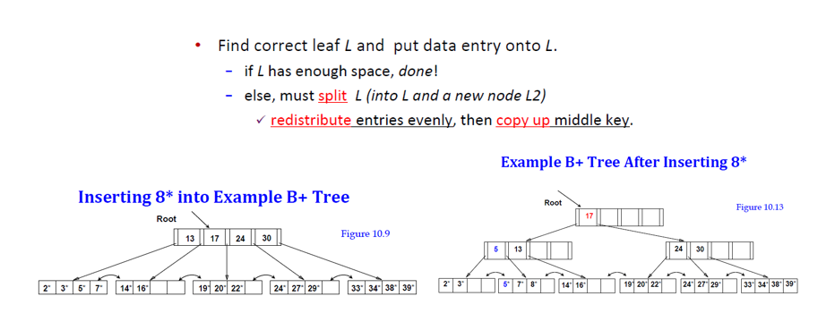
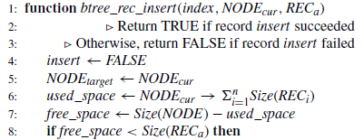
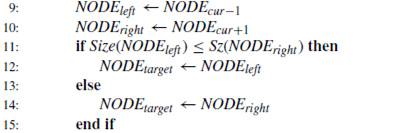
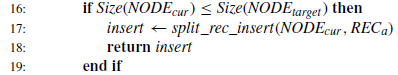
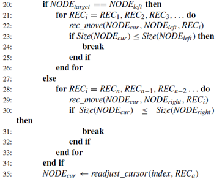

*본 글은 성균관대학교 이상원 교수님의 "A Case for Space Compaction of B-Tree Nodes on Flash Storage" 논문을 바탕으로 작성하였습니다.*

## 1. 기존 b+tree 알고리즘의 한계

우선 기존의 b+tree알고리즘을 생각해보면 다음과 같은 일련의 과정으로 동작합니다.  
\
  
\
8이라는 새로운 값을 `leaf node`에 `insert` 할때, 만약 해당 `leaf node` 자리가 충분하지 않으면 split을 진행합니다. 위의 예시에는 `[2,3,5,7]`에 해당하는 노드가 `[2,3] + [5,7,8]` 로 분리되는 모습을 보여줍니다.  
하지만  Sibling Redistribution을 이용하면 이러한 split을 하지 않아도 됩니다. 옆에 자리가 남아있는 `[14,16]`에 해당하는 `leaf node`에다가 `[2,3,5,7,8]` 을  Redistribution 하면 되기 때문입니다. 
예를 들자면 `[2,3,5]`와 `[7,8,14,16]`로, 혹은 `[2,3,5,7]`과 `[8,14,16]`로 Redistribution 할 수 있습니다.

## 2. Sibling Redistribution 설명

참고 논문 : [A Case for Space Compaction of B-Tree Nodes on Flash Storage](https://ieeexplore.ieee.org/document/10102447)

위 논문의 4쪽 DATA REDISTRIBUTION 을 정리하면 다음과 같습니다. 
`NODE_cur`에 해당하는 `leaf node`에 새로운 값을 `REC_a` 를 넣는 상황을 가정해봅니다.  
\
  
\
코드를 통해 위의 상황을 다음과 같이 정리합니다. 먼저 `NODE_cur` 노드 속에 기존의 `REC` 들이 가진 모든 `size`를 합쳐서 `used_space`를 계산하고 이를 다시 전체 사이즈에서 빼서 `free_space`의 크기를 계산합니다. 
다음으로 만약 새로 들어오는 `RECa` 의 크기가 해당 `free_space` 보다 크다면 이를 처리하기 위한 알고리즘으로 진입합니다. 만약 `free_space`가 더 크다면 그냥 간단히 `insert`만 하면 해당 함수는 끝나게 됩니다.  
\
  
\
Split 혹은 Redistribution을 하기에 앞서 우선 `NODE_cur`의 좌우 Sibling 들을 `NODE_left`와 `NODE_right`로 지정해주고, 둘 중에서 더 큰 노드를 찾습니다. 그리고 그 노드를 Redistribution의 대상인 `NODE_target` 으로 만들어줍니다.  
\
  
\
다음으로는 만약 `NODE_target`의 사이즈가 `NODE_cur`사이즈보다 크다면 `split_rec_insert()`을 수행하여 기존처럼 split을 진행합니다.  
\
  
\
이전의 경우가 아닌 경우, 본격적으로 Sibling Redistribution 을 진행합니다. 우선 `NODE_left`를 `NODE_target` 로 한 경우, `NODE_left`에 `NODE_cur` 의 REC를 계속 넘깁니다. 이것이 멈추는 시점은 바로 `NODE_cur` 의 크기가 `NODEleft`크기와 같거나 작아지는 시점입니다. 교안의 설명 "현재 insert가 발생하는 노드와 redistribution target sibling 노드가 저장하고 있는 레코드 개수가 같아질 때까지 옮긴다."에 해당합니다.

결론적으로 이러한 방식은 기존 split의 횟수를 줄임으로서 같은 데이터의 양을 더 적은 node에 담을 수 있습니다. 이는 결국 in-use space 을 줄여서 I/O performance 와 transaction throughput 을 향상시키고 space utilization을 높인다. 이러한 방식은 SSD와 같은 장비에서 더욱 높은 효과를 보여줍니다.

## Source

- 『A Case for Space Compaction of B-Tree Nodes on Flash Storage』 *Bo-Hyun Lee; Mijin An; Sang-Won Lee; - 지음*  
  [https://ieeexplore.ieee.org/document/10102447](https://ieeexplore.ieee.org/document/10102447)
