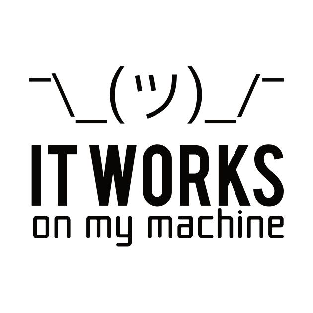
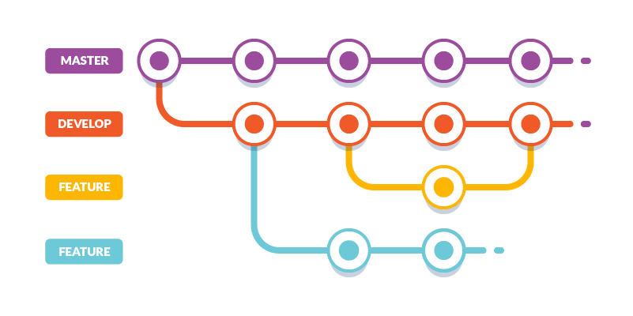

*해당 글은 과거 **velog**에 쓴 글을 다듬어서 이전한 글입니다. 원본은 [**링크**](https://velog.io/@hdyang0686/%EB%8A%A6%EC%9D%80-%ED%95%B4%EC%BB%A4%ED%86%A4-%EC%B0%B8%EC%A0%84%EA%B8%B0)를 참조하시기 바랍니다.*   
\
이번 국방부 해커톤 대회 참전기로 velog의 시작을 열어보려 합니다.

# 1. 어쩌다?
친구의 추천으로 갑자기 참여하게 된 국방오픈소스아카데미의 대회,
> **2021년 군장병 공개SW 온라인 해커톤**. 

처음엔 마냥 바쁘기만 한 일병 생활에서 과연 할 수 있을지 걱정했지만, 친구의 열화에 마지못해 시작했습니다. 같이 코딩 수업도 듣고, 파이썬 공부도 하고 바쁜 나날을 지내다 무사히 두 명 모두 해커톤 지원에 성공했습니다. 지금은 당연히도 친구에게 매우 고마워하는 중입니다 :) 해커톤이 절반도 지나지 않았는데 이미 배운 것들이 차고 넘치기 때문입니다.

# 2. 그래서 어때?
벌써 많은 시간이 지난 현재 시점에서 내가 느낀 점은 다음과 같습니다.
> **개발은 이렇게 하는 거구나...**

평소 학교에서는 이론 배우고, 과제 해서 내고, 시험 보는 게 대부분이었습니다. 물론 팀 프로젝트로 Git 등 협업을 진행해본 적도 있지만, 대부분 간단한 수준이라서 이번 해커톤 대회는 여러모로 충격의 연속이었습니다. 일단 하나의 완성된 프로젝트를 설계하고 만들어나가는 과정 중에서 몇몇 중요한 점들을 확인하게 되었습니다.  

## 1) 개발 환경

여러 명의 사람들이 무사히 하나의 프로젝트를 만들기 위해서는 통일된 환경이 필요합니다. 본인의 컴퓨터에서는 되는데 다른사람 컴퓨터에서는 안되면 참으로 난감하기 때문입니다. 다행이 이번 해커톤에서는 깃허브의 코드스페이스를 지원해 줘서 개발 환경 통일이 쉬웠고, devcontainer 를 통해 똑같은 환경을 손쉽게 만들었습니다.  

## 2) 개발 규칙

이번에도 늘 그렇듯이 깃허브를 썼지만, 좀 더 효과적인 개발을 위해 깃 플로우를 비롯한 세부적인 코딩 방식 및 명명 규칙들을 미리 토의해서 정해놓고 프로젝트를 시작했습니다. 이는 서로의 코드를 좀 더 쉽게 이해하고 전반적인 진행 과정을 한눈에 알아 볼 수 있도록 도와주었습니다.  

## 3) 개발 및 협업 툴
  
  
  
\
이번 개발에서 저희는 여러 툴을 사용했는데, 이들은 작업 효율을 높여준다는 점과 서로의 생각을 좀 더 쉽게 알 수 있다는 점에서 아주 탁월했습니다. 
예를 들어 **Jandi** 를 통한 소통은 마치 회사에서 일 하는것 처럼 업무 분담과 회의를 진행시킬 수 있도록 해주었습니다. 
**Figma**는 디자인에 대한 각자의 생각을 상상을 하나로 명확하게 모아 주었습니다.
**Notion**은 프로젝트 진행 상황 및 모든 정보를 알기 쉽게 기록하도록 해주었습니다.
이처럼 좋은 개발 및 협업 툴을 적절히 선정한다면 개발에 아주 도움이 된다는걸 깨달았습니다.

# 3. 결론은?
아직은 프로젝트 중이지만, 저는 이미 많은 것을 배울 수 있었습니다. 이는 물론 같은 팀원들에 능력자분들이 많고, 그 뛰어나 능력만큼이나 친절함이 있어서 잘 가르쳐주었기 때문입니다. 이런 데 제가 어떻게 버스만 타겠습니까. 매일 연등을 불태우며 남은 기간도 열심히 해커톤에 참여해보려 합니다. 파이팅!

## Source

- 깃허브 프로젝트 주소  
  [https://github.com/Yanghyeondong/web_Guntor-Guntee_EarlyFried](https://github.com/Yanghyeondong/web_Guntor-Guntee_EarlyFried)