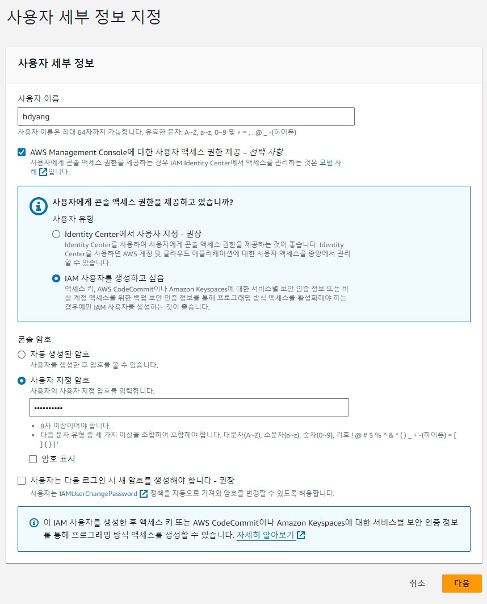
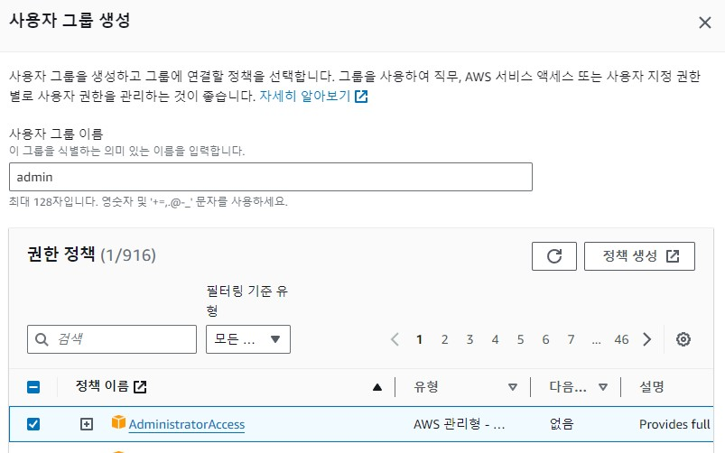
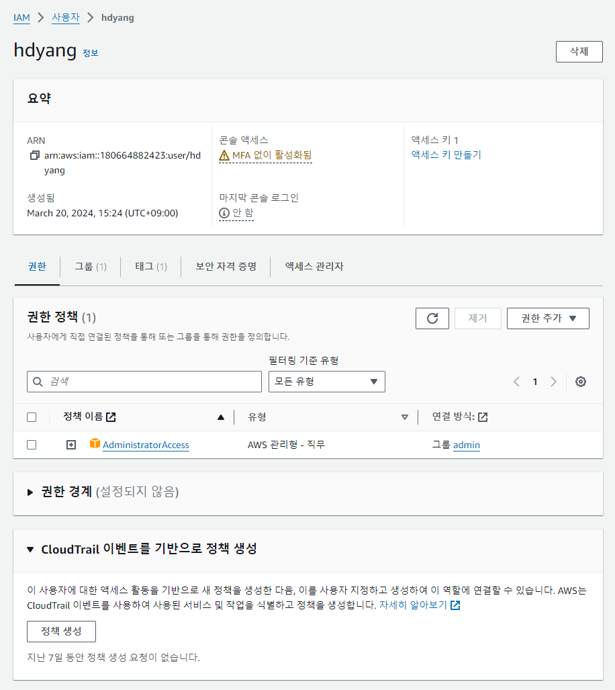
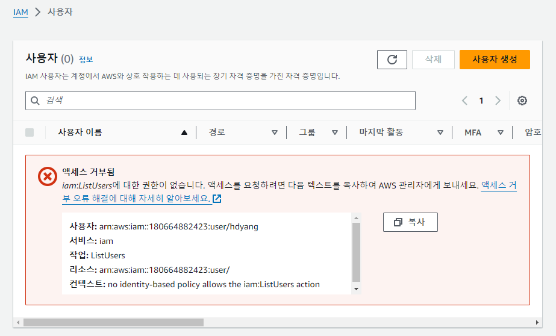
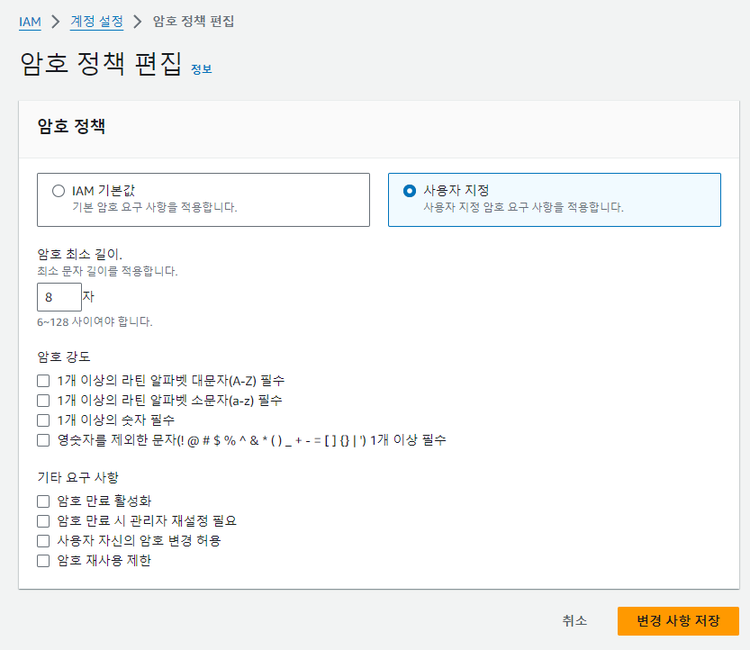
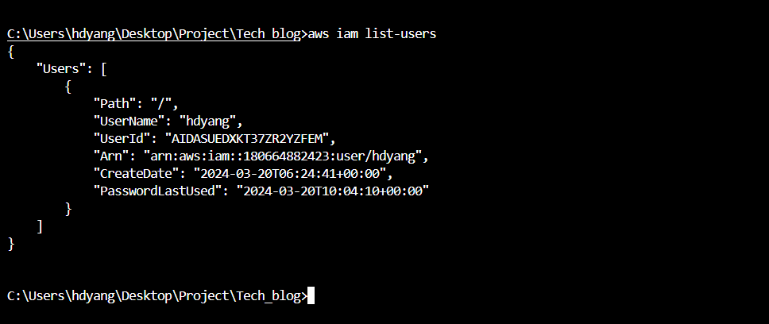
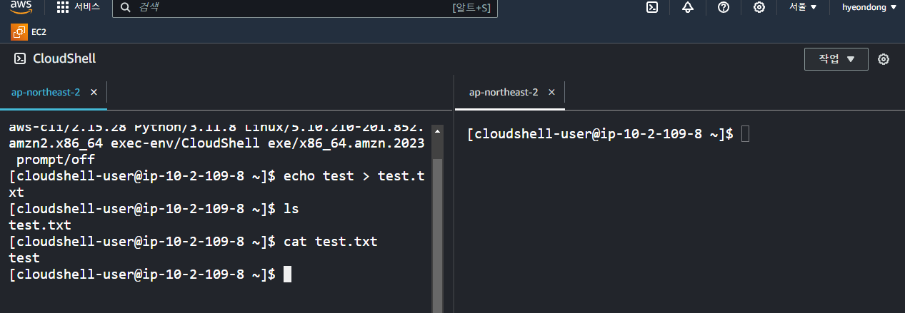

*본 포스트는 Udemy **AWS Certified SAA - Stephane Maarek** 강의를 일부 정리한 것입니다.*  
*상세한 정보는 [해당 강의](https://www.udemy.com/course/best-aws-certified-developer-associate/)를 참고하세요*

## AWS 소개

### AWS 특징

- AWS는 온디맨드 방식으로 원할 때 마다 원하는 만큼만 서버를 사용&확장 할 수 있다.
- Neflix, Dropbox, NASA가 사용한다.
- 다양한 기능들이 전부 연결되어서 사용된다.
- 전세계의 리전들과 이를 연결하는 사설 네트워크, 등으로 이루어져 있다.

### AWS 리전

데이터 센터의 집합.  
대부분의 서비스는 특정 리전에 제한된다. 리전을 변경할시 서비스를 처음부터 사용하는 것!  
\
리전 선택 기준
1. Compliance(법률 준수) 각 나라의 데이터 정책에 따라 준수
2. Latency(지연 시간) 서비스의 빠른 속도를 위해 서비스 지역과 가까운 곳을 골라야 함
3. Available services(가용 서비스) 원하는 서비스가 있는 리전을 선택해야 됨
4. Pricing(비용) 리전마다 비용이 다 다르다

### AWS Availability (가용 영역)

리전마다 3~6개의 가용 영역이 있다.  

각 가용 영역마다,
- 여분의 전원, 네트워크, 통신을 갖추고 있다.
- 하나 또는 2개의 데이터 센터가 있다.
- 하나에 문제가 생겨도 서로 다른 가용 영역과는 독립되어 있다.

가용 영역끼리 고대역 저지연 네트워크로 연결되 리전을 형성한다.

### Edge Location(전송 지점)
- 전 세계에 전송 지점이 있다.
- 최종 사용자에게 최소 지연으로 서비스 제공 가능.

## IAM (Identity and Access Management)
사용자를 생성하고 그룹에 배치한다.

- root 계정은 계정을 생성할때만 사용하고, 이후에는 사용 공유 금지.
- 사용자 생성과 그룹화. ex.) Developer와 Operations
- 그룹은 그룹을 포함시킬수 없다! 사용자만 배치 가능
- 그룹에 속하지 않는 사용자가 있을수도 있다.
- 한 사용자가 여러 그룹에 속하는 것은 가능.
- 글로벌 서비스다.

### IAM Permissions

- Json 문서로 관리된다.  
- 비용이나 보안의 측면에서 중요.
- AWS는 최소 권한의 원칙 적용 : 사용자에게 필요 이상의 권한을 주지 않음.
- 태그는 리소스의 메타데이터를 제공.

### IAM Policies(정책)

- 그룹마다 권한의 상속이 가능
- 개별 인원에게 인라인 정책도 가능 (그룹의 유무와 상관없이)
- 복수개의 그룹에 해당하면 그 여러 그룹의 권한을 모두 부여 받는다.

#### IAM Policies 구성 요소

- 버전 넘버: 정책 언어 버전
- 정책 식별 ID(옵션)
- Statement(문장)  
   sid: 식별자 (옵션)  
   effect: 측정 API에 대한 접근 허용 여부 - Allow or Deny  
   principal: 정책이 적용될 사용자, 계정, 역할 등  
   action: Effect에 기반해 허용 or 거부 되는 API 목록  
   resource: action이 적용될 리소스의 목록  
   전부를 호출 = ex. iam:Get*  
   condition : 언제 statement가 적용될 것인지  

### 사용자 보호를 위한 2가지 방법
1. Password Policy(비밀번호 정책)  
   비밀번호 최소 길이, 특정 문자 포함, 이전 번호 재사용, 변경 권한, 변경 주기 설정 가능.
2. MFA(다요소 인증)  
   비밀번호와 물리적인 security 디바이스도 활용  
   가상 MFA - Google Aurhenticator, Authy(하나의 장치에서 여러토큰, 여러 장치도 가능)  
   UTF 키 - Yubikey 같은 장비  
   하드웨어 key fob  
   실제 실습 시: Auth app, security key, hardware totp token 이 있다.  

### AWS 접근 3가지 방법

1. AWS console
   password + mfa
2. AWS CLI
   access key
3. AWS SDK (API 호출 키)
   access key

### AWS SDK(software development kit)

- 특정 언어를 사용하는 라이브러리들의 모음
   자바스크립트, 파이썬(boto) ....
- AWS에 접속하고 관리하게 해줌
- 애플리케이션 코드에 임베디를 해야한다!

### AWS ClouldShell

웹 페이지에서 접근이 가능한 CLI  
파일 업로드 다운로드가 가능하고 저장해도 남아 있다

### IAM Role(역할)

AWS 서비스에 권한을 부여하는 것. AWS에서 개체가 credential을 받도록.  
사용자와 동일하지만, 실제 사람이 아닌 AWS 서비스가 사용한다.  
ex. EC2에서 다른 리소스를 사용하려할때 Role이 필요하다.  

### IAM 보안 도구

1. IAM Credentials Report(자격 증명 보고서)  
   계정 수준에서 가능  
   계정에 있는 사용자와 다양한 자격 증명을 포함한 보고서  
   어떤 사용자가 비밀 번호를 안바꾸었는지, 계정이 사용되는지도 파악 가능.  
2. IAM Access Advisor(액세스 관리자)  
   user 레벨에서 가능  
   user에게 부여된 권한과 액세스 시간을 볼수 있음  
   어떤 권한이 사용되지 않는지 관찰하여 최소 권한 원칙을 지키기에 좋다.  
   
### IAM 가이드 라인

- root계정은 AWS 계정을 설정할때 제외하고는 사용하지 말것  
- 하나의 AWS 사용자(user)는 하나의 실제 물리 사용자와 매핑.  
- 강력한 비밀번호 정책, MFA 권장.  
- AWS 서비스를 사용할때는 Role로 권한을 줘야한다.  
- CLI와 SDK 사용을 위해서는 엑세스 키를 사용한다.  
- IAM user와 엑세스 키를 절대 공유하지 말것!  

## 실습 이미지

  
  
  
  
  
  
  

## Source

- 『AWS Certified Cloud Solutions Architect』 *Stephane Maarek - 지음*  
  [https://www.udemy.com/course/best-aws-certified-developer-associate](https://www.udemy.com/course/best-aws-certified-developer-associate/)
