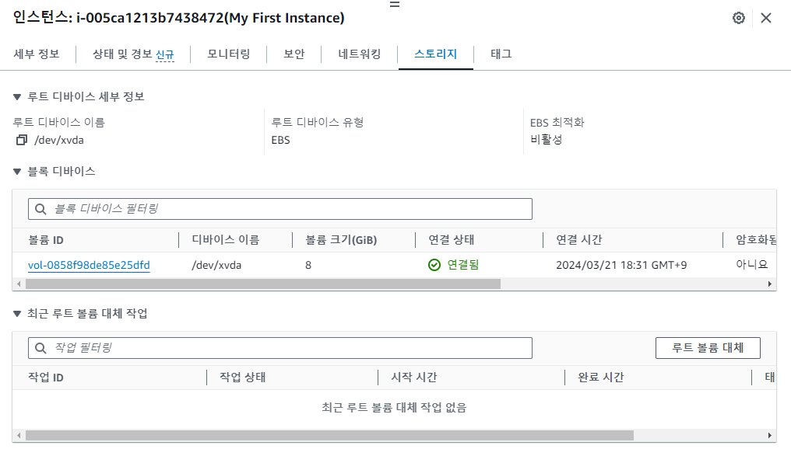

*본 포스트는 Udemy **AWS Certified SAA - Stephane Maarek** 강의를 일부 정리한 것입니다.*  
*상세한 정보는 [해당 강의](https://www.udemy.com/course/best-aws-certified-developer-associate/)를 참고하세요*

## EC2(Elastic Compute Cloud)

AWS에서 제공하는 서비스형 Infrastructure.  
클라우드는 필요할때마다 언제든지 컴퓨팅 대여가 가능하고, EC2가 그 예시이다.

- EC2 - VM 임대
- EBS - 가상 드라이브에 데이터 저장
- ELB - 로드 밸런서로 로드를 분산
- ASG - 오토 스케일링 그룹을 통해 서비스 확장

### EC2 옵션
\
OS  
- Linux, Windows, MacOs
CPU  
- 컴퓨팅 성능, 코어의 수
Ram  
- Ram 용량
Storeage  
- Network attacted : EBS, EFS
- Hardware : EC2 instance Store
- 주의! EBS는 기본적으로 instance 종료시 삭제하도록 되어있다. (stop은 아님)
Network Card  
- 네트워크 카드의 속도, Public ip 등
Firewall Rules(방화벽 규칙)  
- Security group(보안 그룹)
Bootstrap script  
- 첫 런치를 위한 EC2 User data

### Bootstrap

머신이 작동될때 명령을 시작하는 것. 부팅 작업을 자동화.  
first start 에만 script가 실행된다. 다시 실행 안됨  
- 업데이트 설치
- software 설치
- 파일 다운로드

작업을 추가할수록 인스턴트가 할 일이 늘어난다.  
EC2 User data 스크립트는 계정에서 실행된다. 따라서 명령어는 sudo로.  
\
예시
```bash
#!/bin/bash
sudo apt update
sudo apt install vim
```

### Instance 설명

Public IPv4  
인스턴스에 접근하기 위해 사용할 주소  

Private IPv4  
AWS 네트워크 내부적으로 인스턴스에 접근하는 주소

### Instance 운영
Instance를 정지할 시 요금이 들지는 않는다.  
Instance 재시작시 공용 IPv4 주소가 바뀐다! 사설 IP는 그대로 유지된다  

### EC2 Instance 타입

범용, 컴퓨팅 최적화, 메모리 최적화, 가속 컴퓨팅, 스토리지 최적화,  
HPC 최적화, 인스턴스 기능, 인스턴스 성능 측정 등.  
\
m5.2xlarge
- m : 인스턴스 클래스 (ex. 범용)
- 5 : 세대. AWS에서 새로운 세대의 하드웨어 사용.
- 2xlarge : 인스턴스 클래스 내에서 크기.  

General Purpose(범용) m, t 등으로 시작.
- 웹 서버, 코드 리포지터리 등 다양한 작업에 적합
- 컴퓨팅, 메모리, 네트워크의 밸런스가 좋다

Compute Optimized(컴퓨팅 최적화) c로 시작.
- 컴퓨터 집약적(인텐시브한) 작업에 좋다.
- Batch Processing (일괄 처리)
- Media Transcoding
- 고성능 웹서버
- HPC
- 과학 모델링 & 머신러닝
- 게이밍 서버

Memory Optimized(메모리 최적화) r, x, z로 시작
- 메모리 데규모 데이터셋 처리
- 고성능 인메모리 DB (관계 or 비관계)
- 분산 웹 캐시 저장소 elastic cache
- 비즈니스 인텔리전스 BI
- 대규모 비정형 데이터 실시간 처리

Storage Optimized(스토리지 최적화) i, d, h 로 시작
- 로컬 스토리지에서 대규모 데이터셋에 액세스
- OLTP(고주파 온라인 트랜잭션 처리)
- DB(관계 or 비관계 NoSQL)
- 인 메모리 데이터베이스 캐시 ex. Redis
- 분산파일시스템
- 데이터 웨어하우징

### Security group(보안 그룹)

EC2 인스턴스 외부의 방화벽이며, 트래픽을 관리한다.  
AWS에서 네트워크 보안 실행의 핵심.  
\
Allow rule를 사용 - 허용된 것이 무엇인지 확인.  
IP 주소를 참조해 Rule을 만든다 - 컴퓨터나 다른 보안 그룹끼리 참조 가능.  
여러 인스턴스에 연결 가능하다. 보안 그룹과 인스턴스는 1:1 아니다.  
반대로 하나의 인스턴스에 여러 보안 그룹도 가능.  
리전과 VPC의 조합으로 통제된다. 리전을 변경하면 새로 만들어야 됨.  
\
통제 방식은
- Port
- 인증된 IP 범위 - IPv4 or 6 (0.0.0.0/0는 전부를 의미)
- 인&아웃바운드 네트워크
\
보안 그룹은 EC2 외부에 있기에 EC2 입장에서는 차단을 확인할 수 없다.    
SSH 액세스를 위해 별도의 보안 그룹 분리를 추천한다.  
애플리케이션이 time out으로 접근이 불가능하면 보안 그룹의 문제이다.  
연결 거부 응답을 받으면 이것은 보안 그룹의 문제가 아니라 애플리케이션의 문제.  
\
기본적으로,
- 모든 인바운드 트래픽은 차단 block
- 모든 아웃바운드 트래픽은 허용 aurhorised

### 로드밸런서

보안 그룹에서 보안 그룹을 참조하는 방법.  
올바른 보안 그룹만 연결되면 다른 인스턴스를 통해서 바로 통신이 가능하다.  
즉, 참조된 보안 그룹에 해당하면 다른거는 신경쓸필요 없이 통신이 열린다.  
IP를 신경쓰지 않아도 되어서 좋다.  

### 포트 
 
- 22 = SSH(secure shell) : 인스턴스에 로그인하도록 해줌
- 21 = FTP(file trasfer protocol) : 파일 공유 시스템에 파일 업로드
- 22 = SFTP(secure file trasfer protocol) : ssh를 통해 파일을 업로드, 보안 프로토콜 적용
- 80 = HTTP : 보안이 되지 않은 사이트에 액세스
- 443 = HTTPS : 보안 사이트에 액세스
- 3389 = RDP(remote desktop protocol) : 윈도우 인스턴스 로그인에 사용

### EC2 Instance Connect

웹에서 작동하는 SSH 같은 연결.  
Amazon Linux만 지원한다.  
Amazon Linux는 aws cli도 내장.  

### 보안 주의

EC2 인스턴스에 IAM API 키, 비밀키를 입력해서는 절대 안된다!  
IAM Role을 사용하자!  

### EC2 구매 옵션

**온디맨드**
- **단기간**의 워크로드
- linux, window는 초당, 다른 OS는 시간당.
- 비용이 가장 많이 들지만 바로 지불할 금액 없음, 장기적인 약정도 없음.
- 단기적이고 중단 없는 워크로드가 필요할때
- 애플리케이션의 behave 거동을 예측할 수 없을때.

**Reserved(예약)** 
- 1년 & 3년 **장기간**의 워크로드. ex. 장기간 DB 사용
- 온디맨드에 비해 72% 할인.
- 특정 인스턴스 속성을 예약 (인스턴스 타입, 리전, OS, 테넌시 등) AZ도 결정
- 테넌시: EC2 인스턴스가 물리적 하드웨어에 분산되는 방식을 정의
- 1년(할인 적음), 3년(할인 높음) 중에 선택 가능.
- 전부 선결제(할인 높음), 부분 선결제(할인 보통), 선결제 없음(할인 적음) 중에 선택 가능.
- 특정 리전이나 존을 선택가능. 특정 AZ에 있는 예약된 용량.
- 사용량이 일정한 애플리케이션에 유리. ex. DB
- 마켓플레이스에서 예약 인스턴스를 사고 팔수있다.

**Convertible Reserved(전환형 인스턴스 예약)**
- 시간이 지나서 인스턴스 타입을 바꾸고 싶을때
- 인스턴스 타입, 리전, OS, 테넌시 등을 변경할 수 있다.
- 유연성이 더 크기 때문에 할인률은 적다. 66%

**Savings Plan(절약 플랜)**
- 1년 & 3년. 특정 인스턴스 타입을 약정하는게 아니라 달러 단위로 특정한 사용량을 약정.
- **장기간**의 워크로드
- 예약형과 동일하게 70% 할인
- 1년 & 3년 동안 시간당 10달러로 약정
- 사용량이 한도를 넘어서면 온디맨드 가격으로 청구
- 특정 인스턴스 패밀리, 리전으로 고정된다. ex. m5
- 인스턴스 사이즈는 유연하므로 m5.xlarge, m5.2xlarge
- OS (windows, linux)
- 테넌시(Host, Dedicated, Deafult)

**Spot Instance**
- **아주 짧은 워크로드**. 매우 저렴하지만 언제라도 그 인스턴스들이 손실될 수 있다. 신뢰성 낮음
- 온디맨드에 비해 90% 가까이 저렴
- 스폿 인스턴스에 지불하려는 최대 가격을 정의하고 스폿이 그걸 넘어가면 인스턴스가 손실됨.
- 가장 비용 효율적인 인스턴스, 고장에 대한 회복력이 있다면 아주 유용하다.
- 적합한 예시로는, Batch Job, 데이터 분석, 이미지 처리, distributed(분산형) 워크로드, 시작과 종료가 유연한 워크로드.
- 중요한 작업이나 데이터베이스에는 적절하지 않다!

**Dedicated Host(전용 호스트)**
- **물리 서버 전체**를 예약해서 인스턴스 배치를 제어
- Compliance(법규) 준수 요건이 있거나 특정 소켓, 코어를 사용해야하는 소프트웨어 라이센스가 있을때.
- 온디맨드로 초당 비용 혹은 1년 & 3년 예약
- AWS에서 가장 비싼 옵션
- BYOL (bring your own license)인 경우 사용
- 규정이나 법규가 있는 회사인 경우 사용 
- 물리적 서버에 대한 액세스를 가지고 로우 레벨 하드웨어에 가시성을 가진다.

**Dedicated Instance(전용 인스턴스)**
- **다른 고객과 하드웨어를 공유하지 않는다**. 같은 계정 안에서 다른 인스턴스와 함께 하드웨어 공유
- 전용 하드웨어에서 실행되는 인스턴스. 물리적인 서버와는 다르다?
- 인스턴스 배치에 권한이 없다.
- 자신만의 인스턴스를 자신만의 하드웨어에 갖는다.

**Capacity Reservations**
- 원하는 기간동안 특정한 AZ(Availability Zones - 가용 영역)에 **온디맨드 인스턴스**를 예약
- 필요할때마다 용량에 접근 가능
- time commitment(기간 약정)은 없고, 할인도 없다. 언제라도 용량 예약과 취소 가능.  
- 할인을 위해서는 지역별 예약과 결합하거나 Savings Plan과 같이 사용
- 인스턴스 실행과 무관하게 온디맨드 요금이 부과된다!! 용량을 예약하면 그것에 대해 청구된다.
- 특정 AZ에 있어야하는 **단기간**의 중단없는 워크로드에 적합.

### Spot Instance

최대 스팟 가격 정의 (시간당 가격인듯?)  
인스턴스의 스팟 가격이 우리 최대 가격보다 낮으면 해당 인스턴스 유지.  
시간당 스팟 가격은 offer와 용량에 따라 달라진다.  
현재 스팟 가격이 최대 가격을 초과하면 2가지 선택. 2분의 유예기간.  
- 인스턴스 중지. 이후 스팟 가격이 최대 밑이 되면 중단점부터 다시 시작.  
- 인스턴스 상태가 필요 없으면 종료해 버림. 이후 언제든 작업을 재시작할때 새 인스턴스로 시작.

### Spot Block 스팟 블록
- 지정된 기간(1~6 시간) 동안 스팟 인스턴스 차단.
- 매우 드물게 회수되기도 한다.

### Spot Instance Request

인스턴스 수, 최대 가격, 시작 사양 Amazon Machine Image(AMI) 등을 저장.  
유효 기간을 정의. 언제부터 언제까지. 무한대도 가능.  

Request Type 2가지
1. 일회성(one time) 요청
   스팟 요청이 완료되는 즉시 인스턴스 실행.
   스팟 요청은 사라진다.

1. 영구(persistance) 요청
   스팟 요청이 유효한 기간 동안은 인스턴스수도 유효하게 유지되어야 한다.
   인스턴스가 중지되면, 스팟 요청이 다시 실행된다.

스팟 요청을 취소하기 위해서는 open, active, disabled 중 하나여야 한다.  
인스턴스의 종료는 AWS에서 하지 않는다. 사용자가 해야함.  
따라서 스팟 요청 취소 -> 스팟 인스턴스 종료 해야됨.  
스팟 인스턴스를 먼저 종료하면 스팟 요청으로 돌아가서 자동으로 또 시작해버림.  

### Spot Fleet(스팟 플릿)
set of Spot Instances + (optional) On-Demand Instance  
정의한 가격 제한으로 목표 용량을 충족하기 위해 최선을 다함.
> 즉, 스팟 인스턴스 종류를 하나로 제한할 필요가 없고 여러 가능한 풀을 줘서 그 안에서 내가 바라는 용량 목표치를 알아서 달성 하도록 한다.
가능한 Launch Pool 에서 시작. 다양한 instance type, OS, AZ 등
플릿이 가장 적합한 런치 풀을 선택. 스팟 플릿이 예산에 도달하거나 원하는 용량에 도달하면 인스턴스 시작을 중지한다. 따라서 스팟 플릿에 스팟 인스턴스를 할당하는 전략을 정의.

### 스팟 플릿 인스턴스 allocate 할당 정의

LowestPrice(최저 가격)
- 가장 낮은 가격 pool에서 인스턴스 시작.
- 비용이 최적화 된다. 워크 로드가 짧은 경우에 좋다.

Diversified(다양하게)
- 스팟 인스턴스가 정의한 모든 pool에 분산.
- 가용성과 장기간의 워크로드에 좋다. 한 pool이 사라져도 나머지 pool이 작동 중이다.

Capacity Optimized(용량 최적화)
- 원하는 인스턴스 수에 맞는 최적의 용량을 가진 풀을 갖게 됨.

Price Capacity Optimized(가격 용량 최적화)
- 먼저 사용 가능한 용량이 가장 큰 풀을 선택하고, 그 중 가격이 가장 낮은 풀을 선택.
- 대부분의 워크로드에 가장 적합.

스팟 플릿은 스팟 인스턴스를 기반으로 추가 비용 절감 가능.  
적절한 스팟 인스턴스 풀을 선택하여 최대 비용 절감이 가능하도록 똑똑하게 작동함.

간단한 스팟 인스턴스 요청을 하는 경우는 원하는 인스턴스 유형과 AZ를 정확히 알고 있는 경우.  
스팟 플릿을 요청하는 경우는 조건(ex. 가장 낮은 가격)을 만족하는 모든 인스턴스 유형과 AZ를 선택.

## 실습 이미지

  
  
  
  
  
  
  
  
  
  

## Source

- 『AWS Certified Cloud Solutions Architect』 *Stephane Maarek - 지음*  
  [https://www.udemy.com/course/best-aws-certified-developer-associate](https://www.udemy.com/course/best-aws-certified-developer-associate/)
