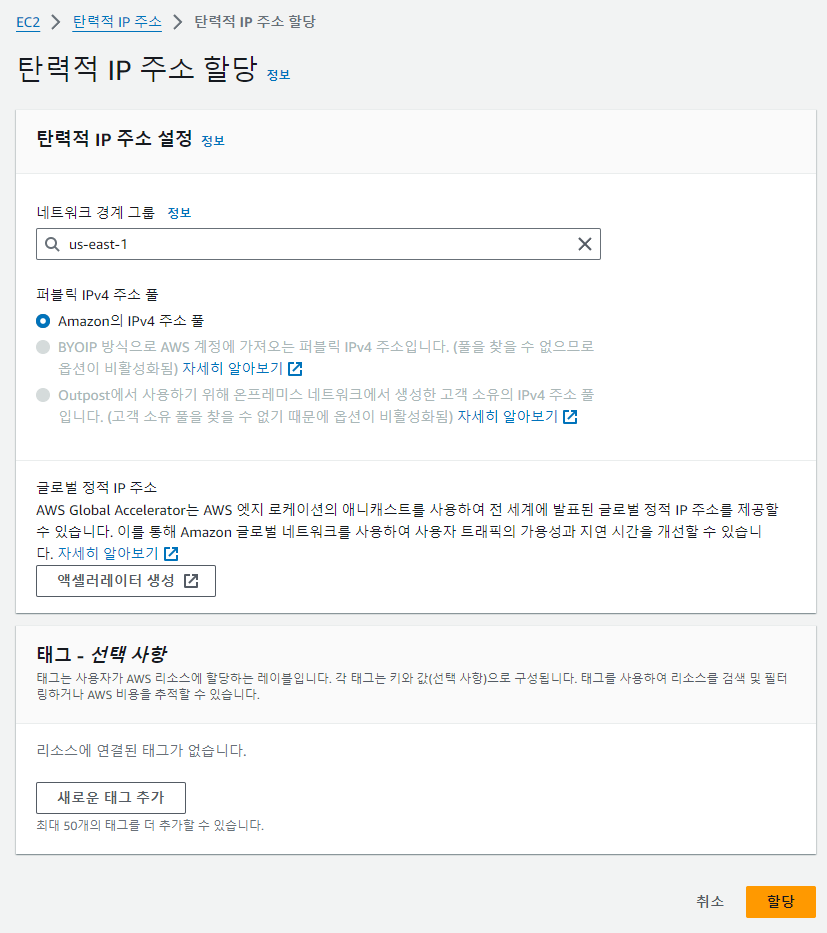
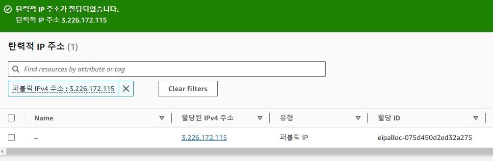
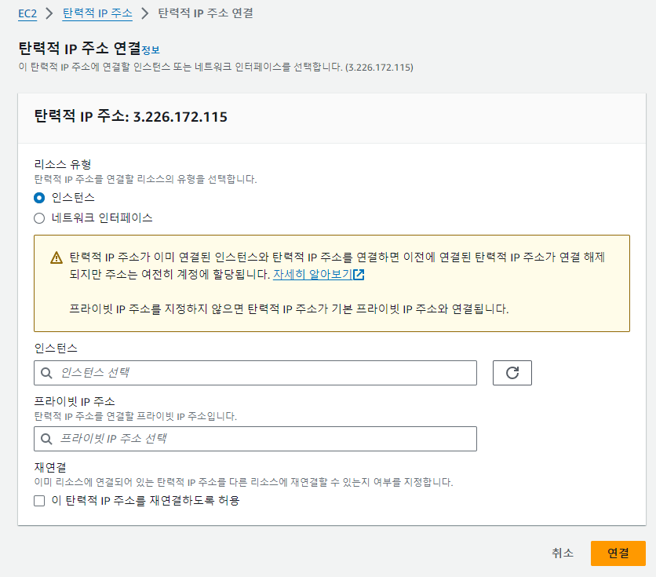
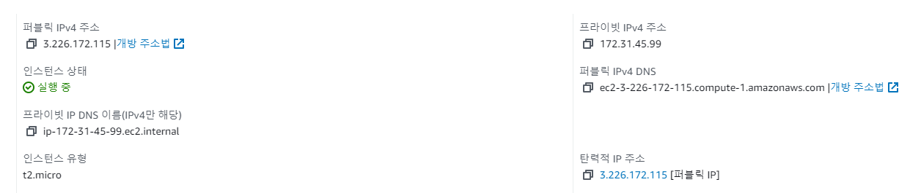
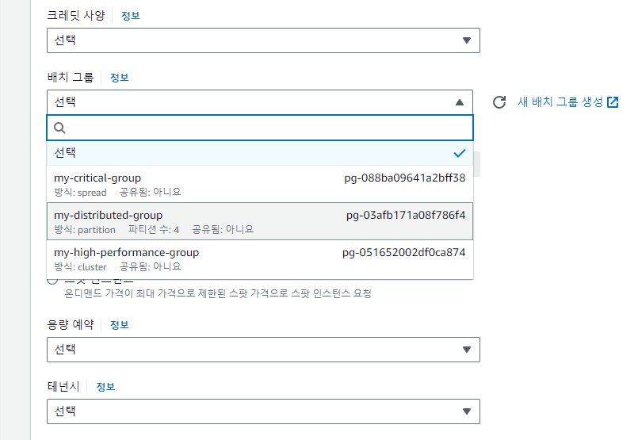
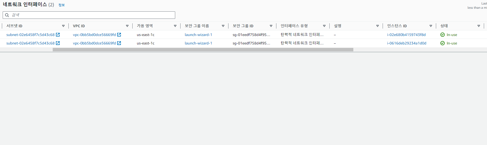
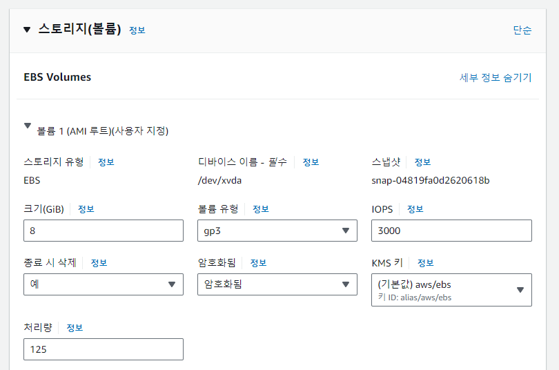
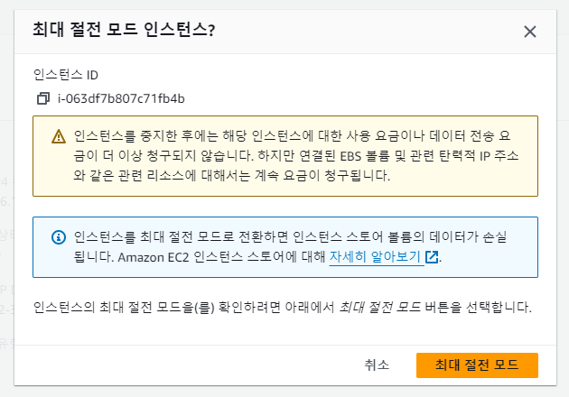

*본 포스트는 Udemy **AWS Certified SAA - Stephane Maarek** 강의를 일부 정리한 것입니다.*  
*상세한 정보는 [해당 강의](https://www.udemy.com/course/best-aws-certified-developer-associate/)를 참고하세요*

## EC2 IP

### IPv4

37억개의 서로 다른 주소 허용. 현재 고갈 예정.  

### Private IP

기기가 오직 private 네트워크 안에서만 식별되며, private 네트워크안에서만 유일하면 된다.  
NAT 장치와 인터넷 게이트웨이(프록시)를 통해 인터넷과 연결된다.  
지정된 범위의 IP만 private 아이피로 사용가능.  

### Public IP

기기가 인터넷 상에서 식별되는 주소. ISP에 의해 발급.  
전체 웹에서 유일해야 함.  

### Elastic IP

EC2 인스턴스를 시작하고 중지할 때 public ip는 바뀐다(private ip는 안바뀜).  
고정된 공용 IP를 사용하려면 Elastic IP 가 필요하다.  

- IPv4를 사용한다. 
- 삭제하지 않는한 계속 가지고 있다. 
- 한번에 한 인스턴스에만 첨부가능.  
- Elastic IP를 가지고 있는데 사용하지 않으면 요금이 부과된다.  
- 계정당 Elastic IP는 5개만 사용가능. 따라서 사용하지 않는것이 좋다. 매우 좋지 않은 구조적 결정.
- 대신 random public ip를 써서 DNS(Domain Name System) name 할당.  
- 로드밸런서를 통해 public ip를 전혀 사용하지 않을수도 있다.  

## EC2 Placement Group(배치 그룹)
EC2 인스턴스가 AWS 인프라에 배치되는 방식을 제어하고자 할 때 사용.
AWS 하드웨어와 직접적인 상호작용은 안하지만 배치 방식을 알려주고자 할때.

### Cluster

단일 AZ내에서 지연시간이 짧은 하드웨어 설정으로 인스턴스를 그룹화.  
높은 성능을 제공하지만 위험도 높음.  
모든 EC2 인스턴스가 동일한 랙(동일한 가용영역, 동일한 하드웨어)에 있다.  
고성능 네트워크 구성이 가능하다는 장점. 빅 데이터 job 등.  
랙에 fail이 발생하면 모든 인스턴스가 동시에 fail 된다. 위험도 높음.  

### Spread

가용성을 극대화하고 fail 위험을 최소화 해야 할때 사용.  
크리티컬 애플리케이션에서 자주 활용.  
모든 EC2 인스턴스가 다른 하드웨어에 위치. (동일한 AZ 내에서도 다른 하드웨어)  
여러 가용 영역에 걸쳐 있을수 있고, 동시 fail의 위험이 감소하는 장점.  
배치 그룹의 AZ당 인스턴스가 **7개**로 제한. 배치 그룹의 규모에 제한이 있음.  
너무 크지 않은 애플리케이션에만 적용가능.  

### Partition

Spread와 비슷하게 분산하지만, 여러 파티션에 인스턴스가 분할.  
파티션은 AZ내의 하드웨어 랙 세트에 의존.  
**AZ당 최대 7개의 파티션**이 있을 수 있고, 각 파티션에는 많은 EC2 인스턴스가 있을수 있다.  
각 파티션은 AWS의 랙을 나타낸다.  
파티션이 많으면 인스턴스가 여러 하드웨어 랙으로 분산되어 fail로 부터 안전.  
파티션은 동일한 리전의 여러 AZ에 걸쳐 있을수 있다. 최대 수백 개의 EC2 인스턴스를 얻을 수 있음.  
어떤 파티션에 인스턴스가 있는지 확인은 메타데이터 서비스.  
파티션 전반에 걸쳐 데이터와 서버를 나누고 파티션을 인식 가능한 애플리케이션의 경우 사용한다.  
Hadoop, HDFS, HBase, Cassandra, Kafaka 같은 빅 데이터 애플리케이션.  

### ENI (Elastic Network interfaces) 탄력적 네트워크 인터페이스

VPC(Virtual Private Cloud)의 논리적 구성 요소이며 가상 네트워크 카드를 나타낸다.  
EC2 인스턴스가 네트워크에 액세스하게 해줌. 인스턴스 외부에서도 사용된다!

#### ENI 속성

1. 주요 private Ipv4와 보조 private Ipv4를 가진다. ex. Eth0, Eth1 ...
2. private Ipv4 별로 하나의 elastic ip 혹은 public ip를 가진다.
3. 하나 이상의 보안 그룹을 연결할 수 있다.
4. EC2 인스턴트와 독립적으로 생성 및 즉시 연결, 이동이 가능하다.
   ex. 장애조치: 인스턴스1에 연결된 ENI를 인스턴스2로 옮겨서 privat ip를 이동시킬수 있다.
5. **특정 AZ에 바인딩 된다**.

### EC2 Hibernate(최대 절전 모드)

일반적인 상황에서,  
인스턴스를 stop(중지)하면 EBS(Elastic Block Store)는 재시작까지 유지.  
인스턴스를 terminate(종료)하면 EBS도 삭제. (일반적인 설정에서)  
\
절전 모드에서는,  
RAM에 있는 인메모리 상태는 그대로 보존. = 인스턴스 부팅이 빨라진다.  
OS를 완전히 중지하거나 시작하지 않고 그냥 멈춰두었기 때문에.  
RAM의 인 메모리 상태가 암호화된 EBS 볼륨에 덤프(기록)되고, RAM이 사라진다.  
인스턴스 재시작시 볼륨에서 메모리를 불러와 RAM으로 가져간다.  
\
최대 절전 모드 사용 사례
1. 오래 실행되는 프로세스를 갖고 있고 중지하지 않을때.
2. RAM 상태를 저장하고 싶을때
3. 빠르게 재부팅을 하고 싶을 때
4. 중단 없이 인스턴스를 절전 모드로 전환하고 싶을 때 
\
최대 절전 모드 지원
1. 다양한 인스턴스 패밀리 c3, c4, m3 ...
2. 인스턴스 램 크기는 150GB 까지
3. 베어 메탈 인스턴스는 지원 안함
4. 여러 운영체제 가능 linux, windows ...
5. 절전 모드를 활성화하기 위해서는 EC2 인스턴스 루트 볼륨 유형이 EBS 볼륨이어야만 하며, 암호화가 필요하고 충분한 용량이 필요하다.
6. 온디맨드(On-Demand), 예약(Reserved), 스팟(Spot) 모든 종류의 인스턴스에 사용할 수 있다.
7. 최대 60일까지 절전모드 가능.

## 실습 이미지

  
  
  
  
  
  
  
  
  

## Source

- 『AWS Certified Cloud Solutions Architect』 *Stephane Maarek - 지음*  
  [https://www.udemy.com/course/best-aws-certified-developer-associate](https://www.udemy.com/course/best-aws-certified-developer-associate/)
