*본 포스트는 Udemy **AWS Certified SAA - Stephane Maarek** 강의를 일부 정리한 것입니다.*  
*상세한 정보는 [해당 강의](https://www.udemy.com/course/best-aws-certified-developer-associate/)를 참고하세요*

## EBS(Elastic Block Store) 볼륨

인스턴스에 연결 가능한 네트워크 드라이브(물리적 드라이브가 아님).  

- 인스턴스가 종료된 이후에도 데이터 지속가능.  
- 일부 EBS는 여러 인스턴스에 다중 연결이 가능하다.
- 하나의 인스턴스에 여러 EBS 연결은 가능.
- 특정 AZ에 고정되어 있다. 하지만 스냅샷을 이용하면 다른 AZ로 이동도 가능하다.
- EC2 인스턴스에서 분리 및 다른 곳으로의 연결이 가능.
- 원하는 용량 및 IOPS(초당 전송 수)를 미리 지정해야 한다.  

#### TIP

EC2 인스턴스를 통해 EBS를 생성하는 경우, 종료(terminate)시 삭제 옵션 속성이 있다.  
기본적으로, 루트 볼륨에는 체크가 되어 있고 새로운 EBS 볼륨에는 체크가 되어있지 않다.  
루트 볼륨을 유지하고자 하는 경우 루트 볼륨의 종료 시 삭제 속성을 비활성화.  

### EBS Snapshots(스냅샷)

EBS 볼륨의 특정 시점에 대한 백업.  
스냅샷은 다른 AZ나 리전으로 복사할수 있다.

### EBS Snapshots Archive 스냅샷 아카이브

최대 75%까지 저렴한 아카이브 티어로 스냅샷을 옮길 수 있는 기능.  
자주 사용하지 않는 스냅샷을 저렴하게 보관하는 용도.   
아카이브 복원은 24 ~ 72시간이 걸린다. (즉시 복원 아님)  

### EBS Snapshots Recycle Bin 스냅샷 휴지통

영구 삭제 대신 휴지통에넣어 복원 가능하도록.
보관 기간은 1일 ~ 1년.

### Fast Snapshot Restore (FSR)

완전히 초기화된 스냅샷에서 볼륨을 생성하여 첫 사용시에 지연 시간을 없애는 기능.  
지연 시간을 최소화하여 빠르게 스냅샷으로부터 EBS 볼륨을 복원하는 기능?  
스냅샷이 아주 크거나 EBS, EC2를 빠르게 초기화해야 할때 유용하다.  

## AMI (Amazon Machine Image)

EC2 인스턴스를 통해 만든 이미지.  

- 원하는 소프트웨어 또는 설정 파일을 추가 가능
- 별도의 운영 체제 설치 가능
- 모니터링 툴을 추가 가능
- AMI를 통해 pre-packaged를 사용하면 부팅 및 설정에 드는 시간을 줄일수도 있음.  
- 특정 리전에서 구축하고 다른 리전으로 복사할수도 있다.  

Public AMI : AWS에서 제공  
your own AMI : 직접 만들고 관리  
Marketplace AMI : 다른 사람이 구축한 이미지 (기업에서 자체적으로 구성하고 판매하기도 함)  

### AMI 구축 과정

1. EC2 인스턴스를 원하는 대로 설정
2. 인스턴스를 중지해 데이터 무결성 확보
3. 이 인스턴스를 바탕으로 AMI를 구축. 이 과정에서 EBS 스냅샷이 생성.

## EC2 Instance Store(인스턴스 스토어)

네트워크 드라이브의 성능은 제한이 있다.  
EC2 가상머신과 연결된 실제 하드웨어 서버의 물리적인 디스크 공간을 갖는다.  
이와 연결된 하드웨어 드라이브를 EC2 인스턴스 스토어라고 한다.  
- I/O 성능 향상에 좋다.
- EC2 인스턴스를 중지하거나 종료하면 해당 인스턴스 스토어는 손실된다. 임시 스토리지.
- 장기간 데이터 보관 장소는 아니다. 장기는 EBS
- 버퍼나 캐시, 스크래치 데이터, 임시 콘텐츠를 담기에 좋다.

### EBS 볼륨 타입

gp2/gp3
- 범용 SSD 볼륨
- 다양한 워크로드에서 가격과 성능의 절충안

io1/io2
- 최고 성능 SSD
- mission-critical 하고 low-latency 와 high-throughput 워크로드에 사용

st1
- 저비용 HDD
- 잦은 접근과 처리량이 높은 워크로드에 사용

sc1
- 최저비용 HDD
- 접근 빈도가 낮은 워크로드에 사용

EBS 고려할 점들
- Size 크기
- Throughput 처리량
- IOPS I\O per sec

부팅 볼륨 : gp2/gp3, io1/io2 만 가능.

### 범용 SSD 볼륨 - gp2/gp3

짧은 지연시간을 가짐.  
시스템 부팅 볼륨, 가상 데스크톱, 개발, 테스트 환경에서 사용 가능.  
1GB ~ 16TB의 크기

#### gp3

최신 세대 볼륨.  
각 옵션은 독립적.
- 3000 ~ 16000 IOPS
- 125MiB/s ~ 1000MiB/s 처리량

#### gp2

오래된 세대.  
각 옵션은 연결.
- 볼륨의 GB를 늘릴때 IOPS가 증가한다.
- 5,334GB라고 한다면 최대 용량인 16,000 IOPS를 초과

### Provisioned IOPS (프로비저닝을 마친 IOPS) SSD - io1/io2

IOPS 성능을 유지할 필요가 있는 주요 비즈니스 애플리케이션,  
16000 IOPS 이상을 요구한느 애플리케이션에 적합.  
일반적으로 데이터베이스 워크로드에 알맞다.  
스토리지 성능과 일관성에 아주 민감.  

#### io1/io2
- 1GB ~ 16TB의 크기
- Nitro EC2 인스턴스의 경우 64,000 IOPS, 나머지는 32,000 IOPS
- IOPS와 크기를 독립적으로 증가 가능
- io2가 io1 보다 동일 비용 대비 내구성과 IOPS가 더 높다.

#### io2 블록 익스프레스
- 4GB에서 64TB
- 지연 시간이 밀리초 미만
- 256,000 IOPS

### HDD - st1, sc1
부트 볼륨 불가능.
125MiB ~ 16TB

#### st1 - Throughput 최적화 HDD
빅데이터, 데이터 웨어하우징, 로그 처리에 적합
성능
- Throughput은 500MB/s, 최대 IOPS는 500

#### sc1 - Cold HDD
아카이브 데이터 용
접근 빈도가 낮은 데이터
최저 비용으로 데이터를 저장할 때
성능
- Throughput은 250MB/s, 최대 IOPS는 250

### EBS MultiAttach - io1/io2

하나의 EBS 볼륨을 같은 AZ에 있는 여러 EC2 인스턴스에 연결.  
각 인스턴스는 볼륨에 대해 동시에 읽고 쓰기가 가능하다.  
가용성을 높이기 위해 Teradata 같은 클러스터링 리눅스 애플리케이션을 사용할때.  
애플리케이션이 동시 쓰기 작업을 관리해야 할때.  
\
주의할 점
- **해당 AZ 내에서만 사용가능하다!**
- 한번에 **16개**의 인스턴스에만 연결가능.
- cluster-aware (클러스터 인식) 파일 시스템을 사용해야 함. XFS나 EX4는 안된다!!

### EBS 암호화
1. 저장 데이터가 볼륨 내부에 암호화
2. 인스턴스와 볼륨간의 전송 데이터 암호화
3. 스냅샷, 스냅샷으로 생성한 볼륨 암호화

암호화 및 복호화 과정은 보이지 않고 백그라운드에서 EC2와 EBS가 알아서 처리.  
**지연 시간에는 영향이 거의 없다!**  
KMS에서 키를 생성하고 AES-256 암호화 표준을 사용.  

#### 암호화 및 복호화 과정
1. 볼륨의 EBS 스냅샷을 생성
2. 복사 기능을 통해 EBS 스냅샷을 암호화
3. 스냅샷을 이용해 새 암호화 된 EBS 볼륨을 생성
4. 해당 볼륨을 원본 인스턴스에 연결

암호화되지 않은 EBS 볼륨에서 생성한 스냅샷은 암호화되지 않는다.  
기초가 되는 스냅샷이 암호화되어 있으면 볼륨도 자동으로 암호화.

## EFS (Elastic File System)

Managed(관리형) NFS(Network file system)이다. 
- 서로 다른 AZ에 있는 여러 인스턴스에도 마운트 될수 있다.
- 가용성이 높고 확장성이 뛰어나며 비싸다. gp2의 3배.
- 사용량에 따라 비용을 지불한다. 프로비저닝할 필요가 없다.
- 사용사례: 콘텐츠 관리, 웹 서빙, 데이터 공유, wordpress
- 내부적으로 NFS 프로토콜을 사용한다.
- EFS 접근을 제어하기 위해서는 보안 그룹을 설정해야 한다.
- 리눅스 기반 AMI 에서만 사용가능! 윈도우는 안됨
- KMS를 통해 미사용 암호화를 사용가능
- POSIX 리눅스 파일 시스템, 표준 파일 API 사용.
- 용량을 미리 계획할 필요가 없고, 자동 확장된다.

### EFS 성능, 스토리지 클래스

#### EFS scale
- NFS 클라이언트 수천 개와 10GB 처리량을 확보.
- PB 규모의 네트워크 파일 시스템으로 자동 확장 가능.

#### Performance Mode 설정 가능
- General purpose (범용)
  지연 시간에 민감
  웹 서버나 CMS
- Max I/O 최대 I/O
  지연 시간이 조금 더 김
  throughput 처리량이 높다
  병령성이 높다
  빅데이터나 미디어 처리가 필요한 경우

#### Throughput Mode 설정 가능
- Bursting 버스트
  스토리지 양에 따라 확장되는 처리량
  1TB = 50MiB/s + 100MiB/s 버스트
- Provisioned
  스토리지 사이즈와 관련없이 Throughput을 설정.
- Elastic
  워크로드에 따라 자동으로 Throughput을 조절.
  워크로드를 예측하기 어려울때 유용하다.

#### Storage class
Storage Tier(며칠 후 파일을 다른 계층으로 옮기는 기능)
- EFS Standard = Regional
  자주 접근하는 데이터
- EFS IA
  자주 접근하지 않는 데이터. 파일 검색시 비용이 발생하지만, 저장 비용이 감소
  수명 주기 정책을 정해야 함.

#### Availability(가용성)과 Durability(내구성)
다중 AZ로 EFS를 구성할시 AZ의 fail에도 EFS 파일 시스템에 영향이 없다.
One Zone EFS도 개발용으로 사용 가능.
엑세스 빈도가 낮은 스토리지 계층과 호환되며, EFS One Zone IA로 할인을 90% 해줌.

### EBS vs EFS 정리

#### EBS
- io1/2를 제외하곤 하나의 인스턴스에만 할당된다.
- AZ 레벨에서 lock된다.
- gp2는 디스크와 I/O 가 비례해서 증가.
- io1은 IO를 독립적으로 증가 가능.
- AZ간에 마이그레이션을 위해서는 스냅샷을 만들어야 함.
- EBS 볼륨 백업은 I/O를 사용하므로 많은 트래픽을 처리할때는 실행하면 안됨. EC2의 성능에 영향을 미침
- 인스턴스의 루트 EBS 볼륨은 기본적으로 종료와 함께 사라진다.

#### EFS
- 네트워크 파일 시스템
- 여러 AZ에 걸쳐 수백개의 인스턴스에 첨부 가능
- 서로 다른 AZ에서 서로 다른 마운트 가능. 여러 인스턴스가 하나의 파일 시스템 공유
- POSIX를 사용하므로 리눅스 인스턴스만 가능
- EBS 보다 가격이 높지만 EFS-IA를 통해 비용 절감 가능

## 실습 이미지

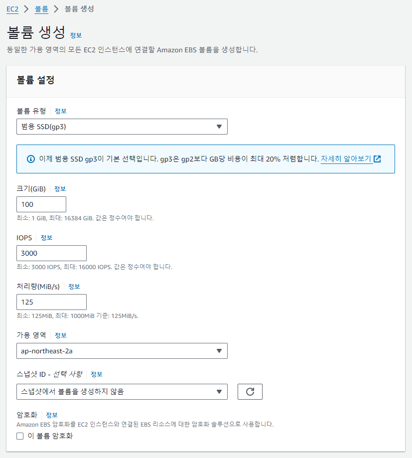  
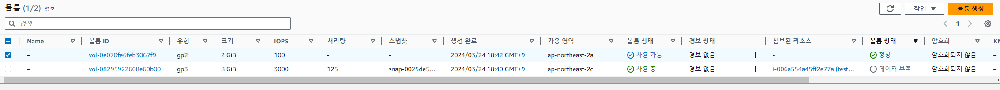  
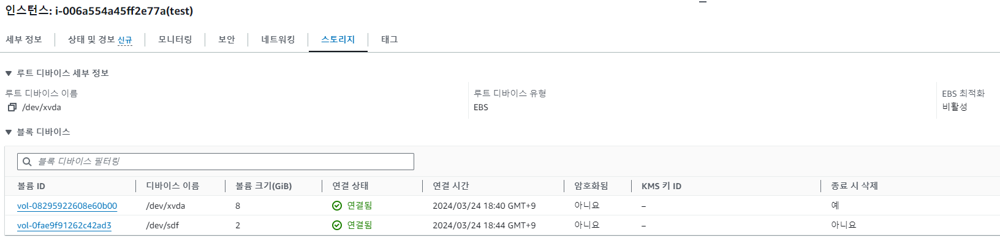  
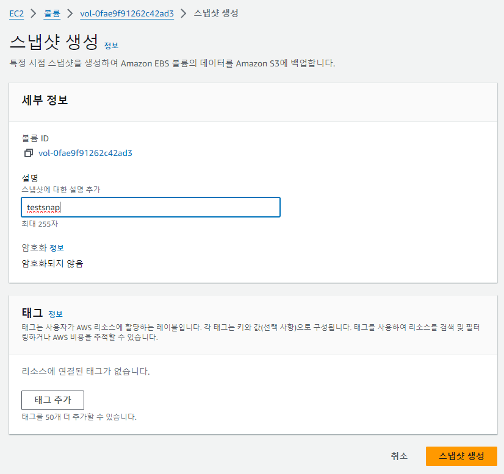  
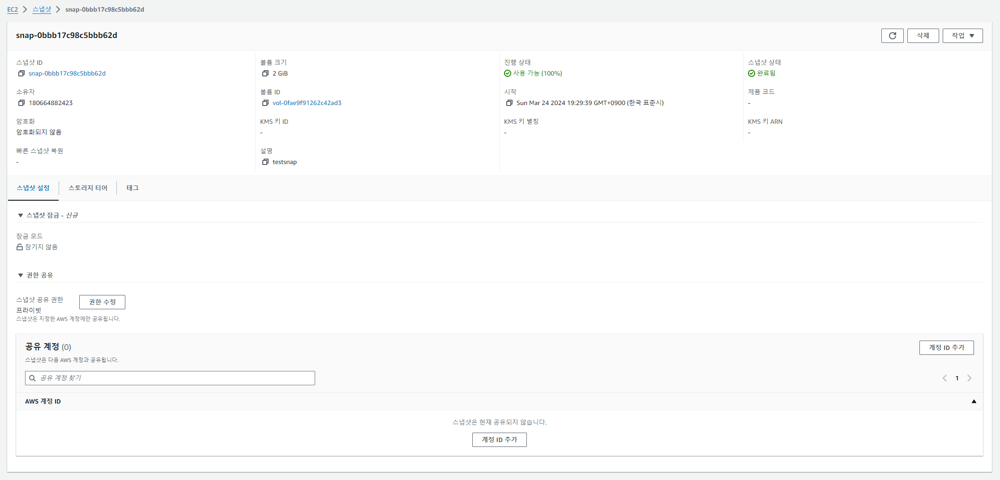  
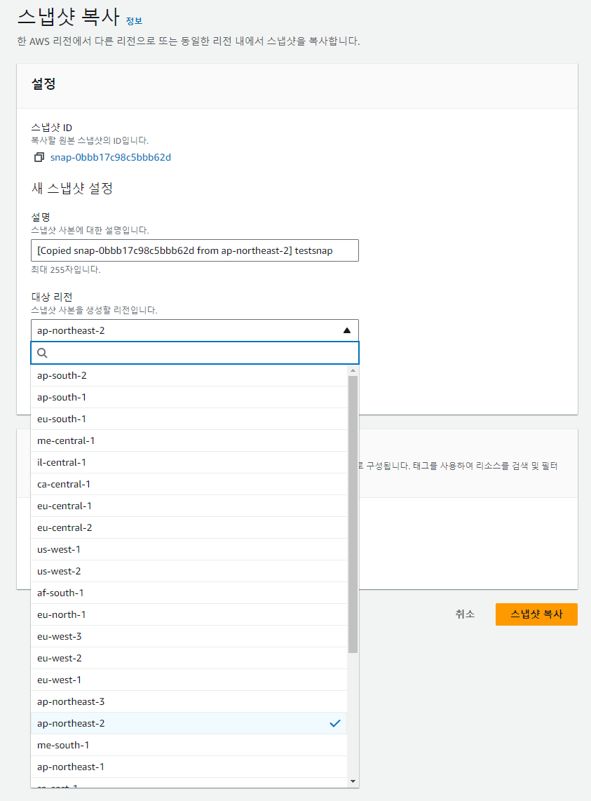  
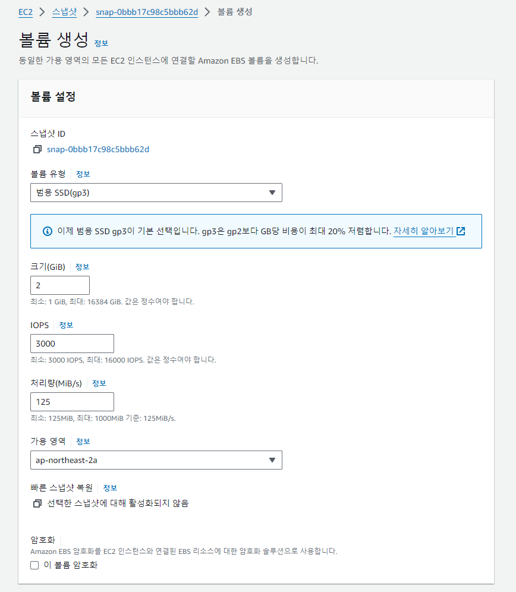  
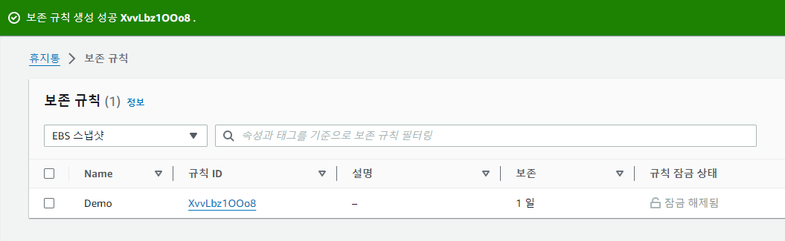  
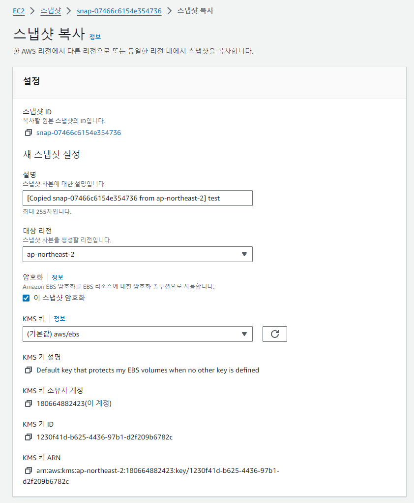  
  
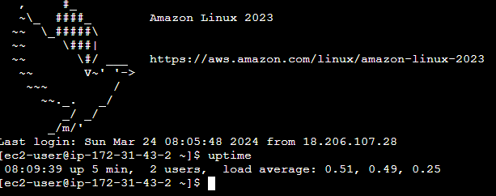  
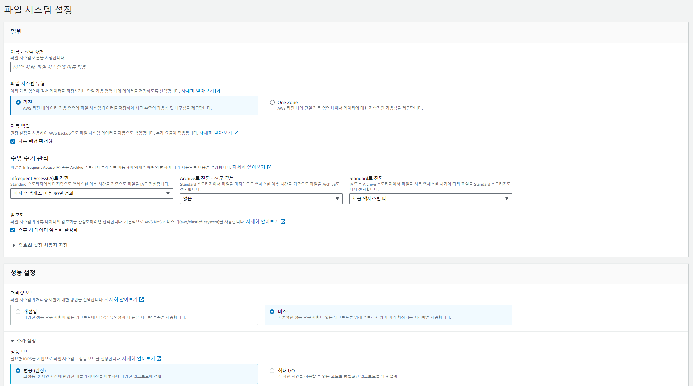  
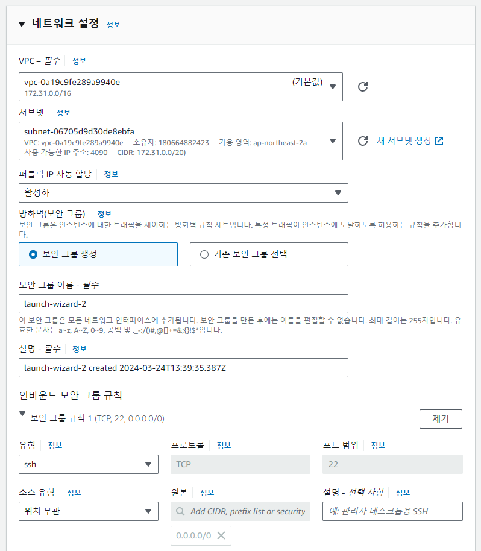  
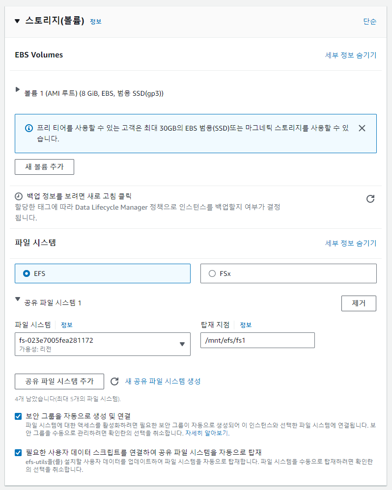  
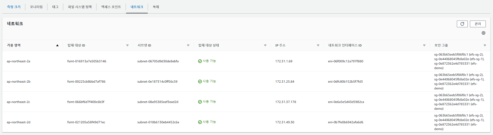  
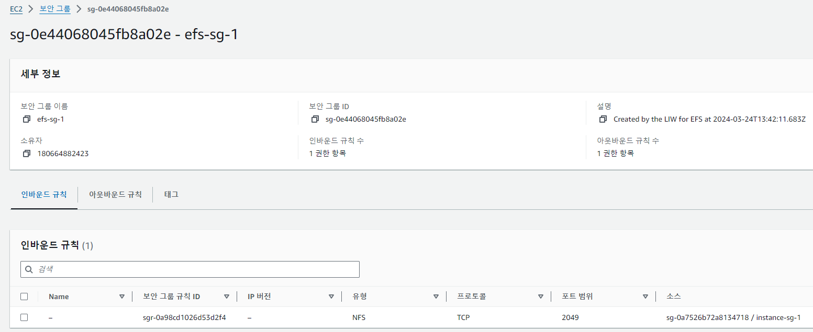  
## Source

- 『AWS Certified Cloud Solutions Architect』 *Stephane Maarek - 지음*  
  [https://www.udemy.com/course/best-aws-certified-developer-associate](https://www.udemy.com/course/best-aws-certified-developer-associate/)
