*본 포스트는 Udemy **AWS Certified SAA - Stephane Maarek** 강의를 일부 정리한 것입니다.*  
*상세한 정보는 [해당 강의](https://www.udemy.com/course/best-aws-certified-developer-associate/)를 참고하세요*

### Scalability 확장성

#### vertical scalability 
인스턴스의 크기를 확장. t2.micro -> t2.large.  
분산되지 않은 시스템이서 자주 활용. ex. RDS, ElastiCache  
확장시 하드웨어의 제한이 있다.

#### horizontal scalability (=elasticity)
인스턴스나 시스템의 수를 늘리는 방법.  
스케일 인: 수를 줄이는 것. 스케일 아웃: 수를 늘리는 것.  
분배 시스템이 있다는 것을 의미. 모든 애플리케이션이 지원하지는 않는다.  
- auto scaling group
- load balancer
### High Availability 고가용성
애플리케이션 혹은 시스템을 적어도 둘 이상의 AZ나 데이터 센터에서 가동하는 것.  
목표는 데이터 센터에 손실에서 살아남는 것. 센터 하나가 멈춰도 계속 작동하도록.  
#### 수동 고가용성  
RDS 다중 AZ를 갖추는 경우.
#### 활성 고가용성  
수평 확장을 하는 경우.
- auto scaling group multi AZ
- load balancer multi AZ

### Load Balancing

트래픽을 여러 서버들(EC2 인스턴스 다운스트림)로 전달하는 서버.  
부하를 다수의 다운스트림 인스턴스로 분산하기 위해 사용한다.  
- 애플리케이션에 단일 엑세스 지점 DNS를 노출하고, 인스턴스 장애를 원활히 처리가능.  
- 상태 확인 메커니즘으로 어떤 인스턴스로 트래픽을 보낼 수 없는지 확인한다.
- SSL 종료도 지원하여 HTTPS 트래픽을 가질수 있다.
- 쿠키로 stickiness 고정도를 강화 가능.
- Zone에 걸친 고가용성을 가진다.
- 클라우드내 개인 트래픽과 공공 트래픽을 분리 가능.

### ELB (Network load balancer)
관리형 로드 밸런서.  
- AWS가 관리하며 어떤 경우에서도 작동을 보장하고, 업그레이드와 유지 관리 및 고가용성을 책임.
- 자체 로드 밸런서보다 저렴하고 확장성이 좋다.  
- 여러 AWS 서비스와 연결. EC2, ECS, Route53 등등

### AWS의 load balancer 종류
1. CLB (classic load balancer) 2009  
   HTTP, HTTPS, TCP, SSL와 secure TCP를 지원  
2. ALB (Application load balancer) 2016  
   HTTP, HTTPS와 WebSocket 프로토콜을 지원  
3. NLB (Network load balancer) 2017  
   TCP, TLS, secure TCP와 UDP 프로토콜 지원, 고성능  
   지연 시간을 최소로 유지하면서 초당 수백만건을 처리할때  
4. GWLB (Gateway load balancer) 2022  
   보안, 침임 탐지, 방화벽에 측화. 네트워크 트래픽 분석에 유리.  
   3계층과 IP 프로토콜에서 작동  

로드 밸런서에 따라 internal(private), external(public) 하게 적용할 수 있다.

### ALB (Application load balancer)
머신 간 다수 HTTP 애플리케이션의 라우팅 처리가 가능.  
머신들은 Target group(대상 그룹)으로 묶이게 된다.  
마이크로 서비스나 컨테이너 기반 애플리케이션 (ex. aws ECS)에 가장 좋다.  
Layer 7의 애플리케이션 로드밸런서로, HTTP 전용이다.  
동일한 EC2 인스턴스의 여러 애플리케이션에 로드 밸런싱 : container 활용.  
리다이렉트도 지원. HTTP HTTPS 리다이렉션도 로드 밸런서 레벨에서 가능.  
포트 매핑 기능이 있어 동적 포트 리다이렉션이 가능하다.  
경로 라우팅도 지원한다.  
\
대상 그룹에 따른 라우팅
- URL 대상 경로 path 기반 라우팅  
  example.com/users, example.com/posts  
  URL상 서로 다른 경로이고, 이를 다른 대상 그룹에 리다이렉트 가능.
- hostname 기반 라우팅  
  one.example.com, other.example.com
- Query String과 Header 기반 라우팅  
  example.com/users?id=123&order=false

### ALB Target Group
ALB는 여러 대상 그룹으로 라우팅이 가능.
상태 확인은 대상 그룹 레벨에서 이루어진다.

- EC2 인스턴스 (auto scaling group에 의해 관리)
- ECS task (ECS 자체 관리)
- Lambda fuction
- private IP adresses

ALB를 사용할때도 고정 호스트 이름이 부여된다.  
애플리케이션 서버는 클라이언트의 IP를 직접 보지 못한다. 로드 밸런서의 private ip와 연결될 뿐.   
클라이언트 실제 IP는 X-Forwarded-For라고 불리는 헤더에 Port와 Proto 삽입  

### health Checks 상태 확인
ELB가 EC2 인스턴스의 올바른 작동 여부를 확인하는 것.  
port와 route에서 체크가 이루어진다. ex. HTTP, 4567 port, /health endpoint    
HTTP가 200으로 응답하지 않는다면 인스턴스 상태가 좋지 않다고 기록된다.

### NLB (Network Load Balancer)
Layer 4 로드밸런서로서 TCP와 UDP 트래픽을 다룰 수 있다.  
초당 수백만 건의 요청 처리 가능, 지연 시간 낮음 (100밀리초, ALB는 400).
AZ 별로 하나의 IP를 가진다. Elastic IP를 각 AZ에 할당가능.
여러개의 고정 IP를 가진 애플리케이션 노출에 유리.  ex. 1~3개의 IP로만 액세스할 수 있는 애플리케이션

### NLB Target Group

- EC2 인스턴스
- private IP adresses
- ALB 앞에 NLB를 배치할 수 있다.

### NLB health Checks
가능한 옵션
1. TCP
2. HTTP
3. HTTPS

### GWLB (Gateway load balancer)
배포 및 확장과 AWS의 타사 네트워크 가상 어플라이언스의 플릿 관리.  
방화벽, 침입 탐지 및 방지, IDPS, 심층 패킷 분석 시스템 등에 사용.  
Route table이 수정되면 모든 사용자 트래픽은 GWLB를 통과한다.  
GWLB는  가상 어플라이언스 그룹(제 3자) 전반으로 트래픽을 확산.  
모든 로드 밸런서보다 낮은 수준인, L3 IP 패킷 계층.  
투명 네트워크 게이트웨이  
VCP의 모든 트래픽이 GWLB가 되는 단일 엔트리와 출구를 통과  
트래픽을 가상 어플라이언스에 분산해 로드 밸런서  
**6081번 포트 GENEVE 프로토콜**

### GWLB Target Group

- EC2 인스턴스
- private IP adresses

### ELB Sticky Sessions (고정 세션), Session Affinity (세션 밀접성)

클라이언트가 로드 밸런서에 연속해서 요청을 하면 동일한 백엔드 인스턴스로 연결.  
CLB, ALB 에서 설정 가능.  
쿠키를 활용. 고정성과 만료 기간도 있다.  
고정성 활성화시 부하에 불균형이 생길수도.  

쿠키 종류 2가지
#### 애플리케이션 기반 쿠키
- 커스텀(사용자 정의) 쿠기  
  각 대상 그룹별로 지정해야 되며, AWSALB, AWSALBAPP, AWSALBTG 같은 이름은 안됨.
- 애플리케이션 쿠키  
  로드밸런서 자체 생성  
  이름은 **AWSALBAPP**

#### 기간 기반 쿠키
로드밸런서 자체 생성  
AWSALB, AWSELB 등을 가짐.

### Cross-Zone Load Balancing 교차 영역 로드 밸런싱
각각의 로드 밸런서가 모든 AZ에 등록된 모든 인스턴스에 부하를 고르게 분배  
AZ 마다 인스턴스 수가 달라도 모든 인스턴스가 공평하게 부하를 받는다.  
ALB는 Cross-Zone이 기본으로 활성. 비활성화 가능.  
AZ 간의 데이터 이동은 비용이 들지 않는다.  
NLB와 GWLB는 기본적으로 비활성화. AZ간 이동에 비용이 든다.  
CLB는 비활성 기본, 무비용.  

#### Cross-Zone을 사용하지 않는 경우
각 로드 밸런서를 가진 AZ 끼리 나누어 가져서 인스턴스 입장에선 공평하지 않다.  

### SSL (Secure Sockets Layer)
SSL 인증서는 클라이언트와 로드밸런서 사이에서 트래픽을 암호화 해준다.
- in-flight 암호화. 이동 중에는 암호화되고 송신자와 수신자 측에서만 복호화 가능.
- TLS(Transport Layer Security) = SSL의 새로운 버전.  
- SSL은 인증 기관 CA 에서 발급한다.  
- 퍼블릭 SSL 인증서를 로드 밸런서에 넣으면 암호화 가능. X.509 인증서 사용.  
- 만료 날짜가 있어서 주기적으로 갱신해야 함.  
- 로드밸런서와 EC2 사이에서는 HTTP를 사용하지만 프라이빗 네트워크라 안전하다.  
- ACM (AWS certificate manager)로 관리한다.  
- HTTPS 리스너에 인증을 꼭 추가해줘야 한다.

### SNI (Server Name indication)
여러 SSL인증서를 하나의 웹서버에 연결해 여러 웹사이트 지원 가능.  
SSL 핸드셰이크 단계에서 서버가 어떤 인증서를 로드해야하는지 알 수 있다.  
ALB, NLB, ClouldFront 에서만 지원한다.  

### Connection Draining (연결 드레이닝) = Deregistraion Delay (등록 취소 지연)

인스턴스가 등록 취소나 비정상 상태일때 어느정도 시간을 줘서 healty 활성 요청을 완료하도록 한다.   
ELB에 연결된 인스턴스가 드레이닝 단계가 되면 이미 연결된 유저는 드레이닝 시간을 통해 요청을 완료하고, 새로운 요청을 보내지 않도록 한다.  
이후 모든 연결이 정지된다. 이때 교체등의 작업이 가능.   
드레이닝 시간은 기본적으로 5분이며, 1~3600초 사이. 값이 0이면 드레이닝 없음.  

### ASG (Auto Scaling Group)

증가 혹은 감소하는 로드 따라 스케일 아웃(인스턴스 추가) 스케일 인(인스턴스 제거) 자동화.  
ASG의 최소 및 최대 개수 보장을 위해 매개변수 설정 가능.  
로드 밸런서와 페어링하면 ASG에 속한 모든 EC2 인스턴스가 로드 밸런서에 연결된다.  
인스턴스가 비정상이면 새로 생성한다.  
무료 기능이며, 하위 리소스에 대한 비용만 내면 된다.  

#### CloudWatch
CloudWatch 경보를 기반으로 스케일링 정책 설정 가능.  
metric (CPU 평균 사용량 등) 기반으로 경보를 울리고 오토 스케일링을 한다.

#### Dynamic Scaling Policies
Target Tracking Scaling 대상 추적 스케일링
- 가장 단순하고 설정하기 쉽다
- ex. 평균 CPU 사용률을 40% 대에 머무르도록 할때
- 기본 기준선을 세우고 상시 가용 하도록
Simple / Step Scaling 단순, 단계 스케일링
- ex. CloudWatch 알람으로 전체 ASG에 대한 CPU 사용률이 70%를 초과하면 두 유닛을 추가
- ex. CloudWatch 알람으로 전체 ASG에 대한 CPU 사용률이 30%를 미만이면 두 유닛을 제거
Scheduled Actions 
- ex. 매주 금요일 오후마다 최소 인스턴스 수를 10개로 늘리도록

#### Predictive Scaling
과거 로드를 분석해서 예측을 하고 스케일링을 한다.  
머신러닝 기반의 스케일링이 기대된다.  

#### 좋은 Metrics to scale
1. CPU 사용률
2. 대상별 요청 수
3. Network I/O 병목 확인

#### Scaling Cooldown 스케일링 휴지

스케일링 작업(인스턴스 추가 삭제)마다 5분 정도의 휴지 기간.  
추가 인스턴스 실행 및 종료 방지.  
새로운 인스턴스의 안정화와 새로운 지표의 양상을 살펴보기 위함.  
Tip: 즉시 사용 가능한 AMI를 이용하여 인스턴스 구성 시간 단축.  

## 실습 이미지

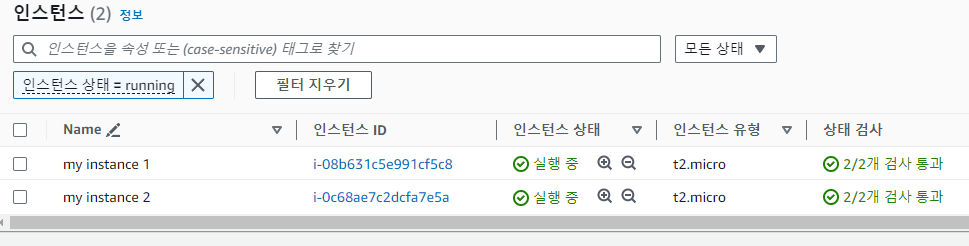  
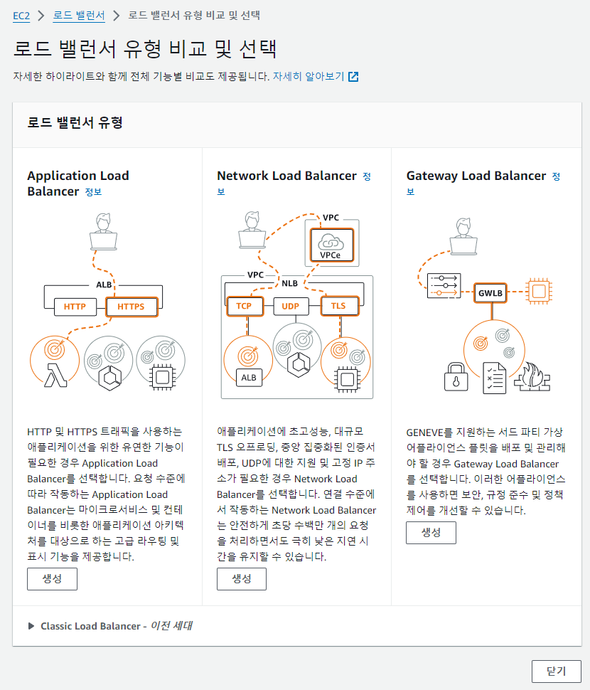  
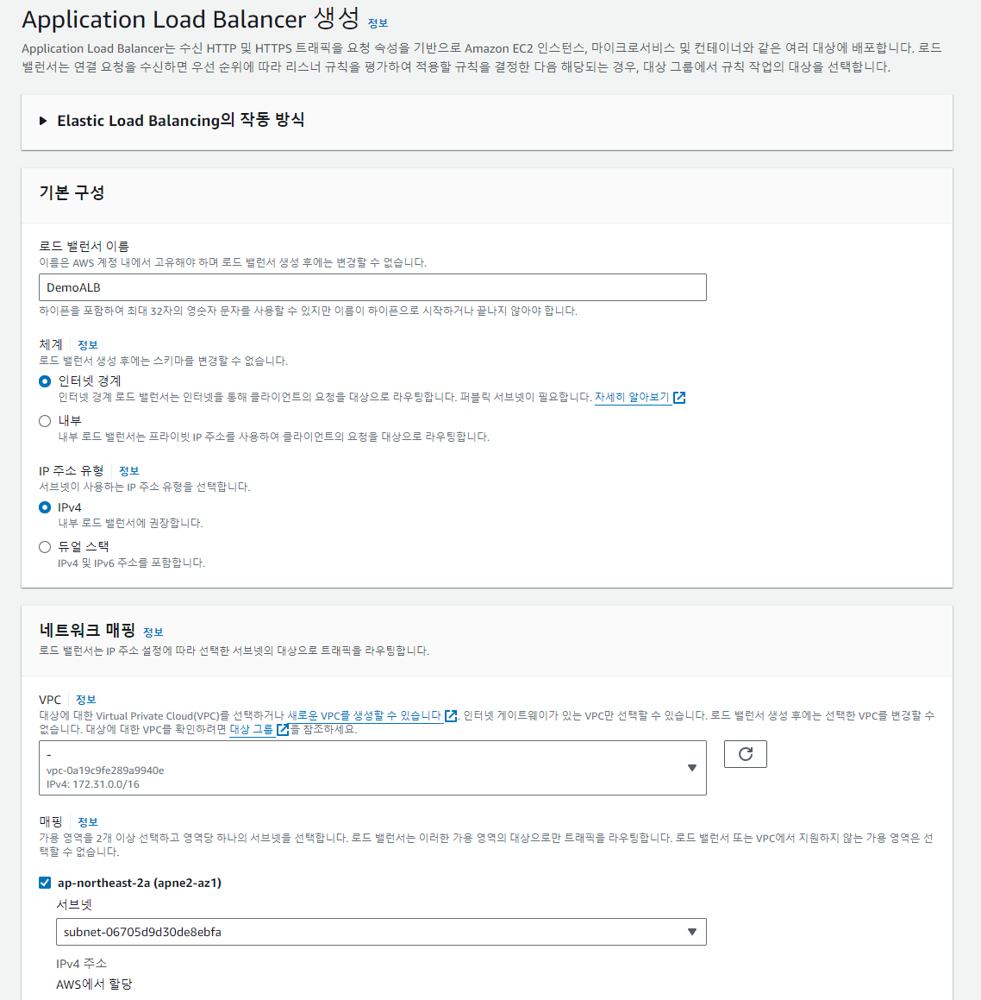  
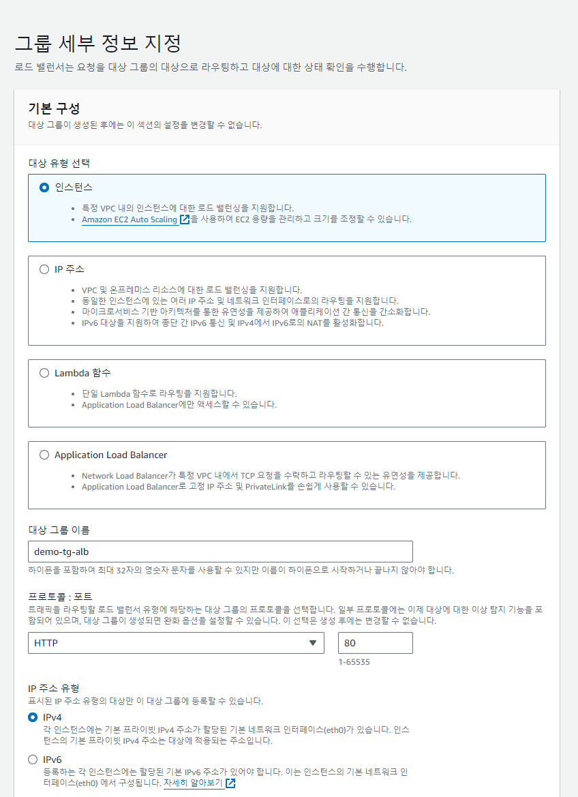  
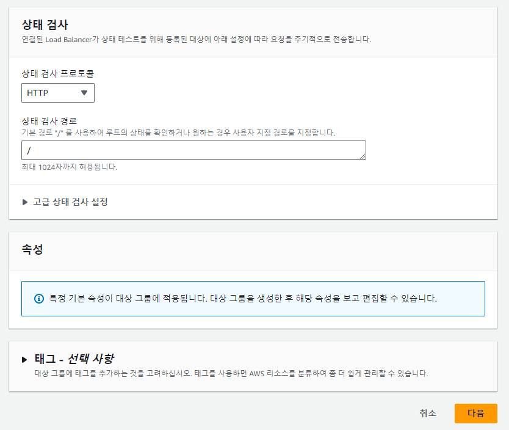  
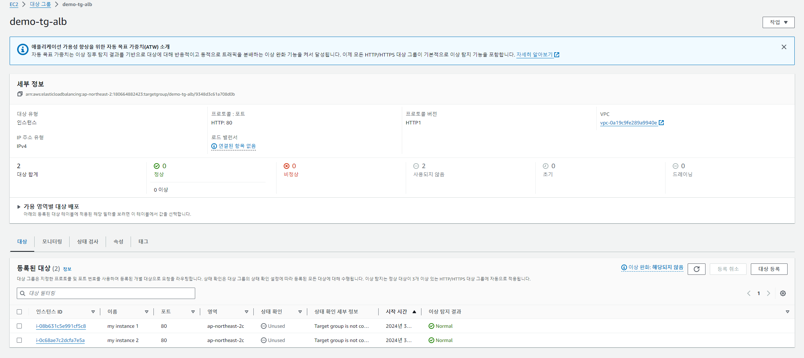  
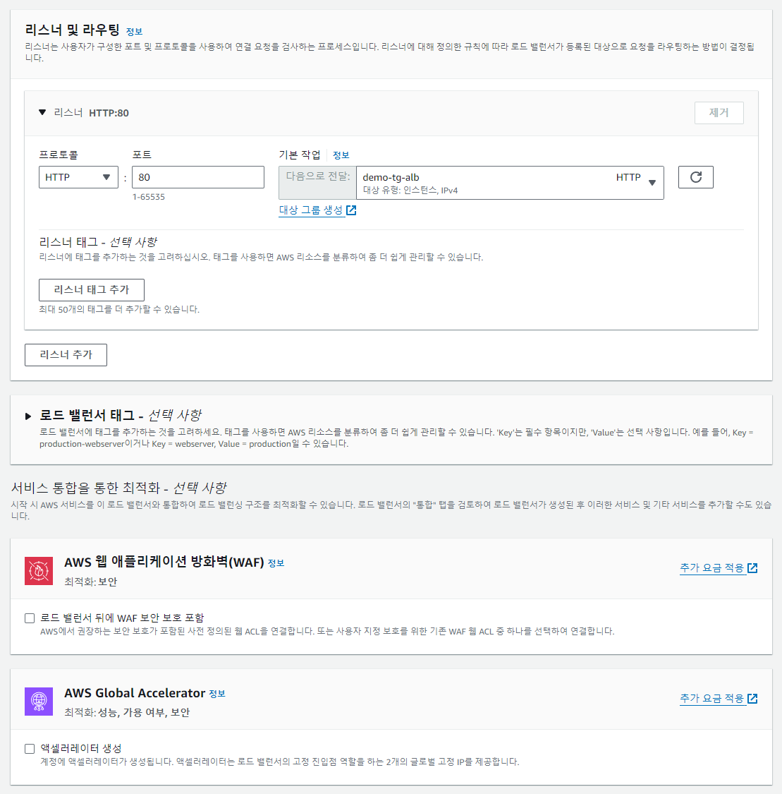  
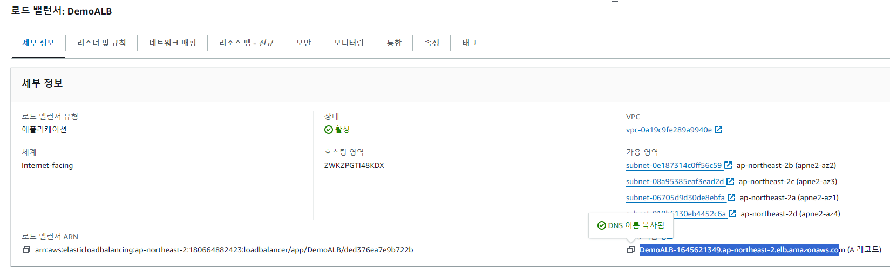  
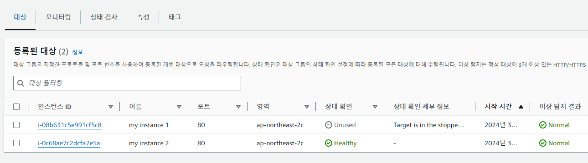  
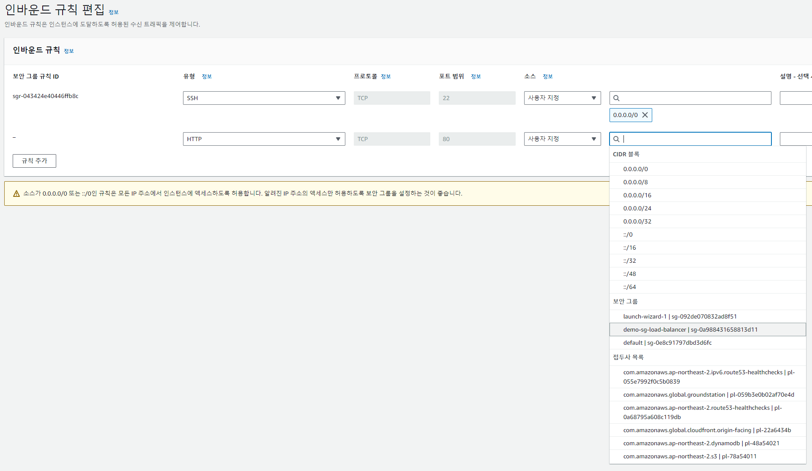  
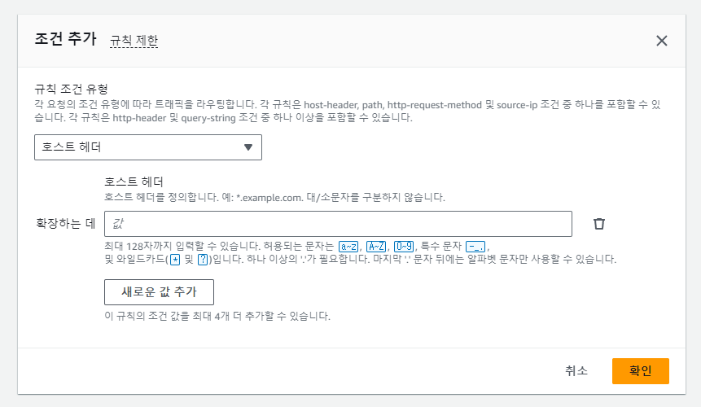  
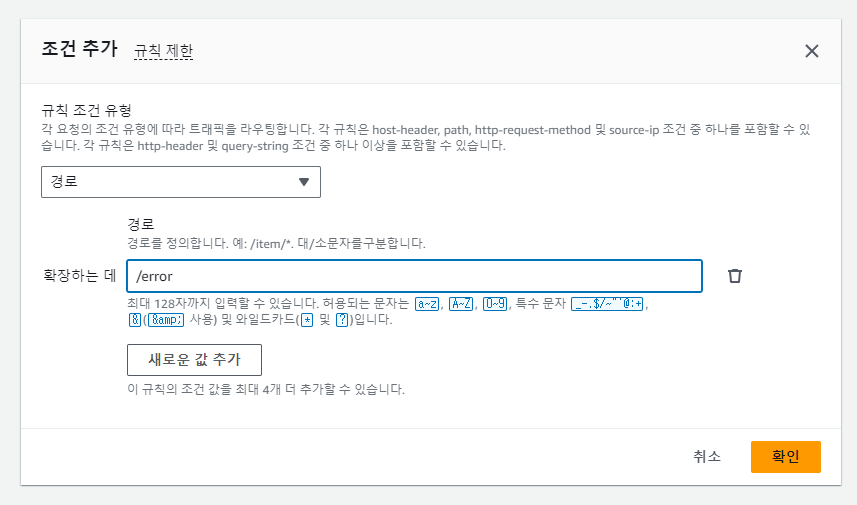  
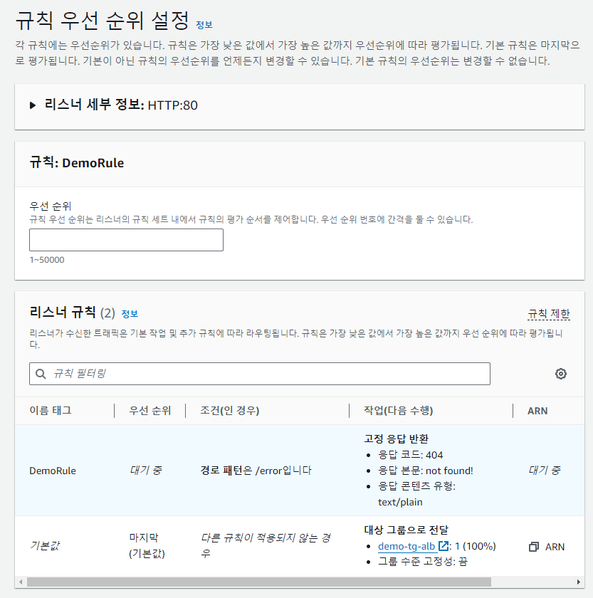  
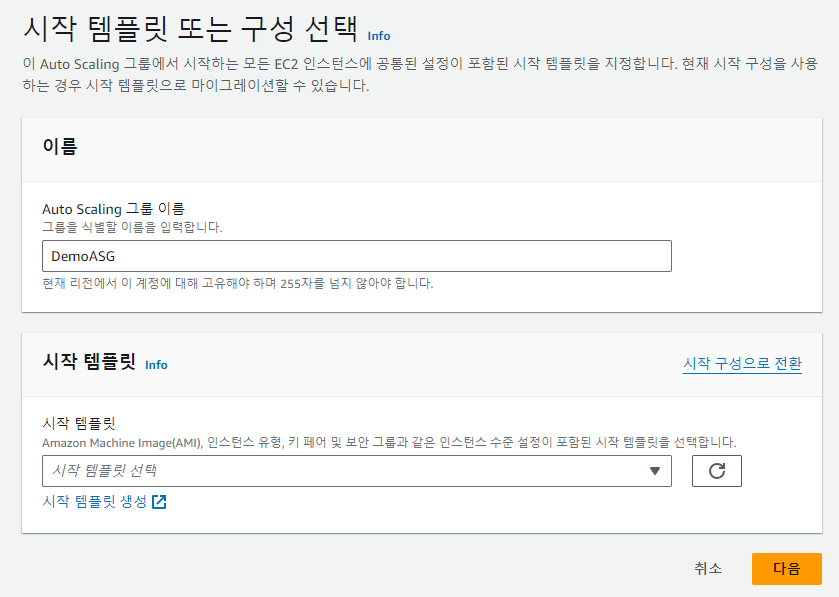  
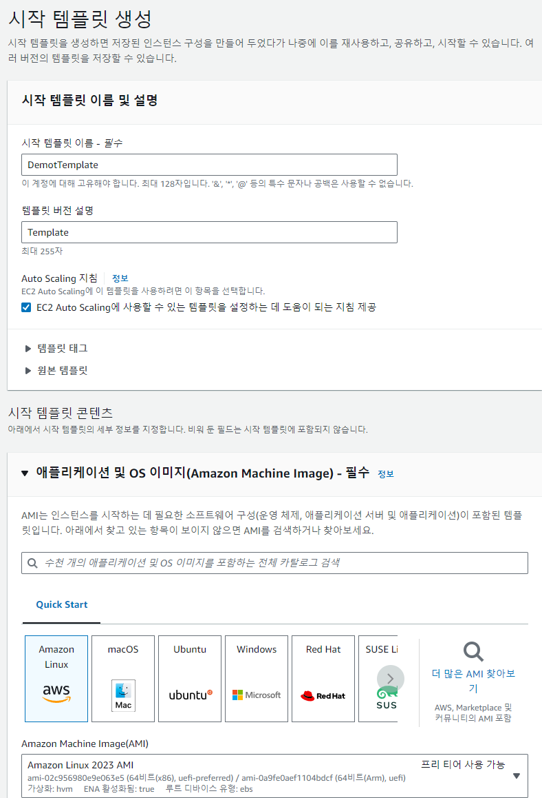  
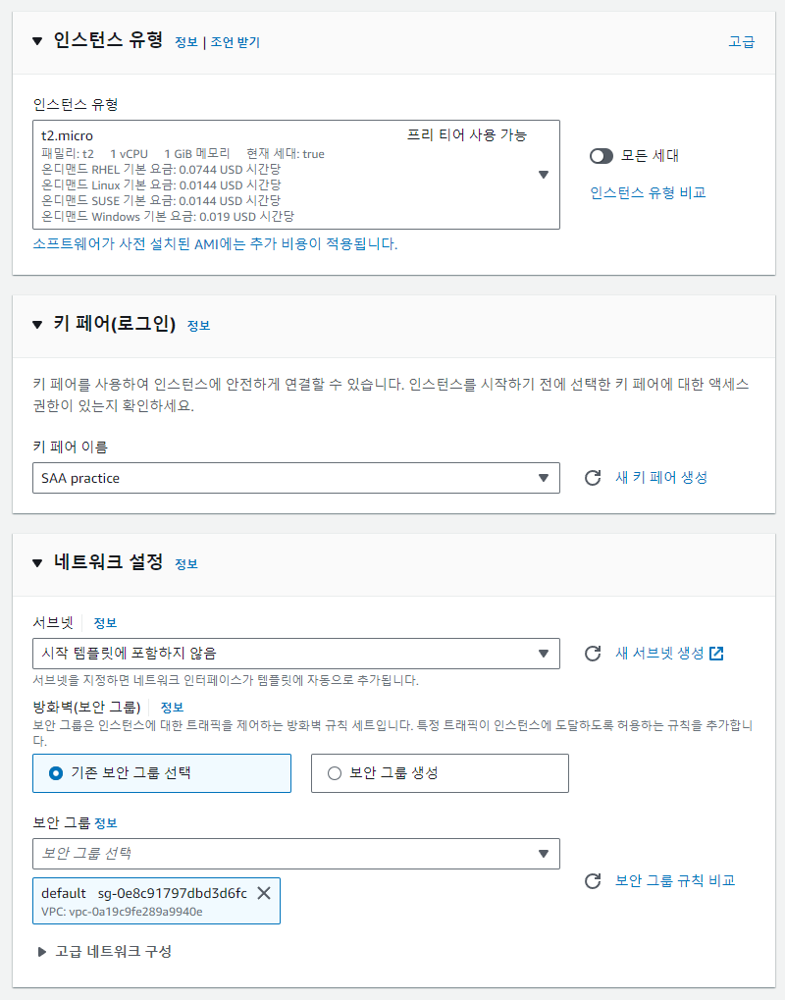  

## Source

- 『AWS Certified Cloud Solutions Architect』 *Stephane Maarek - 지음*  
  [https://www.udemy.com/course/best-aws-certified-developer-associate](https://www.udemy.com/course/best-aws-certified-developer-associate/)
