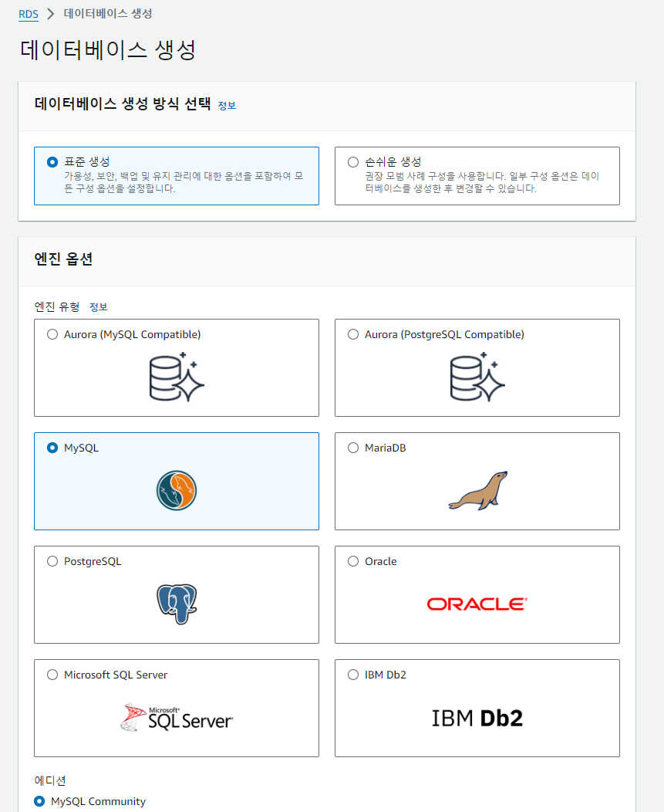
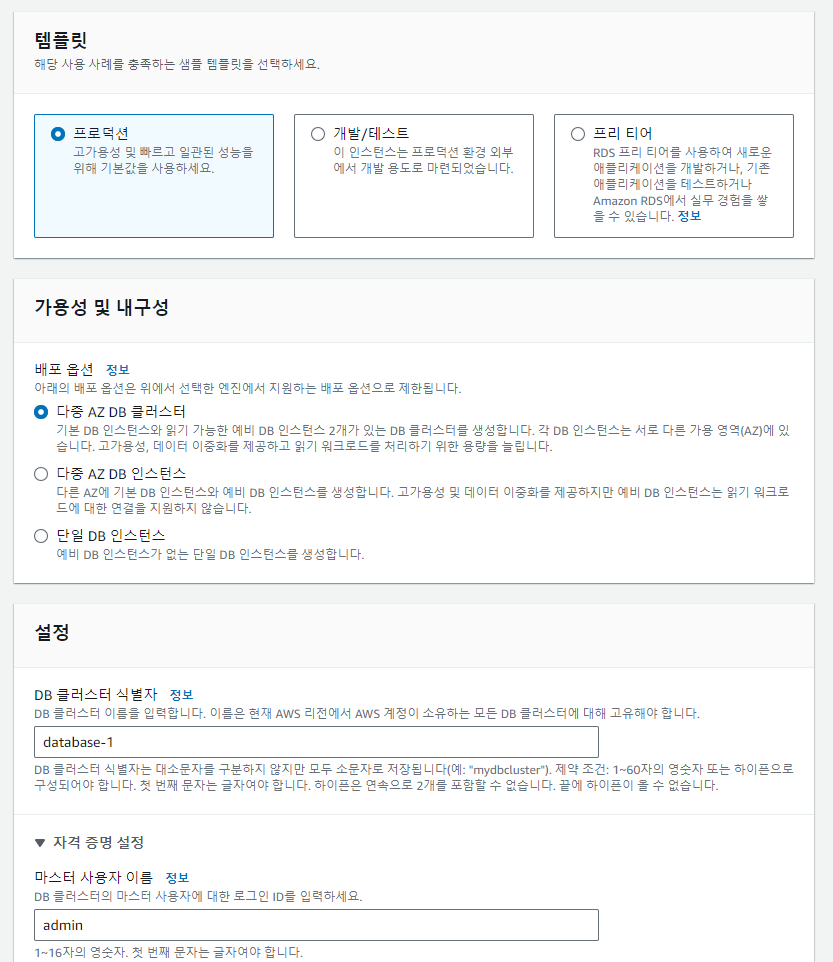
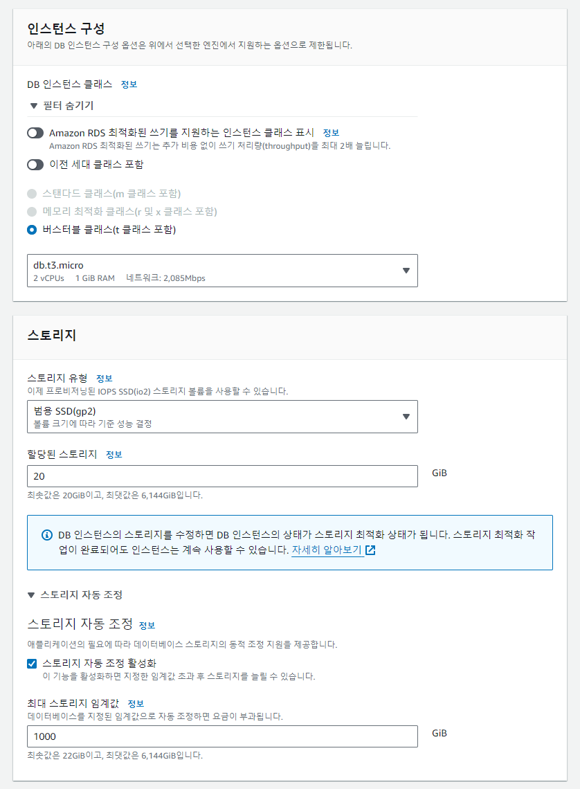
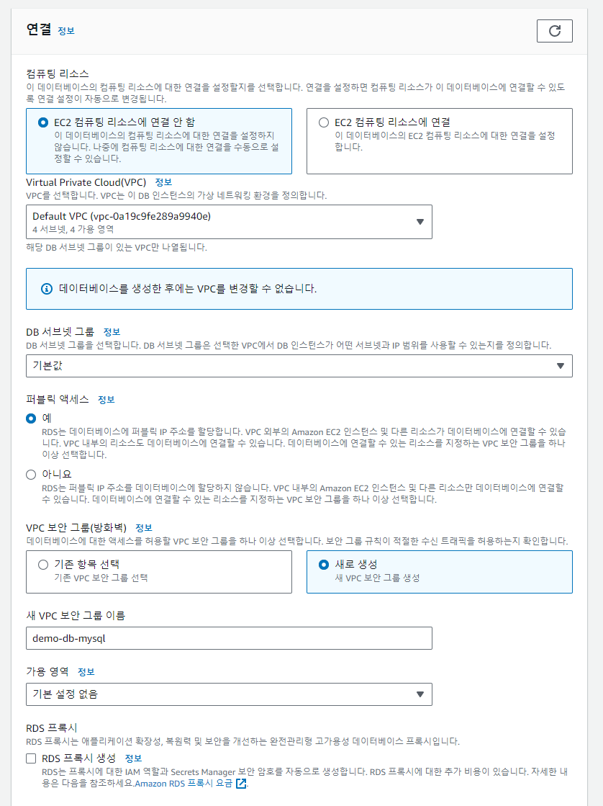
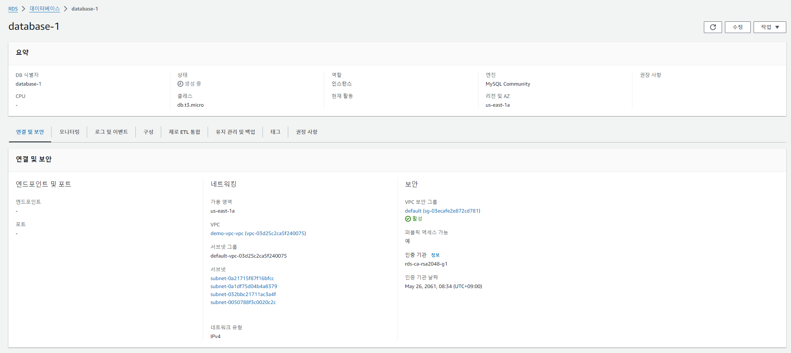
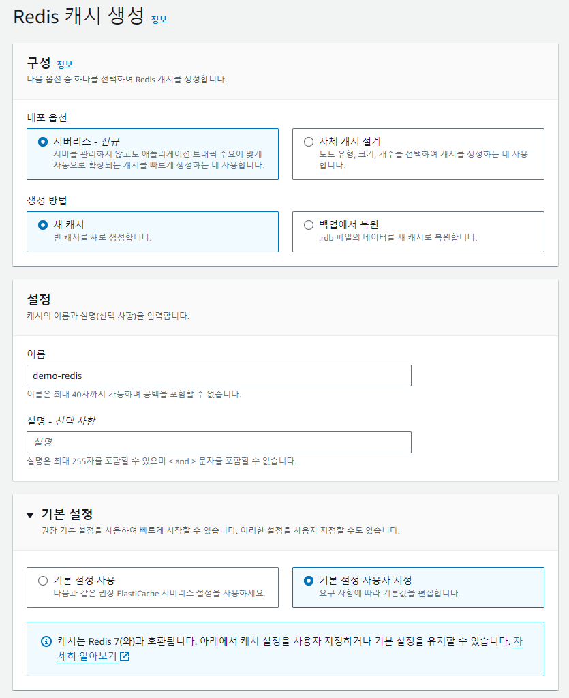
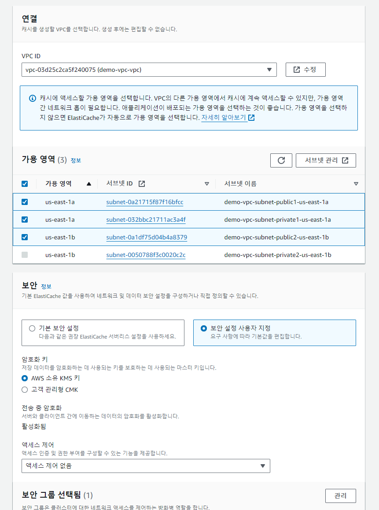

*본 포스트는 Udemy **AWS Certified SAA - Stephane Maarek** 강의를 일부 정리한 것입니다.*  
*상세한 정보는 [해당 강의](https://www.udemy.com/course/best-aws-certified-developer-associate/)를 참고하세요*

## RDS (Relational Database Servive) 
관계형 데이터베이스 서비스.  
SQL을 쿼리 언어로 사용.  
AWS가 DB를 관리한다.  
\
지원 DB:  
- PostgreSQL
- MySQL
- MariaDB
- Oracle
- Microsoft SQL Server
- Aurora

EC2 인스턴스 자체 DB 서비스를 배포하지 않는 이유는 RDS가 관리형 이기때문.  
프로비저닝, 기본 운영체제 패치, 타임 스탬프 복원 등.  
**RDS 인스턴스에 SSH 접근은 불가능하다!**

### RDS storage auto scaling
애플리케이션이 RDS 데이터베이스에서 읽기와 쓰기 작업을 많이 하면.  
임곗값에 도달, 자동으로 스토리지를 오토 스케일링.  
워크로드 예측이 힘든 애플리케이션에서 굉장히 유용하다.  
최대 스토리지 임곗값 설정필요.  
\
스토리지 자동 수정은:  
1. 남은 공간이 10% 미만  
2. 스토리지 부족 상태가 5분 이상 지속  
3. 지난 수정으로부터 6시간이 지났을 경우  

### RDS 읽기 전용 복제본

읽기를 스케일링 한다.  
- 읽기 전용 복제본은 최대 15개까지 생성 가능. 오로라 기준.
- AZ나 리전을 걸쳐서 생성 가능.
- 주 RDS 인스턴스와 읽기 전용 복제본 사이에서는 ASYNC 비동기식 복제.
- 읽기가 일관적으로 유지된다. 예시 참조.
- 읽기 전용 복제본을 데이터베이스로 승격도 가능.
- **SELECT 명령어만 사용가능하다!!**
- 읽기 전용 복제본은 같은 리전이라면 AZ가 달라도 네트워크 복제로 인한 이동 비용이 들지 않는다.
- AWS는 기본적으로 다른 가용 영역으로의 데이터 이동은 비용이 들지만 관리형 서비스는 예외.

#### 예시
기존의 Master RDS에 새로운 애플리케이션을 위한 워크로드가 발생할때.  
그대로 연결하면 오보로드와 기존 애플리케이션의 속도가 느려진다.  
여기서 읽기 전용 복제본을 만들고 비동기식 복제를 하면 복제본에서 읽기 작업 가능.  
기존 애플리케이션은 영향을 받지 않는다.  

### RDS 다중 AZ
주로 재해 복구에 사용된다.
- 동기식 SYNC 로 다른 AZ에 스탠바이 인스턴스로 복제. 
- Master RDS의 변경사항이 대기 인스턴스에 그대로 복제된다.
- **하나의 DNS** 이름을 갖고 애플리케이션도 하나의 DNS 이름으로 통신.
- Master에 문제가 생겨도 스탠바이 DB에 자동으로 장애조치 수행. 새로운 Master가 되도록.
- 가용성을 높일 수 있다.
- 스탠바이 DB는 단지 대기할 뿐 누구도 읽거나 쓰지 않는다.

다른 리전에 읽기 전용 복제본을 만들고 다중 AZ를 설정하면 특정 리전의 fail에도 신속하게 다른 리전에서 읽고 쓰기 작업이 가능하다.

단일 AZ에서 다중 AZ로의 전환이 가능한가?
- 가능하다. 다운타임 전혀 없이.
- 다중 AZ 기능을 활성화만 하면 스탠바이 DB가 생긴다.  
\
내부적인 과정
1. 기존 RDS가 자동으로 스냅샷 생성
2. 스냅샷이 새로운 스탠바이 DB에 복원
3. 스탠바이 DB가 복원되면 동기화가 설정되는 것.

### RDS custom
기저 운영체제나 사용자 지정 기능에 엑세스 가능.  
Oracle, Microsoft SQL Server 사용 가능.  
\
기능:
- 내부 설정 구성
- 패치 적용
- 네이티브 기능 활성화
- SSH와 SSM으로 인스턴스에 접근 가능
사용자 지정 설정을 위해서는 자동화나 스케일링 옵션 종료 추천.

### Amazon Aurora
- Postgres, MySQL과 호환가능.
- RDS MySQL보다 5배, Postgre보다 3배 높은 성능.
- 스토리지 자동 확장 기능. 10GB -> 128TB
- 읽기 전용 복제본 15개
- 클라우드 네이티브라 가용성 높음

#### Aurora 가용성
- 3개의 AZ에 6개의 복제본을 둔다.
- 쓰기에는 6개의 사본중 4개만 있으면 된다.
- 읽기는 6개의 사본중 3개만 있으면 된다.
- 작은 블록 단위로 확장 및 자가 복구. 백엔드에서 P2P를 활용.
- 수백개의 볼륨 활용
- master에 문제가 생기면 30초 이내 장애 조치 시작.
- 리전간 복제를 지원한다.
- 읽기 전용 복제본 자동 스케일링 가능하다.

#### Aurora DB Cluster
writer endpoint:   
- DNS 이름으로 마스터를 가리킨다.  
Reader endpoint:    
- 복제본의 위치와 URL 등을 확인 가능.
- 연결 로드 밸런싱에 도움을 줌.  
- 모든 읽기 전용 복제본과 연결됨.  
- 로드밸런싱이 문장(statement) 레벨이 아닌 연결 레벨에서 일어난다!  

#### Aurora 복제본 Auto Scaling
다른 목적의 (ex. 분석 쿼리) 커스텀 엔드 포인트 등을 DB 인스턴스와 연결하면,  
기존의 리더 엔드포인트는 사용하지 않게 된다.  
Aurora 복제본의 subset을 활용하도록.  

#### Aurora Serverless (서버리스)
- 자동화된 데이터베이스 예시화, Auto Scaling 제공
- 간헐적이고 예측 불가능한 업무량에 대응 가능
- capacity planning을 할 필요 없음
- 활용 Aurora 인스턴스마다 초당 비용 지불하여 비용 효율적

#### Aurora Global database
- 모든 읽기와 쓰기가 일어나는 하나의 기본 리전이 있다.
- 최대 5개의 보조 읽기 전용 리전 생성 가능. 응답 지연 1초 이하.
- 보조 리전당 최대 16개의 읽기 전용 복제본 사용 가능.
- 재해 복구시 다른 리전으로 변환하는데 1분 이내.
- 평균적으로 한 리전에서 다른 리전으로 데이터를 복제하는 1초 이하의 시간.

#### Aurora machine Learning
SQL 인터페이스를 통해 애플리케이션에 기계 학습 예측을 제공해준다.  
다른 AWS ML 서비스와 간단하고 최적화된 통합.  
1. SageMaker(ML 모델)
2. Amazon Comprehend(감정 분석)

### RDS 백업
자동 백업
- 자동으로 DB 전체 백업을 수행한다.  
- 5분마다 트랜잭션 로그가 백업. 즉, 가장 빠른 백업은 5분 전의 백업.
- 자동 백업 보존 기간은 1~35일 사이로 설정가능.
수동 DB 스냅샷
- 사용자가 수동으로 트리거
- 수동으로 한 백업을 원하는 기간동안 유지.
- DB를 중지해도 스토리지 비용은 계속 지불해야 한다.
- 이럴때는 스냅샷을 만든 후 원본 DB를 삭제하면 된다.
- 훨씬 저렴하다.

### Aurora 백업
자동 백업
- 비활성화 불가. 1~35일 백업 보존.
- 시점 복구 기능. 어느 시점으로든 복구 가능
수동(온디맨드) DB 스냅샷 백업
- 사용자가 수동으로 트리거
- 수동으로 한 백업을 원하는 기간동안 유지.

### RDS & Aurora 복원.
자동화된 백업이나 수동 스냅샷을 활용하여 새 데이터베이스 생성.  
\
S3로부터 DB 복구
- RDS의 경우, 온프레미스 db를 백업해서 S3에 저장하고 이를 RDS 인스턴스로 복원.
- MySQL Aurora 의 경우, Percona XtraBackup을 활용하여 온프레미스를 db를 백업하고 Aurora로 복원.

### Aurora DB 복제
기존의 Aurora 클러스터 DB에서 새로운 Aurora 클러스터를 생성.  
ex.) 테스트를 진행하고 싶을때. 기존 프로덕션 Aurora를 복제한 스테이징 Aurora를 만듬.
- 스냅샷 보다 빠르다. copy-on-write 프로토콜을 사용하기 때문.
- 처음에는 동일한 데이터 볼륨을 사용하다가 업데이트가 이루어지면 추가 스토리지가 할당되고 데이터가 복사 및 분리된다.
- 비용 효율적이고 프로덕션 DB에 영향이 없으며 스냅샷 및 복원 기능도 필요없다.
- 재해 복구 및 감사 목적으로 장기 백업에 좋다.

### RDS & Aurora 보안
데이터가 볼륨에 암호화.  
KMS를 사용해 Master와 모든 복제본의 암호화 (DB를 처음 실행 때 정의)  
Master 즉 주 DB를 암호화하지 않으면 읽기 전용 복제본을 암호화 불가.  
암호화 되어있지 않은 기존 데이터베이스를 암호화 -> 스냅샷을 가지고 와서 암호화 옵션을 키고 복원해야 한다.  

#### In-flight(전송중) 암호화
클라이언트가 AWS의 TLS 루트 인증서 사용

#### DB 암호화
- 사용자 이름과 패스워드 조합
- IAM role 역할 사용

#### 보안 그룹
특정 포트, IP, 보안그룹 허용 및 차단가능.

#### Audit logs 감사 로그
쿼리의 생성과 DB 작동 확인 가능.

#### TIP
RDS와 Aurora에는 SSH가 없지만, RDS 커스텀은 예외다.

### RDS proxy (프록시)
VPC 내에 RDS DB를 배포 가능 하지만,  
완전 관리형 RDS DB 프록시도 배포 가능.  
- 완전한 서버리스
- 오토스케일링 가능
- 다중 AZ 지원
- RDS와 Aurora의 장애 조치 시간을 66%까지 줄일수 있음.
- 애플리케이션 코드 변경이 필요없다. 
- IAM 인증을 강제할 수 있다. 
\
프록시가 필요한 이유:
- 애플리케이션이 DB내에서 DB연결 풀을 형성하고 공유 가능.
- 인스턴스에 일일이 연결하는 대신 프록시에 연결하면 인스턴스로 가는 연결을 줄일수 있다.
- CPU와 RAM 등 효율성을 향상시킬 수 있고
- 개방된 연결과 시간초과를 최소화
- 장애 조치시 각각 app 인스턴스가 직접 처리하는게 아니라 RDS 프록시가 db 인스턴스를 처리한다.

### RDS 프록시는 퍼블릭 액세스가 불가하다!. VPC 내에서만 가능.

## ElastiCache
캐싱 기술인 Redis 또는 Memcached를 관리.
- 매우 높은 성능과 짧은 지연 시간을 가진 인메모리 DB.
- DB 의 로드를 줄여줌. 일반적인 쿼리는 캐시에 저장.
- 캐시만 사용하여 쿼리의 결과를 검색 가능.
- 애플리케이션을 상태 stateless(비저장형)으로 만들어줌.
- AWS에서 매니징 해준다.
- ElastiCache 사용을 위해서는 애플리케이션 코드를 많이 바꿔야함.

### 캐싱 과정
ElastiCache 쿼리 - 캐시 히트 - DB이동 절약  
ElastiCache 쿼리 - 캐시 미스 - DB이동  

### 캐시 무효화 전략
가장 최신 데이터만 사용하기 위해.  

#### stateless(비저장형, 무상태) 
클라이언트와 서버 관계에서 서버가 클라이언트의 상태를 보존하지 않음.  

#### stateless 애플리케이션 상태
사용자가 어떤 애플리케이션에 로그인하면, 애플리케이션이 세션 데이터를 ElastiCache에 쓰기.  
다른 인스턴스로 리다이렉션 되면, 세션 캐시를 ElastiCache에서 직접검색 가능.  
사용자는 여전히 로그인 된 상태이다!  

### Redis vs Memcached
#### Redis
Key, Value 구조 데이터를 저장하고 관리하는 오픈 소스 기반의 비관계형 DBMS.  
인메모리 데이터 구조를 가지며 DB, 캐시, 메세지 브로커로 사용된다.  
- 다중 AZ 지원 (자동 장애 조치)
- 읽기 복제본 가능
- AOF를 사용한 데이터 내구성
- 백업 기능 지원
- set과 정렬된 set을 지원
  고유성과 요소 순서를 모두 보장
  요소가 추가될 때마다, 올바른 순서로 추가됨.
  예를 들어 실시간 리더보드를 구현할 수 있다.
  애플리케이션 측에서는 이 기능을 프로그램밍 할필요 없다. Redis에서 액세스 가능.
보안
- Redis에서만 IAM 인증을 지원. 나머지는 사용자 이름 비밀번호
- IAM 정책을 정의하면 AWS API 수준 보안에만 사용
- Redis AUTH이라는 Redis 내부 보안을 통해 비밀번호와 토큰을 설정. 보안 그룹에 추가하여서 더욱 보안.
- SSL 전송 중 암호화지원

#### Memcached
- 데이터 분할을 위해 멀티 노드를 사용(Sharding 샤딩)
- 고가용성, 복제가 없음
- 영구 캐시가 아님
- 백업 및 복원 없음
- 멀티 스레드 아키텍쳐
보안
- SASL 기반 승인 제공

### ElastiCache 패턴

1. Lazy loading(지연 로딩) 사용자가 필요로 하는 시점에 로딩  
   모든 데이터가 캐시되고 데이터가 캐시에서 지체 가능.  
   캐시 미스때만 데이터를 ElastiCache에 로드한다.  
2. Write Through
   DB에 데이터가 기록될 때마다 캐시에 데이터를 추가하거나 업데이트.  
   데이터가 지체되지 않음.  
3. 세션 스토어
   유지 시간 기능을 사용해 세션을 만료.  

### TIP
읽기 전용 복제본은 DNS 이름을 갖는 새로운 엔드 포인트를 추가.  
읽기 로드를 밸런싱하기 위해서는 애플리케이션이 개별적으로 참조를 하게끔 변경해야 함.  
다중 AZ는 활성화 상태의 데이터베이스 종류와 상관 없이 동일한 연결 문자열을 유지합니다.  

## 실습 이미지

  
  
  
  
  
  
  

## Source

- 『AWS Certified Cloud Solutions Architect』 *Stephane Maarek - 지음*  
  [https://www.udemy.com/course/best-aws-certified-developer-associate](https://www.udemy.com/course/best-aws-certified-developer-associate/)
