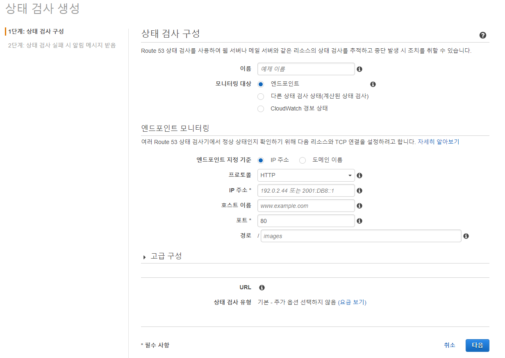

*본 포스트는 Udemy **AWS Certified SAA - Stephane Maarek** 강의를 일부 정리한 것입니다.*  
*상세한 정보는 [해당 강의](https://www.udemy.com/course/best-aws-certified-developer-associate/)를 참고하세요*

## DNS(Domain Name system)
호스트 이름 -(번역)-> 서버 IP 주소   
- 계층적 이름 구조 사용 (.com, google.com, ww.google.com)  
- Zone file : DNS 레코드 포함  
- Name server : DNS 쿼리를 해결  
- TLD(탑레벨 최상위 도메인) : com, .us, .in, .gov, .org  
- SLD(서브레벨 2단계 도메인) :  amazon.com, google.com  
http://api.www.example.com.  
- 주소 마지막 . 을 root 라고 한다.  
- .com 은 TLD
- example.com 은 SLD
- www.example.com 은 서브 도메인
- api.www.example.com 은 도메인 이름
- http 는 프로토콜
- 전체를 FQDN(Fully qualified domain name) 

## Route 53
완전히 관리되며 "권한있는" DNS. 
- 도메인 Registra로서 기능한다
- 고가용성, 확장성을 가짐
- 권한있다 = 사용자가 DNS 레코드 업데이트 가능
- 100% SLA(서비스 수준 협약서) 가용성을 제공한다.
- 53은 전통적인 DNS 포트이다.

### Route 53 DNS Record
각 레코드는 다음을 포함.
- 도메인, 서브 도메인 이름 : example.com
- 레코드 타입 : **A, AAAA, CNAME, NS**
- Value : 123.456.789.123
- TTL(Time To Live) : DNS resolver에서 레코드가 캐싱 되는 시간

#### A
호스트 이름과 IPv4 IP 매핑

#### AAAA
호스트 이름과 IPv6 IP 매핑

#### CNAME
호스트 이름을 다른 호스트 이름과 매핑  
대상 호스트 이름은 A나 AAAA 레코드  
**루트 도메인 이름이 아닌 경우에만 가능!!**  
상위 노드에 대한 CNAMES를 생성할 수 없음  
- example.com에 CNAME을 만들 수는 없다
- www.example.com에 대한 CNAME 레코드는 가능하다.
- www도 일종의 홈페이지를 위한 서브 도메인이라 할수 있다.

#### Alias (별칭 레코드)
Route53 한정 호스트 이름이 특정 AWS 리소스로 향하도록 할 수 있다.  
app.mydomain.com -> blabla.amazonaws.com  
- 루트 및 비루트 도메인 모두에 작동한다! Zone Apex  
- ALB등 AWS 리소스의 IP 변경을 자동으로 파악한다.  
- 별칭 레코드는 항상 AWS 리소스의 A/AAAA 이다.  
- TTL 설정 불가. AWS가 자동으로 관리.  
별칭 가능 대상  
- ELB
- Cloud Front
- S3
- Amazon API Gateway
- Elastic Bean stock

EC2 DNS 이름에 대해서는 별칭 레코드 설정 불가!

#### NS(Name servers)
호스팅 존의 이름 서버  
호스팅 존에 대한 DNS 쿼리에 서버 DNS 이름 또는 IP 주소로 응답  
트래픽이 도메인으로 라우팅 되는 방식을 제어  

#### 호스팅 존
레코드의 컨테이너.  
도메인, 서브도메인으로 가는 트래픽의 라우팅 방식을 정의.  
\
퍼블릭 호스팅 존
- 퍼블릭 도메인 이름을 구매해서 등록
- ex. application1.mypublicdomainname.com 의 IP 주소 쿼리 해결
프라이빗 호스팅 존
- 공개되지 않는 도메인 이름을 지원
- VPC만 해결 가능
- ex. application1.company.internal

### TTL (Time To Live)

DNS로부터 쿼리의 결과를 받을때, TTL을 받는다.  
TTL은 클라이언트에게 이 결과를 캐시하도록 요청.  
DNS 요청 쿼리를 계속해서 자주 보내는 상황을 방지.  
모든 레코드에 있어 필수적이지만, Alias(별칭 레코드)는 제외.  

### Routing Policies
DNS 쿼리에 응답하는 방법을 정의.  
트래픽은 DNS를 통과하지 않는다. 착각 없도록.  

#### simple 단순 라우팅 정책
일반적으로 트래픽을 단일 리소스로 보내는 방식.
- 별칭 레코드를 함께 사용하면 하나의 AWS 리소스만을 대상으로 지정.
- 상태 확인 (health check)는 불가능 하다.
- 다중 값을 사용하면 여러 임베딩된 주소를 보내주고 클라이언트가 랜덤으로 선택한다.
- 하지만 안전한 쿼리가 아닐수도. 비정상 리소스가 있을수 있으므로. 더 강력한 다중 값 라우팅 정책

#### weighted 가중치 라우팅 정책
가중치를 활용해 요청의 일부 비율을 특정 리소스로 보내기  
- 전체 합이 100이 아니여도 됨.  
- DNS 레코드들은 동일한 이름과 유형을 가져야 함.
사용 예시
- 서로 다른 지역들에 걸쳐 로드 밸런싱을 할 때
- 적은 양의 트래픽을 보내 새 애플리케이션을 테스트하는 할 때
- 가중치 0의 값을 설정해 특정 리소스 트래픽 중단하기.

#### Latency 지연 시간 라우팅 정책
지연 시간이 가장 짧은, 가장 가까운 리소스로 리다이렉팅  
- 지연 시간에 민감한 웹사이트나 애플리케이션에 좋다
- 유저가 가장 가까운 리전에 연결하는 시간을 기반으로 측정
- health check와 연결 가능

#### Failover 장애 조치 라우팅 정책
기본 인스턴스가 정상이면 Route 53도 기본 레코드로 응답  
상태 확인이 비정상이면 장애 조치에 도움이 되는 두 번째 레코드로 응답  

#### Geolocation 지리 위치 라우팅 정책
사용자의 실제 위치를 기반  
사용 사례
- 콘텐츠 분산 제한
- 웹사이트 현지화
- 예를 들어 프랑스면 프랑스 지역의 인스턴스 IP로, 독일이면 독일로

#### IP 기반 라우팅 정책
클라이언트의 IP 범위, CIDR(Classless Inter-Domain Routing) 목록 정의  
CIDR = 클래스 없는 도메인간 라우팅 기법. 인터넷 주소를 원래 IP 주소 체계보다 더욱 능동적으로 할당.
- IP를 미리 알고 있기에, 성능 최적화 및 네트워크 비용 절감 가능.
- 사용자가 특정 CIDR 블록 (서브넷 ex. 203.0.113.0/24 -> 203.0.113.0 ~ 203.0.113.255) 으로 들어오면 인스턴스 1,2,3,4에 전달.

#### Mutiple value 다중 값 라우팅 정책
트래픽을 다중 리소스로 라우팅할 때 사용.
- 상태 확인과 연결하면 각각의 다중 값 쿼리에 최대 8개의 정상 레코드가 반환.
- 따라서 안전한 쿼리가 가능
- ELB와 유사해 보이지만 ELB를 대체할 수는 없다. 클라이언트 측면에서의 로드밸런싱.

#### Geoproximity 지리 근접 라우팅
사용자와 리소스의 지리적 위치를 기반으로 라우팅  
- 편향값을 사용해 특정 위치를 기반으로 더 많은 트래픽을 이동
- 특정 리소스에 더 많은 트래픽을 보내려면 편향값을 증가시켜서 확장
- 리소스에 트래픽을 줄이려면 편향값을 음수로 축소
- 리소스는 AWS 를 사용하거나 온프레미스라면 위도와 경도 지정
- 편향 활용을 위해 고급 Route 53 트래픽 플로우를 사용
- bias 0 vs 50인 경우 분할선이 0 쪽으로 움직인다.
**지리 근접 라우팅은 편향을 증가시켜 한 리전에서 다른 리전으로 트래픽을 보낼 때 유용**

### Heath Check (상태 확인)
DNS 장애 조치에 사용 가능.
- HTTP 상태 확인은 **public 리소스**에 대해서만 가능.
- 전 세계에서 온 15개의 상태 확인이 엔드 포인트를 확인하고 임계값을 정상 혹은 비정상으로 설정
- 200 OK 코드 또는 사전 정의한 코드면 리소스는 정상으로 간주
- 30초마다 확인 or 10초마다 확인 (빠른 상태 확인)
- 18% 이상의 상태 확인이 엔드 포인트를 정상 판단하면 Route 53도 정상 간주
- 상태 확인은 로드 밸런서로부터 2xx나 3xx의 코드를 받아야만 통과
- 텍스트 기반 응답일 경우 처음 5,120바이트를 확인
- **상태 확인의 작동이 가능하려면 상태 확인이 애플리케이션 밸런서나 엔드 포인트에 접근이 가능해야 한다**

### 계산된 상태 확인
여러 개의 상태 확인 결과를 하나로 합쳐주는 기능
- 상태 확인들을  합치기 위한 조건은 OR AND NOT
- 하위 상태 확인을 256개까지 모니터링

### 개인 리소스의 상태 확인
- 모든 Route 53의 상태 확인은 공용 웹, VPC의 외부다!!
- 개인 엔드 포인트에 접근 불가
- CloudWatch 지표를 만들어 알람으로 문제를 해결
- ALARM 상태가 되면 상태 확인은 자동으로 비정상

### Domain Registra vs DNS service
도메인 레지스트라를 통해 원하는 도메인 이름을 구매.  
Amazon을 사용해도 되고, 다른 회사를 사용해도 된다.  
보통 레지스트라로 도메인을 사면 DNS 레코드 관리 서비스를 제공한다.  
도메인을 다른 회사에서 구매하고 Amazon의 Route 53으로 관리해도 된다!  
1. Route53 에서 공용 호스팅 영역 생성
2. 도메인을 구입한 타 사이트에서 NS(네임 서버)를 업데이트

## 실습 이미지

  
  
  

## Source

- 『AWS Certified Cloud Solutions Architect』 *Stephane Maarek - 지음*  
  [https://www.udemy.com/course/best-aws-certified-developer-associate](https://www.udemy.com/course/best-aws-certified-developer-associate/)
