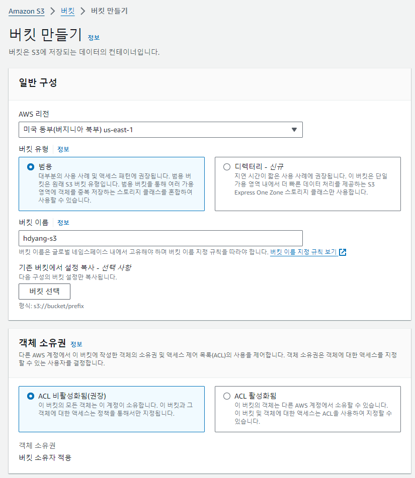
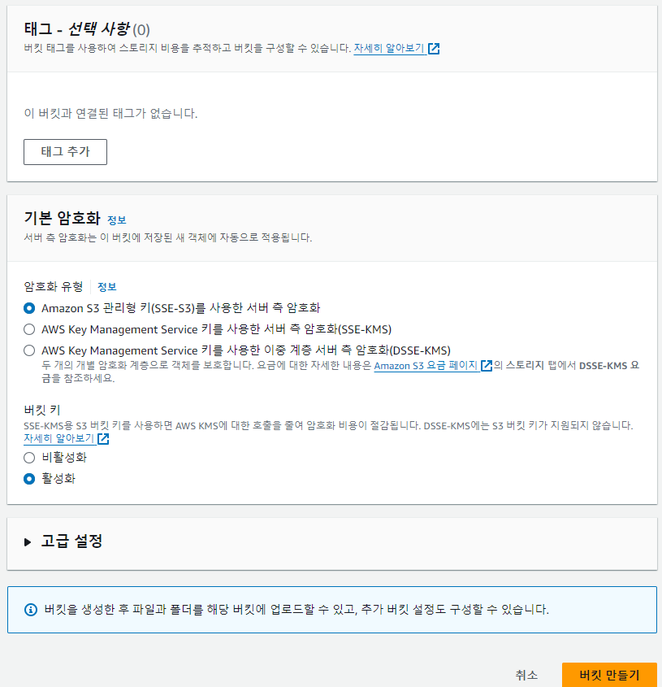
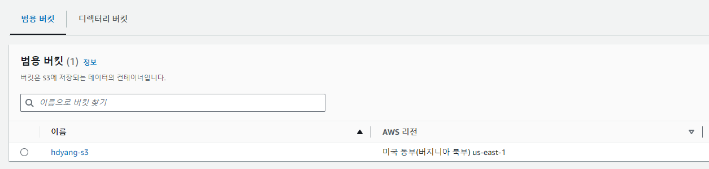
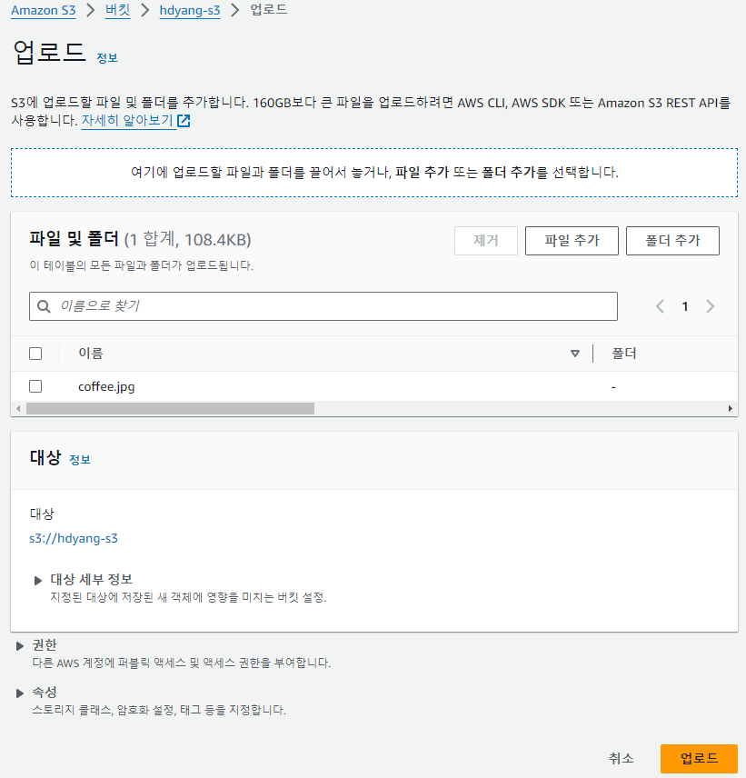
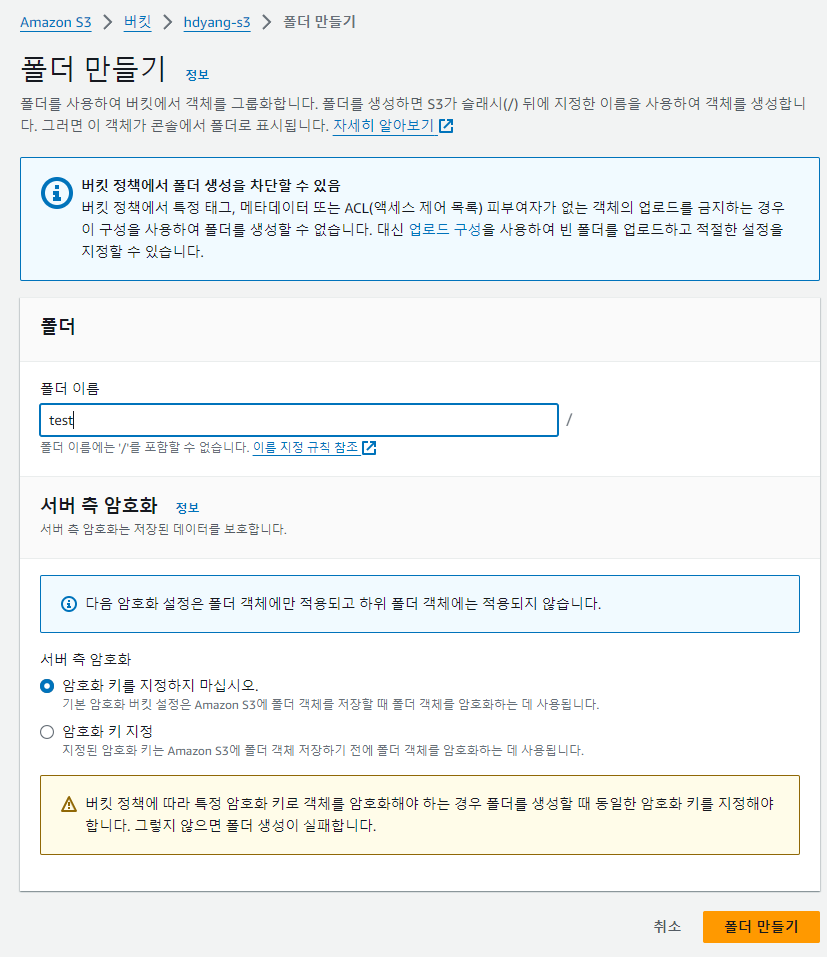
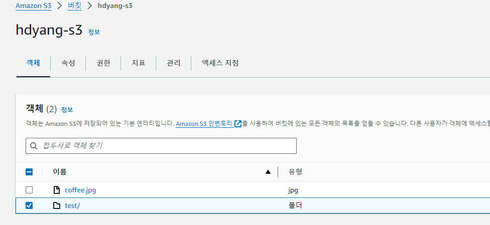
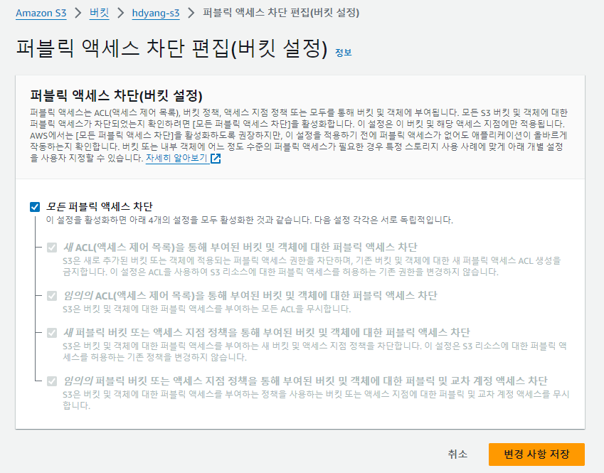
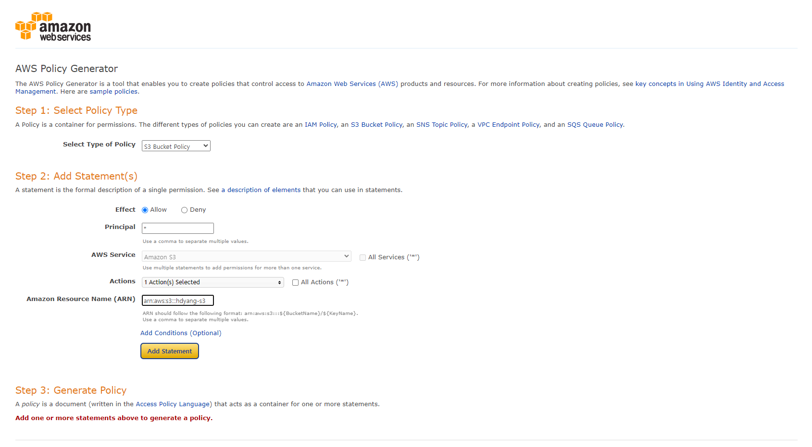
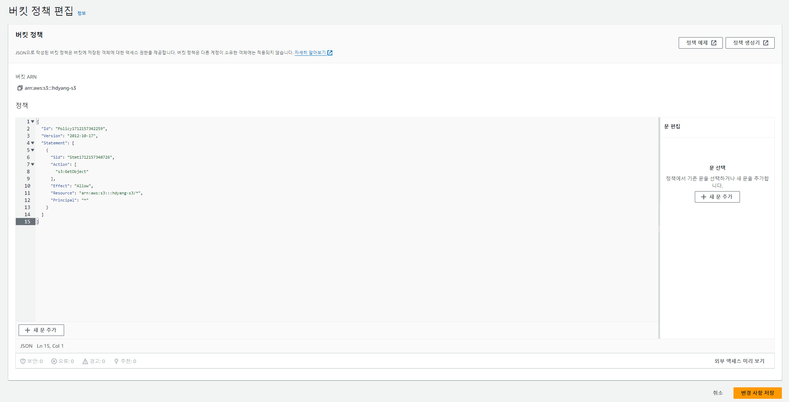
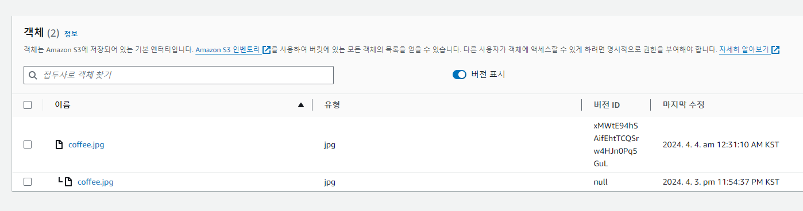

*본 포스트는 Udemy **AWS Certified SAA - Stephane Maarek** 강의를 일부 정리한 것입니다.*  
*상세한 정보는 [해당 강의](https://www.udemy.com/course/best-aws-certified-developer-associate/)를 참고하세요*

## S3
백업과 스토리지로 활용  
파일, 디스크, 재해 복구, 아카이브, 하이브리드 클라우드 스토리지,  
애플리케이션 및 이미지 호스팅, 빅데이터, 정적 웹사이트 등등

### Buckets 버킷
S3가 파일을 저장하는 곳.
- 상위 레벨 디렉토리로 표시.
- 버킷 안의 파일은 객체라고 한다.
- 계정 안에 생성되며, 전역적(모든 리전 포함)으로 고유한 이름이 있어야 한다.
- 즉, 내가 아닌 다른 사람이 사용하는 이름도 안된다
- **리전 수준에서 정의된다. 전역 서비스가 아니다!! 전역적 고유 이름은 필요하지만**
- 네이밍 컨벤션이 존재한다.

#### Object(객체)
- 키가 존재. 
- 키 = 파일 전체 경로. 접두사(상위 경로) + 오브젝트 이름 으로 구성
- 값의 본문은 내용.
- 최대 객체 크기는 5TB
- 5GB보다 파일이 크면 멀티파트 업로드를 사용.
- 메타데이터 = 키, 값 쌍 리스트
- 태그 = 보안과 수명주기

### S3 보안
#### User-Based 사용자 기반
IAM 정책 : 어떤 API 호출이 특정 IAM 사용자를 위해 허용되는지를 승인
#### 리소스 기반 보안
S3 버킷 정책
- S3 콘솔에서 직접 할당할 수 있는 전체 버킷 규칙
- 특정 사용자나 다른 계정 사용자 허용 가능
- 버킷을 공개로 만드는 방법이기도 함
#### 객체 ACL(액세스 제어 목록)
- 세밀한 보안, 비활성화 가능
#### 버킷 ACL(액세스 제어 목록)
#### 암호화 키 사용

### S3 버킷 정책
- JSON 기반 정책
- 리소스 블록 : 이 정책이 적용되는 버킷과 객체 정의
- Effect(결과) : 작업의 허용과 거부
- Action(작업) : ex. GetObject
- Principal(원칙) : 정책을 적용할 계정 또는 사용자.

블록 공개 액세스 설정을 해제하지 않으면 공개 되지 않는다. 유출 방지.

### S3 정적 웹사이트 호스팅
웹 사이트를 호스팅하고 인터넷 접속이 가능하게 만든다.  
403 에러가 난다면 버킷이 공개가 아니라는 뜻

### S3 버전관리
- 버킷 수준에서 활성화해야 하는 설정
- 파일을 업로드할 때마다 선택키에서 파일 버전 생성
- 동일한 키를 업로드하고 해당 파일을 덮어쓰는 경우 버전 2, 3 등을 생성
- 의도하지 않은 삭제를 방지하고 롤백이 가능하다.
- 버전 관리를 활성화하기 전 모든 파일은 널(null) 버전
- 버전 관리를 중단해도 이전 버전을 삭제 x

### S3 복제
- 소스 버킷과 복제 대상 버킷 둘 모두 버전 관리 기능이 활성화.
- 복제 과정은 백그라운드에서 일어나며 비동기식으로 진행.
- IAM으로 읽기, 쓰기 권한을 S3에 부여해야 함.
- 복제를 활성화한 후에는 새로운 객체만 복제 대상!
- 기존의 객체를 복제하려면 S3 배치 복제 기능 사용
- 삭제는 삭제 마커만 복제 가능하다.
- 체이닝 복제는 불가
#### CRR 교차 리전 복제
두 리전이 달라야 한다.
- 법규나 내부 체제 관리
- 다른 리전에 있어 발생할 수 있는 지연 시간 줄이기
- 계정간 복제
#### SRR 같은 리전으로 복제
두 리전이 같아야 한다.
- 다수의 S3 버킷 로그를 통합 
- 개발 환경이 별도로 있어 운영 환경으로의 실시간 복제

### S3 스토리지 클래스
- 객체를 생성할 때 클래스를 선택 가능
- 혹은 스토리지 클래스를 수동으로 수정
- 수명 주기 구성을 사용해 스토리지 클래스 간에 객체를 자동으로 이동 가능
#### Standard
- 범용 목적
- 가용성 99.99%
- 자주 액세스하는 데이터에 사용
- 지연 시간이 짧고 처리량이 높다
- 두 개의 기능 장애를 동시에 버틸 수 있다
사용 사례:
1. 빅데이터 분석
2. 모바일과 게임 애플리케이션
3. 콘텐츠 배포
#### Standard IA (Infrequent Access)
- 자주 액세스하지는 않지만 필요한 경우 빠르게 액세스해야 하는 데이터
- Standard 보다 비용은 적지만 검색 비용이 발생한다
-  가용성 99.9%
사용 사례:
1. 재해 복구
2. 백업
#### One Zone Infrequent Access
- 단일 AZ 내에서는 높은 내구성을 갖지만 AZ가 fail 할시 데이터 잃음
-  가용성 99.5%
사용 사례:
1. 온프레미스 데이터를 2차 백업
2. 재생성 가능한 데이터를 저장
####  Glacier Storage Classes
- 콜드 스토리지
- 아카이빙과 백업을 위한 저비용
하위 클래스
1. Glacier Instant Retrieval   
   밀리초 단위 검색
   ex. 분기에 한 번 액세스하는 데이터에 적합
   최소 보관 기간이 90일
2. Glacier Flexible Retrieval  
   Expedited - 데이터 받기 1-5분  
   Standard - 데이터 받기 3-5시간  
   Bulk - 데이터 받기 5-12시간 (무료)  
3. Glacier Deep Archive  
   12시간 Standard, 48시간 Bulk

#### S3 Intelligent Tiering
사용 패턴에 따라 액세스된 티어 간에 객체를 이동
- FrequentAccess 기본 티어
- Infrequent Access 30일 동안 액세스하지 않는 객체
- Archive Instant Access 90일 동안 액세스하지 않는 객체
- Archive Access 90일에서 700일
- Deep Archive Access 180일에서 700일

### S3 스토리지 클래스간 이동
Lifecycle Rule (라이프 사이클 규칙) 설정
1. Transition Actions  
   다른 스토리지 클래스로 이전하기 위해 객체를 설정  
   생성된 지 60일 후 Standard로 이전, 또는 6개월 후에 Glacier로 이전  
2. Expiration actions  
   만료 시간 뒤에 객체를 삭제  
   액세스 로그 파일 365일 후에 삭제  
   버저닝과 같이 사용하여 모든 파일 버전을 삭제  
   불완전한 멀티파트 업로드를 삭제  
   버킷의 특정한 경로나 태그에 대해 삭제 가능  

ex. 섬네일은 빈번히 액세스하는 게 아니고 쉽게 재생성, One-Zone IA에 두고 60일 후에 만료 삭제

#### 예시 문제
30일 동안은 삭제된 S3 객체를 즉각적으로 복구.  
이후에는 최장 365일 동안 삭제된 객체를 48시간 이내에 복구.  
S3 버저닝 활성화해서 객체 버전 보관. 삭제 마커로 감췄다가 그 다음에 복구.  
이후 객체를 Standard IA로 이동.  

### 최적의 객체 클래스 이전 일수 설정
Amazon S3 Analytics 활용  
Standard나 Standard IA에 관한 추천사항을 제시  
One-Zone IA나 Glacier와는 호환 안됨  

### S3 Requester pays 요청자 지불

소유자가 여전히 버킷의 객체 스토리지 비용을 부담하지만,  
요청자가 객체를 다운로드하면 이제 그 요청자가 다운로드와 관련된 네트워킹 비용을 지불.  
대량의 데이터 셋을 다른 계정과 공유하려고 할 때 매우 유용.  
요청자가 익명이면 안된다. AWS 인증을 받아야 한다.  

### S3 Event Notifications 이벤트 알림
이벤트 : 객체 생성, 삭제, 복구 등
- 이벤트 알림을 만들고 전송
- SNS 토픽이나 SQS Queue, 람다 함수 등을 알람 타깃으로 한다.
- 통상적으로 몇 초에서 몇분 까지
-  IAM 권한 필요, 각 기능마다 액세스 정책 설정
- IAM 역할이 아닌 리소스 액세스 정책을 정의한다 (S3 버킷 정책과 유사)

이벤트를 Amazon EventBridge로 보낼수 있다!  
이를 통해 고급 필터링과 다수 전송 가능

### S3 퍼포먼스
- S3는 요청이 많을 때 자동 확장
- 지연시간 100~200 밀리초
- 초당 3,500개의 PUT/COPY/POST/DELETE 5,500개의 GET/HEAD 요청을 지원
- 버킷 내에서 접두사 수에 제한이 없다

#### 접두사
bucket/folder1/sub1/file  
bucket과 file 사이에 있는 것이 접두사  
/folder1/sub1  

#### 최적화 방법
멀티파트 업로드
- 100MB가 넘는 파일은 멀티파트 업로드 권장
- 5GB가 넘는 파일은 반드시 사용
- 업로드를 병렬화, 전송 속도를 높여 대역폭을 최대화
- 모든 파트가 업로드되면 자동으로 모든 파트를 합쳐 다시 하나의 큰 파일로 만든다
Transfer acceleration 전송 가속화
- 파일을 AWS 엣지 로케이션으로 전송해서 전송 속도 높이기
- 엣지 로케이션 까지는 public 엣지에서 버킷 까지는 private 네트워크로
- 퍼블릭 인터넷 사용을 최소로 하고 프라이빗을 최대화
- 데이터를 대상 리전에 있는 S3 버킷으로 전달
- 멀티파트 업로드와 같이 사용 가능

### S3 byte range fetches 바이트 범위 가져오기
파일을 수신하고 읽는 가장 효율적인 방법.  
다운로드 속도를 높이고 싶을때! 혹은 데이터의 일부분(헤더)만가져올때.  
파일에서 특정 바이트 범위를 가져와서 GET 요청을 병렬화  
실패한 경우에도 더 작은 바이트 범위에서 재시도 -> 복원력 높음  

### S3 Select, Glacier Select
SQL 문에서 간단히 행과 열을 사용해 필터링  
네트워크 전송이 감소, 데이터 검색과 필터링에 드는 클라이언트 측의 CPU 비용도 감소.  

### S3 Batch Operations
단일 요청으로 기존 S3 객체에서 대량 작업 수행
- 한 번에 많은 S3 객체의 메타데이터와 프로퍼티 수정
- 배치 작업으로 S3 버킷 간에 객체를 복사
- S3 버킷 내 암호화되지 않은 모든 객체를 암호화
- ACL이나 태그를 수정
- 한 번에 많은 객체를 복원
- S3 Inventory로 객체 목록을 가져오고 S3 Select로 필터링

## 실습 이미지

  
  
  
  
  
  
  
  
  
  

## Source

- 『AWS Certified Cloud Solutions Architect』 *Stephane Maarek - 지음*  
  [https://www.udemy.com/course/best-aws-certified-developer-associate](https://www.udemy.com/course/best-aws-certified-developer-associate/)
