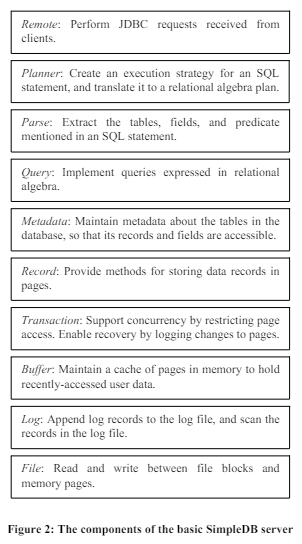

과거 데이터베이스개론 수업을 들으며 진행했던 DB 개선 과제를 복습겸 정리했습니다.

## 1. SimpleDB란? (주의! AWS SimpleDB아님)

Boston College의 Edward Sciore 교수님이 논문으로 발표한 Java 기반의 다중 사용자 DB입니다.  
주로 교육용으로 자주 사용됩니다! 관련 논문은 다음과 같습니다.  
[SimpleDB: a simple java-based multiuser syst for teaching database internals](https://dl.acm.org/doi/10.1145/1227504.1227498)

  
SimpleDB 컴포넌트 구조


## 2. SimpleDB 실행 방법 (Embedded mode)


```bash
# 데이터베이스 테이블/레코드 생성
$ cd	$SDBHOME/target $	java	-cp	./simpledb-project-1.0.0.jar	simpleclient.embedded.CreateStudentDB
# 데이터베이스 내 레코드 확인
$	java	-cp	./simpledb-project-1.0.0.jar	simpleclient.embedded.StudentMajor
# 데이터베이스 삭제
$	cd	$SDBHOME/target/studentdb $	rm	–i *.tbl
# Interactive shell을 실행
$ cd $SDBHOME/target $ java	-cp	./simpledb-project-1.0.0.jar	simpleclient.SimpleIJ
```

## 목표: Improving Buffer Manager (LRU, midpoint-insertion policy)
SimpleDB의 vanila buffer manager는 다음과 같은 한계점이 존재한다.
1. buffer replace 정책에서 항상 맨 앞에오는 unpinned buffer만 사용한다.
2. 이미 buffer에 있는 블록을 확인할때 단순히 선형 탐색만 한다. 
buffer manager를 수정하여 위의 2가지 정책을 조금더 효율적으로 바꿀수 있는 LRU policy, midpoint-insertion policy를 구현해보자. midpoint-insertion policy는 다음 포스트에서 다룬다.
향상된 성능은 hit ratio 성능로 확인.


## 구현 및 테스트

### 1. Buffer 클래스 필수 구현 항목
각 버퍼 객체는 자신의 buffer ID를 알 수 있어야 한다. 생성자에서 buffer ID를 가리키는 3번째 매개변수가 있어야한다. getID() 메소드를 통해 buffer ID를 반환받을 수 있도록 한다.

Buffer.java
```java
public class Buffer {
   private FileMgr fm;  /* File manager */
   ...(생략)
   private int bid;
// 버퍼 내에서 buffer ID를 가리키는 변수 bid를 추가한다.

public Buffer(FileMgr fm, LogMgr lm, int bid) {
      this.fm = fm;
      this.lm = lm;
      this.bid = bid;
      contents = new Page(fm.blockSize());
   }
// 생성자에서 buffer ID를 가리키는 3번째 매개변수를 추가한다.

public int getID() {
      return bid;
   }
// 자신의 buffer ID를 반환하는 getID() 메소드를 구현한다.

public VanillaBufferMgr(FileMgr fm, LogMgr lm, int numbuffs) {
      ...(생략)
      for (int i=0; i<numbuffs; i++)
         bufferpool[i] = new Buffer(fm, lm, i);
   }

public LRUBufferMgr(FileMgr fm, LogMgr lm, int numbuffs) {
      ...(생략)
      for (int i=0; i<buff_size; i++)
         unpin_buffer.add(new Buffer(fm, lm, i));
   }
```
위의 버퍼 클래스 생성자 변화에 따라, 버퍼 매니저에서도 새로운 n개 버퍼 생성시 BlockID를 0~n-1까지 할당한다.


### 2. VanillaBufferMgr 클래스 필수 구현 항목
printStatus() 메소드를 호출하면 자신의 현재 상태를 나타내야한다.
```java
public void printStatus(){
    /* Write your code */
      System.out.println("Allocated Buffers:");
      for (Buffer buff : bufferpool){
         System.out.print("Buffer " + buff.getID()+ ": " );
         String is_pin = "unpinned";
         if (buff.block() != null)
            System.out.print(buff.block().toString()+ " "); 
         if (buff.isPinned()) 
            is_pin = "pinned";
         System.out.println(is_pin); 
      }
   }
   ```
각 버퍼의 ID, block, pinnedStatus를 출력한다. buff.block()의 경우 BlockId의 toString() 메소드를 호출하여 [filename, blkID] string을 만들어 낸다. 아직 버퍼가 할당되지 않았을 경우, BlockId는 비어있으므로 해당 부분은 출력하지 않았다.

getHitRatio() 메소드 호출 시 현재 버퍼의 hit ratio를 나타낸다.
```java
public class VanillaBufferMgr implements BufferMgr {
   ...(생략)
   private int hit_cnt;
   private int reference_cnt;
// hit ratio 계산에 활용되는 두 변수를 할당해 준다.

public synchronized Buffer pin(BlockId blk) {
      try {
         long timestamp = System.currentTimeMillis();
         Buffer buff = tryToPin(blk);
         while (buff == null && !waitingTooLong(timestamp)) {
            wait(MAX_TIME);
            buff = tryToPin(blk);
         }
         if (buff == null)
            throw new BufferAbortException();
         else {reference_cnt++;}
         return buff;
      }
      catch(InterruptedException e) {
         throw new BufferAbortException();
      }
   }
```
reference cnt는 블럭을 pin하려는 경우, 해당 블럭 반환이 성공적일 때만 증가한다. 따라서 tryToPin(blk) 를 했을때 반환되는 buff가 널이 아닌경우, 즉 성공했을 경우에만(에러가 아닌 경우) reference_cnt++;를 해주었다.
```java
private Buffer tryToPin(BlockId blk) {
      Buffer buff = findExistingBuffer(blk);
      if (buff == null) { // not find in buffer
         buff = chooseUnpinnedBuffer();
         if (buff == null)
            return null;
         buff.assignToBlock(blk);
      }
      else { // find in buffer
         hit_cnt++; 
      } 
      if (!buff.isPinned())
         numAvailable--; // new allocate becaues not in buffer
      buff.pin();
      return buff;
   }
```
hit cnt는 현재 버퍼풀에 pin하고자 하는 블럭이 있을 경우 증가하므로, findExistingBuffer(blk)의 결과값이 널이 아닐때, 즉 찾았을 때만 hit_cnt++로 증가시켜 주었다.
```java
import java.math.BigDecimal;
import java.math.RoundingMode;
...(생략)
public float getHitRatio() {
    /*Write your code */
   //  System.out.println(hit_cnt+" / "+reference_cnt); 
    float hit_ratio = ((float)hit_cnt / (float)reference_cnt) * 100;
    BigDecimal hit_ratio_bd = new BigDecimal(hit_ratio);
    BigDecimal hit_ratio_bd_r2 = hit_ratio_bd.setScale(2, RoundingMode.HALF_UP);
    return hit_ratio_bd_r2.floatValue();
}
```
Hit ratio: buffer hit cnt/reference cnt * 100 (%) 공식에 따라 계산한 값을 반환하는 메소드이다. Round to two decimal places를 충족하기위해 BigDecimal과 RoundingMode를 사용하였다. 기존의 float형태의 hit_ratio을 BigDecimal(hit_ratio)로 변환하고, setScale(2, RoundingMode.HALF_UP)을 통해 소숫점 2자리까지 반올림 해주었다. 반환할때는 다시 floatValue()로 변환하여 리턴한다.


### 3. LRUBufferMgr 필수 구현 항목

※ LRUBufferMgr 구현에 있어 VanillaBufferMgr의 메소드 tryToPin(), findExistingBuffer(), chooseUnpinnedBuffer() 등을 재활용 하였다.

Unpinned buffer의 리스트를 따로 관리한다. Allocated buffer들에 대해 map을 유지한다
```java
public class LRUBufferMgr implements BufferMgr {

   private LinkedList<Buffer> unpin_buffer;
   private HashMap<BlockId,Buffer> alloc_buffer;
   ...(생략)
public LRUBufferMgr(FileMgr fm, LogMgr lm, int numbuffs) {
      ...(생략)
      unpin_buffer = new LinkedList<Buffer>();
      alloc_buffer = new HashMap<BlockId,Buffer>();

      for (int i=0; i<buff_size; i++)
         unpin_buffer.add(new Buffer(fm, lm, i));
   }
```
위와 같이 LinkedList<Buffer> 클래스를 사용하여 unpin_buffer를 만들고, HashMap<BlockId,Buffer> 를 활용하여 alloc_buffer를 만들었다. alloc_buffer의 경우 과제 명세 설명 " Keep a map of allocated buffers, keyed on the block they contain." 처럼 map의 일종인 hashmap을 활용했으며, BlockId를 key로 하여 Buffer를 value로 담도록 하였다.
2) Unpinned buffer 작동
```java
private Buffer chooseUnpinnedBuffer() {
      if (unpin_buffer.size() > 0){
         Buffer buff = unpin_buffer.getFirst();
         unpin_buffer.removeFirst();
         return buff;
      }
      return null;
   }
```
과제 명세 설명 "When a replacement buffer is needed, remove the buffer at the head of the list and use it." 를 위와 같이 구현하였다. chooseUnpinnedBuffer()를 통해 replacement buffer가 요청되면, unpin_buffer에서 getFirst()를 통해 가장 앞에 있는 버퍼(head)를 반환한다. 단, 반환하기 전에 removeFirst()통해 버퍼에서 지운다.
```java
public synchronized void unpin(Buffer buff) {
      buff.unpin();
      if (!buff.isPinned()) {
         unpin_buffer.addLast(buff);
         notifyAll();
      }
   }
```
과제 명세 설명 "When a buffer’s pin count becomes 0, add it to the end of the list." 를 위와 같이 구현하였다. 버퍼의 pin count가 0이 되는 순간은 unpin을 할때 발생한다. 이때 buff.isPinned()가 false 라면, 즉, pin count가 0이라면 addLast(buff)를 통해 unpin_buffer의 마지막에 버퍼를 넣어준다.
```java
private Buffer tryToPin(BlockId blk) {
      Buffer buff = findExistingBuffer(blk);
      if (buff == null) { // not find in buffer
         buff = chooseUnpinnedBuffer();
         if (buff == null)
            return null;
         alloc_buffer.remove(buff.block());
         buff.assignToBlock(blk);
         alloc_buffer.put(blk,buff);
      }
      else { // find in buffer
         hit_cnt++;
      }
      unpin_buffer.remove(buff);
      buff.pin();
      return buff;
   }
```
과제 명세 설명 "Use LRU policy" 를 위와 같이 구현하였다. LRU 정책에 따라, unpin되어있는 버퍼가 touch 될 경우 리스트에서 뽑은 다음 맨 마지막으로 순서를 바꿔줘야 한다. 단, 여기서 touch는 pin을 의미하므로, 결국 해당 버퍼는 Unpinned buffer에서 빠지게 된다.

Allocated buffer 구현
```java
public LRUBufferMgr(FileMgr fm, LogMgr lm, int numbuffs) {
      ...(생략)
      unpin_buffer = new LinkedList<Buffer>();
      alloc_buffer = new HashMap<BlockId,Buffer>();

      for (int i=0; i<buff_size; i++)
         unpin_buffer.add(new Buffer(fm, lm, i));
   }

private Buffer tryToPin(BlockId blk) {
      Buffer buff = findExistingBuffer(blk);
      if (buff == null) { // not find in buffer
         buff = chooseUnpinnedBuffer();
         if (buff == null)
            return null;
         alloc_buffer.remove(buff.block());
         buff.assignToBlock(blk);
         alloc_buffer.put(blk,buff);
      }
      else { // find in buffer
         hit_cnt++;
         System.out.println("hit buff id: "+buff.getID()+" block: "+buff.block().toString()); 
      }
      unpin_buffer.remove(buff);
      buff.pin();
      return buff;
   }
```
과제 명세 설명  "A buffer starts out unallocated. It becomes allocated when it is first assigned to a block and stays allocated forever after. When a buffer is firty allocated, it must be added to map. When a buffer is replaced, the map must be changed. the mapping for the old block must be removed, and the mapping for the new block must be added."을 위와 같이 구현하였다.  

최초 Constructor에서는 모든 버퍼가 아직 할당 전이므로 unpin_buffer에만 등록되고 alloc_buffer는 비어있다. 이후 tryToPin()에서 현재 버퍼에 없을때 실제로 첫 할당이 이루어진다.  
여기서, remove()의 경우에는 해시 맵에 있을때만 해당 원소가 제거되므로, 최초 등록시에는 put()만 작동하여 무조건 alloc_buffer에 버퍼가 등록된다. 따라서 "It becomes allocated when it is first assigned to a block"가 충족된다.  
그리고 한번 등록되면 그 이후로는 remove()와 put()이 쌍으로 작동하므로 "mapping for the old block must be removed, and the mapping for the new block must be added"를 수행하며, "allocated forever after" 도 충족한다(지우고나서 항상 다시 등록하므로).
```java
private Buffer findExistingBuffer(BlockId blk) {
      if (alloc_buffer.containsKey(blk)) {
         Buffer buff = alloc_buffer.get(blk);
         return buff;
      }
      return null;
   }
```
과제 명세 설명 "Use a map to determine if a block is currently in the buffer." 을 위와 같이 구현하였다. findExistingBuffer()를 통해 현재 alloc_buffer에 버퍼가 있는지 확인하며, alloc_buffer.containsKey(blk) 가 참이라면 해당 blk에 해당하는 버퍼를 반환한다. 만약 없다면, null을 반환한다.

printStatus() 구현
```java
public void printStatus(){
      System.out.println("Allocated Buffers:");
      for (BlockId i : alloc_buffer.keySet()){
         Buffer buff = alloc_buffer.get(i);
         String is_pin = "unpinned";
         if (buff.isPinned()) is_pin = "pinned";
         System.out.println("Buffer " + buff.getID() + ": " + buff.block().toString() + " " + is_pin);
      }
      System.out.print("Unpinned Buffers in LRU order: ");
      for(Buffer buff : unpin_buffer)
		System.out.print(buff.getID() + " ");
	System.out.println();
   }
```
과제 명세 설명 "Map 내의 각 버퍼의 ID, block, pinnedStatus, unpinned list의 buffer"에 따라 위와 같이 구현하였다. alloc_buffer Map에 존재하는 모든 key들에 대해 value, 즉 버퍼들을 불러와서 해당 버퍼들의 정보를 출력한다. buff.block().toString()을 활용하였다. unpinned buffer의 경우, 앞에서 부터 순차적으로 순회하며 값들을 출력하도록 하였다.

getHitRatio() 구현
```java
public synchronized Buffer pin(BlockId blk) {
      try {
         long timestamp = System.currentTimeMillis();
         Buffer buff = tryToPin(blk);
         while (buff == null && !waitingTooLong(timestamp)) {
            wait(MAX_TIME);
            buff = tryToPin(blk);
         }
         if (buff == null)
            throw new BufferAbortException();
         else {reference_cnt++;}
         return buff;
      }
      catch(InterruptedException e) {
         throw new BufferAbortException();
      }
   }

private Buffer tryToPin(BlockId blk) {
      Buffer buff = findExistingBuffer(blk);
      if (buff == null) { // not find in buffer
         buff = chooseUnpinnedBuffer();
         if (buff == null)
            return null;
         alloc_buffer.remove(buff.block());
         buff.assignToBlock(blk);
         alloc_buffer.put(blk,buff);
      }
      else { // find in buffer
         hit_cnt++;
      }
      unpin_buffer.remove(buff);
      buff.pin();
      return buff;
   }
public float getHitRatio() {
      float hit_ratio = ((float)hit_cnt / (float)reference_cnt) * 100;
      BigDecimal hit_ratio_bd = new BigDecimal(hit_ratio);
      BigDecimal hit_ratio_bd_r2 = hit_ratio_bd.setScale(2, RoundingMode.HALF_UP);
      return hit_ratio_bd_r2.floatValue();
   }
```
getHitRatio()의 경우, VanillaBufferMgr와 동일하게 적용했다. tryToPin(blk) 를 했을때 반환되는 buff가 널이 아닌경우, 즉 성공했을 경우에만(에러가 아닌 경우) reference_cnt++;가 되고, findExistingBuffer(blk) 의 결과값이 널이 아닐때, 즉 원하는 블럭을 찾았을 때만 hit_cnt++가 된다. 최종적으로는 cnt/reference cnt * 100 (%) 공식과 BigDecimal과 RoundingMode를 사용해 소숫점 2자리까지 반올림하여 리턴한다.

기타 구현
위에 소개되지 않았으나, LRU 구현에 사용한 부분들을 정리하였다.
```java
public synchronized int available() {
        return unpin_buffer.size();
   }
```
VanillaBufferMgr 에서는 버퍼 중에서 pinned 되어 있지 않은 버퍼들에 대해 numAvailable 변수를 따로 관리한다. 해당 값은 pin을 할때 새로운 버퍼가 할당되면 감소하고, 기존의 버퍼가 unpin 되면 감소한다. LRUBufferMgr에서는 이러한 변수가 따로 필요없다. Unpinned buffer 자체가 해당 역할을 하며, 해당 리스트의 길이가 결국 가능한 버퍼의 수를 뜻하기 때문이다. 따라서 available() 에서는 size()를 반환했다.
```java
   public synchronized void flushAll(int txnum){

      for (BlockId i : alloc_buffer.keySet()){
         Buffer buff = alloc_buffer.get(i);
         if (buff.modifyingTx() == txnum)
         buff.flush();
      }

      for (Buffer buff : unpin_buffer){
         if (buff.modifyingTx() == txnum)
         buff.flush();
      }
   }
```
VanillaBufferMgr 에서는 flushAll()을 진행하면 버퍼풀에 있는 모든 버퍼에 대해 buff.modifyingTx() == txnum를 만족하면 buff.flush();를 진행한다. LRUBufferMgr 에서는  Unpinned buffer, Allocated buffer 속 모든 버퍼에 대해서 flush()를 하도록 하였다.
```java
private static final long MAX_TIME = 10000;

private boolean waitingTooLong(long starttime) {
      return System.currentTimeMillis() - starttime > MAX_TIME;
   }

public synchronized Buffer pin(BlockId blk) {
      try {
         long timestamp = System.currentTimeMillis();
         Buffer buff = tryToPin(blk);
         while (buff == null && !waitingTooLong(timestamp)) {
            wait(MAX_TIME);
            buff = tryToPin(blk);
         }
         if (buff == null)
            throw new BufferAbortException();
         else {reference_cnt++;}
         return buff;
      }
      catch(InterruptedException e) {
         throw new BufferAbortException();
      }
   }
```
기존 VanillaBufferMgr와 동일하게, LRUBufferMgr에서도 MAX_TIME을 정해서 일정 시간 이상 tryToPin()에 실패할 경우 에러를 발생시키도록 하였다. 

### 4. 테스트
Buffer
getID() 테스트
```java
public class BufferMgrTest {
   public static void main(String[] args) throws Exception {
      SimpleDB db = new SimpleDB("buffermgrtest", 400, 4, "vanilla");
      BufferMgr bm = db.bufferMgr();

      Buffer[] buff = new Buffer[6]; 
      buff[0] = bm.pin(new BlockId("testfile", 0));
      buff[1] = bm.pin(new BlockId("testfile", 1));
      buff[2] = bm.pin(new BlockId("testfile", 2));
      buff[3] = bm.pin(new BlockId("testfile", 3));

      for (Buffer buf : buff){
         if (buf != null)
            System.out.println("bid: " + buf.getID());
      }
   }
}
결과
bid: 0
bid: 1
bid: 2
bid: 3
```
ID가 잘 출력되는 것을 확인할 수 있다.

VanillaBufferMgr
printStatus() 테스트
```java
public class BufferMgrTest {
   public static void main(String[] args) throws Exception {
      SimpleDB db = new SimpleDB("buffermgrtest", 400, 4, "vanilla");
      BufferMgr bm = db.bufferMgr();

      Buffer[] buff = new Buffer[6]; 
      buff[0] = bm.pin(new BlockId("test", 0));
      buff[1] = bm.pin(new BlockId("test", 1));
      buff[2] = bm.pin(new BlockId("test", 2));
      buff[3] = bm.pin(new BlockId("test", 3));
      bm.unpin(buff[2]); 
      buff[0] = null;
      bm.unpin(buff[0]); 
      buff[2] = null;

      bm.printStatus();
   }
}
결과
Allocated Buffers:
Buffer 0: [file test, block 0] unpinned
Buffer 1: [file test, block 1] pinned
Buffer 2: [file test, block 2] unpinned
Buffer 3: [file test, block 3] pinned
```
과제 명세과 동일하게 잘 출력된다.

getHitRatio() 및 예제 코드 테스트
```java
public class BufferMgrTest {
   public static void main(String[] args) throws Exception {
      SimpleDB db = new SimpleDB("buffermgrtest", 400, 3, "vanilla"); // only 3 buffers
      BufferMgr bm = db.bufferMgr();

      Buffer[] buff = new Buffer[6]; 
      buff[0] = bm.pin(new BlockId("testfile", 0));
      ...(생략)

      System.out.println("hit ratio: " + bm.getHitRatio());
   }
}
결과
Available buffers: 0
Attempting to pin block 3...
Exception: No available buffers

Final Buffer Allocation:
buff[0] pinned to block [file testfile, block 0]
buff[3] pinned to block [file testfile, block 0]
buff[4] pinned to block [file testfile, block 1]
buff[5] pinned to block [file testfile, block 3]
hit ratio: 33.33
```
중간에 try가 실패한 buff[5] = bm.pin(new BlockId("testfile", 3))를 제외하면 총 6번의 pin에 대한 성공적인 반환이 존재한다. 따라서 reference cnt = 6. 그리고 bm.pin(new BlockId("testfile", 0)) 과 bm.pin(new BlockId("testfile", 1)) 에서 현재 버퍼풀에 존재하는 블럭을 요청하였으므로 2번의 hit이 발생한다. 따라서  hit ratio = 2 / 6 = 33.3333 이되고, 두자리 반올림에 따라 33.33이 성공적으로 반환이 된다.

### LRUBufferMgr

printStatus() 테스트
```java
public class BufferMgrTest {
   public static void main(String[] args) throws Exception {
      SimpleDB db = new SimpleDB("buffermgrtest", 400, 4, "lru");
      BufferMgr bm = db.bufferMgr();

      Buffer[] buff = new Buffer[6]; 
      buff[0] = bm.pin(new BlockId("test", 0));
      buff[1] = bm.pin(new BlockId("test", 1));
      buff[2] = bm.pin(new BlockId("test", 2));
      buff[3] = bm.pin(new BlockId("test", 3));
      bm.unpin(buff[2]); 
      buff[2] = null;
      bm.unpin(buff[0]); 
      buff[0] = null;

      bm.printStatus();
   }
}
결과
Allocated Buffers:
Buffer 1: [file test, block 1] pinned
Buffer 0: [file test, block 0] unpinned
Buffer 3: [file test, block 3] pinned
Buffer 2: [file test, block 2] unpinned
Unpinned Buffers in LRU order: 2 0
```
과제 명세과 동일하게 잘 출력된다.

getHitRatio() 및 예제 코드 테스트
```java
public class BufferMgrTest {
   public static void main(String[] args) throws Exception {
      SimpleDB db = new SimpleDB("buffermgrtest", 400, 3, "lru"); // only 3 buffers
      BufferMgr bm = db.bufferMgr();

      Buffer[] buff = new Buffer[6]; 
      buff[0] = bm.pin(new BlockId("testfile", 0));
      ...(생략)

      System.out.println("hit ratio: " + bm.getHitRatio());
   }
}
결과
Available buffers: 0
Attempting to pin block 3...
Exception: No available buffers

Final Buffer Allocation:
buff[0] pinned to block [file testfile, block 0]
buff[3] pinned to block [file testfile, block 0]
buff[4] pinned to block [file testfile, block 1]
buff[5] pinned to block [file testfile, block 3]
hit ratio: 33.33
```
잘 출력된다.

hit ratio 차이 확인
```java
public class BufferMgrTest {
   public static void main(String[] args) throws Exception {
      SimpleDB db = new SimpleDB("buffermgrtest", 400, 5, "vanilla"); // only 3 buffers
      BufferMgr bm = db.bufferMgr();

      Buffer[] buff = new Buffer[20]; 
      bm.printStatus();
      System.out.println("-----------------------------------------");
      buff[0] = bm.pin(new BlockId("testfile", 10));
      buff[1] = bm.pin(new BlockId("testfile", 11));
      buff[2] = bm.pin(new BlockId("testfile", 12));
      buff[3] = bm.pin(new BlockId("testfile", 13));
      buff[4] = bm.pin(new BlockId("testfile", 14));
      bm.printStatus();
      System.out.println("-----------------------------------------");
      bm.unpin(buff[1]);
      bm.unpin(buff[2]);
      bm.unpin(buff[3]);
      bm.printStatus();
      System.out.println("-----------------------------------------");
      buff[5] = bm.pin(new BlockId("testfile", 11)); // repin
      bm.printStatus();
      System.out.println("-----------------------------------------");
      bm.unpin(buff[5]);
      bm.printStatus();
      System.out.println("-----------------------------------------");
      buff[6] = bm.pin(new BlockId("testfile", 20));
      bm.printStatus();
      System.out.println("-----------------------------------------");
      buff[5] = bm.pin(new BlockId("testfile", 11)); // repin
      bm.printStatus();
      System.out.println("-----------------------------------------");

      System.out.println("hit ratio: " + bm.getHitRatio());
   }
}
LRU 결과
Allocated Buffers:
Unpinned Buffers in LRU order: 0 1 2 3 4 
-----------------------------------------
Allocated Buffers:
Buffer 0: [file testfile, block 10] pinned
Buffer 4: [file testfile, block 14] pinned
Buffer 3: [file testfile, block 13] pinned
Buffer 2: [file testfile, block 12] pinned
Buffer 1: [file testfile, block 11] pinned
Unpinned Buffers in LRU order: 
-----------------------------------------
Allocated Buffers:
Buffer 0: [file testfile, block 10] pinned
Buffer 4: [file testfile, block 14] pinned
Buffer 3: [file testfile, block 13] unpinned
Buffer 2: [file testfile, block 12] unpinned
Buffer 1: [file testfile, block 11] unpinned
Unpinned Buffers in LRU order: 1 2 3 
-----------------------------------------
Allocated Buffers:
Buffer 0: [file testfile, block 10] pinned
Buffer 4: [file testfile, block 14] pinned
Buffer 3: [file testfile, block 13] unpinned
Buffer 2: [file testfile, block 12] unpinned
Buffer 1: [file testfile, block 11] pinned
Unpinned Buffers in LRU order: 2 3 
-----------------------------------------
Allocated Buffers:
Buffer 0: [file testfile, block 10] pinned
Buffer 4: [file testfile, block 14] pinned
Buffer 3: [file testfile, block 13] unpinned
Buffer 2: [file testfile, block 12] unpinned
Buffer 1: [file testfile, block 11] unpinned
Unpinned Buffers in LRU order: 2 3 1 
-----------------------------------------
Allocated Buffers:
Buffer 0: [file testfile, block 10] pinned
Buffer 2: [file testfile, block 20] pinned
Buffer 4: [file testfile, block 14] pinned
Buffer 3: [file testfile, block 13] unpinned
Buffer 1: [file testfile, block 11] unpinned
Unpinned Buffers in LRU order: 3 1 
-----------------------------------------
Allocated Buffers:
Buffer 0: [file testfile, block 10] pinned
Buffer 2: [file testfile, block 20] pinned
Buffer 4: [file testfile, block 14] pinned
Buffer 3: [file testfile, block 13] unpinned
Buffer 1: [file testfile, block 11] pinned
Unpinned Buffers in LRU order: 3 
-----------------------------------------
hit ratio: 25.0
```
우선 최초의 pin 이전에는 모두 Unpinned Buffers에 있으며 Allocated Buffers에는 없는 것을 확인할 수있다. 최초pin이모두 끝나면 Allocated Buffers 에 전부 할당되며, Unpinned Buffers는 비어 있음을 확인 할 수 있다. 이후 unpin 된 순서대로 버퍼가 리스트에 쌓이며, 만약 그중에서 하나를 새로 pin하면 해당 버퍼는 리스트에 빠진다. 테스트에서는 block 11이 pin으로 리스트에서 빠졌다가 unpin으로 다시 맨 뒤에 추가된 모습이 보인다. 이때 새로운 block 20을 할당하면 가장 오래된 2번 버퍼가 교체되게 된다.2번 버퍼는 리스트에서 빠지고 새롭게 20을 할당 받는다. 따라서 최종적인 레퍼런스는 8번, hit은 block 11에 대해서 2번이므로 hit ratio: 25.0 이다.
Vanilla 결과
```java
Allocated Buffers:
Buffer 0: unpinned
Buffer 1: unpinned
Buffer 2: unpinned
Buffer 3: unpinned
Buffer 4: unpinned
-----------------------------------------
Allocated Buffers:
Buffer 0: [file testfile, block 10] pinned
Buffer 1: [file testfile, block 11] pinned
Buffer 2: [file testfile, block 12] pinned
Buffer 3: [file testfile, block 13] pinned
Buffer 4: [file testfile, block 14] pinned
-----------------------------------------
Allocated Buffers:
Buffer 0: [file testfile, block 10] pinned
Buffer 1: [file testfile, block 11] unpinned
Buffer 2: [file testfile, block 12] unpinned
Buffer 3: [file testfile, block 13] unpinned
Buffer 4: [file testfile, block 14] pinned
-----------------------------------------
Allocated Buffers:
Buffer 0: [file testfile, block 10] pinned
Buffer 1: [file testfile, block 11] pinned
Buffer 2: [file testfile, block 12] unpinned
Buffer 3: [file testfile, block 13] unpinned
Buffer 4: [file testfile, block 14] pinned
-----------------------------------------
Allocated Buffers:
Buffer 0: [file testfile, block 10] pinned
Buffer 1: [file testfile, block 11] unpinned
Buffer 2: [file testfile, block 12] unpinned
Buffer 3: [file testfile, block 13] unpinned
Buffer 4: [file testfile, block 14] pinned
-----------------------------------------
Allocated Buffers:
Buffer 0: [file testfile, block 10] pinned
Buffer 1: [file testfile, block 20] pinned
Buffer 2: [file testfile, block 12] unpinned
Buffer 3: [file testfile, block 13] unpinned
Buffer 4: [file testfile, block 14] pinned
-----------------------------------------
Allocated Buffers:
Buffer 0: [file testfile, block 10] pinned
Buffer 1: [file testfile, block 20] pinned
Buffer 2: [file testfile, block 11] pinned
Buffer 3: [file testfile, block 13] unpinned
Buffer 4: [file testfile, block 14] pinned
-----------------------------------------
hit ratio: 12.5
```
바닐라의 경우, 위와 동일하지만 교체되는 버퍼가 Buffer 2가 아니라 Buffer 1이 된다. 언제 사용되었는지와 상관없이 1이 제일 앞에 있기 때문이다. 결국 LRU와 다르게 마지막 pin에서 block11 은 hit에 실패하고 Buffer 2를 교체하며. 새로 불러오게 된다. 따라서 따라서 최종적인 레퍼런스는 8번, hit은 block 11에 대해서 1번이므로 hit ratio: 12.5 이다. LRU와  Vanilla에서 차이를 확인가능하다.


## Source

- 『SimpleDB: a simple java-based multiuser syst for teaching database internals』  
  *Edward Sciore - 지음*  
  [https://dl.acm.org/doi/10.1145/1227504.1227498](https://dl.acm.org/doi/10.1145/1227504.1227498)
