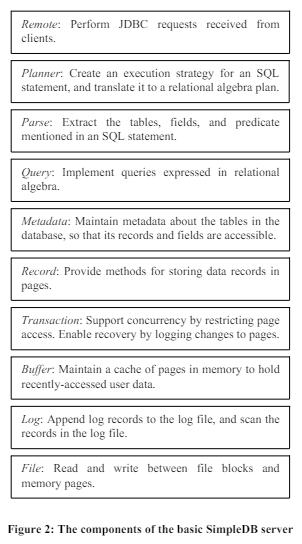

이전 포스트 Boston College SimpleDB 개선 과제 part 1에서 이어집니다!

### SimpleDB란? (주의! AWS SimpleDB아님)
Boston College의 Edward Sciore 교수님이 논문으로 발표한 Java 기반의 다중 사용자 DB입니다.  
관련 논문은 다음과 같습니다. [SimpleDB: a simple java-based multiuser syst](https://dl.acm.org/doi/10.1145/1227504.1227498)

  
SimpleDB 컴포넌트 구조

## 목표: midpoint-insertion policy를 SimpleDB에 적용해 보자.
- midpoint insertion은 MySQL InnoDB에 적용되어 있는 버퍼 정책입니다.  
- 디스크에서 페이지를 읽어 버퍼 풀로 들여올 때, 리스트의 중간 부분(midpoint)에 페이지를 삽입하는 방식입니다.
- read-ahead page, large scan(full table/index scan) 등으로 읽혀진 page들이 빨리 aged out 된다는 장점이 있습니다.

  

## 구현 및 테스트

#### Free buffer list, Allocated Buffer, LRU list, 기타 변수 선언 및 초기화
```java
public class MidInsBufferMgr implements BufferMgr {
   private LinkedList<Buffer> free_list;
   private LinkedList<Buffer> lru_list;
   private HashMap<BlockId,Buffer> alloc_buffer;
   private int buff_size;
   private int hit_cnt;
   private int reference_cnt;
   private static final long MAX_TIME = 10000;

public MidInsBufferMgr(FileMgr fm, LogMgr lm, int numbuffs) {
      buff_size = numbuffs;
      hit_cnt = 0;
      reference_cnt = 0;
      free_list = new LinkedList<Buffer>();
      lru_list = new LinkedList<Buffer>();
      alloc_buffer = new HashMap<BlockId,Buffer>();

      for (int i=0; i<buff_size; i++)
         free_list.add(new Buffer(fm, lm, i));
      
   }
```
`lru_list` 는 java의 `LinkedList`로 구현하였다. 자바 공식홈페이지에 "Doubly-linked list implementation..." 로 설명되어있는 클래스이다. `free_list`의 경우에도 편의를 위해 LinkedList로 구현하였다. 버퍼풀 초기화 시  버퍼들을 `numbuff`만큼 생성, `free list`에 삽입하기 위해 `free_list.add `를 진행하였다. `alloc_buffer`는 이전 과제와 동일하게 `HashMap`으로 구현하였다. `hit_cnt`, `reference_cnt`은 hit ratio를 구하기위해 사용하며 `MAX_TIME`은 pin에서 시간 초과를 확인하기위해 사용한다.

#### LRU MidPoint Insertion 기능 구현
```java
public void midIns(Buffer buff) {
      int size = lru_list.size();
      if (size <= 3){
         lru_list.addFirst(buff);
      }
      else{
         int pos = (size * 5 / 8) + 1;
         lru_list.add(pos-1, buff);
      }
   }
```
LRU list 길이가 3이하면 LRU head로 삽입하고, 아닌 경우에는 LRU list의 head에서 5/8 지점에 페이지를 삽입하도록 하였다. "`(현재 LRU list 길이 * 5/8)` 의 다음 노드로 삽입" 공식 에따라 `pos = (size * 5 / 8) + 1` 을 하였다. 소숫점일 경우 나누기에 의해 int 부분이 절사 된다. 리스트에 집어넣을때는 `lru_list.add(pos-1, buff)` 를 하는데, pos-1인 이유는 리스트에서 첫번째를 0이 아닌 1로봐야 하기때문이다.

#### available() 기능 구현
```java
public synchronized int available() {
      int freenum = free_list.size();
      int unpinnum = 0;
      for(Buffer buff : lru_list){
         if (!buff.isPinned()) unpinnum += 1;
      }
      return freenum + unpinnum;
   }
```
Free list의 버퍼 개수와 unpin된 버퍼 개수를 합한 값을 구하기 위해 `free_list.size()` 값을 구하고 lru_list 내 `!buff.isPinned()` 인 경우의 개수를 누적하여 합을 리턴한다.

#### touch() 함수 구현
```java
public void touch(Buffer buff){
      Boolean valid = lru_list.remove(buff);
      if (!valid) System.out.println("touch error!!");
      lru_list.addFirst(buff);
   }
```
LRU list에 있는 buffer가 hit되었을 때 (= hash map에 해당 buffer가 존재할 때) buffer를 new sublist의 head로 보낸다. 즉, pin이 되면 맨 앞으로 옮겨진다. 따라서 해당 동작을 touch라는 함수로 따로 구현하였다. `lru_list.remove(buff)`을 통해 요청 받은 버퍼를 지우고, `lru_list.addFirst(buff)`을 통해 맨앞에 넣게된다. 만약 없을경우 에러 메세지를 출력한다.

#### waitingTooLong() 설정
```java
private boolean waitingTooLong(long starttime) {
      return System.currentTimeMillis() - starttime > MAX_TIME;
   }
```
exception 관련 코드는 vanilla의 코드를 그대로 가져왔다.

#### pin() 구현
```java
public synchronized Buffer pin(BlockId blk) {
      try {
         long timestamp = System.currentTimeMillis();
         Buffer buff = tryToPin(blk);
         while (buff == null && !waitingTooLong(timestamp)) {
            wait(MAX_TIME);
            buff = tryToPin(blk);
         }
         if (buff == null)
            throw new BufferAbortException();
         else {reference_cnt++;}
         return buff;
      }
      catch(InterruptedException e) {
         throw new BufferAbortException();
      }
   }
```
pin()함수의 경우 이전 과제와 크게다르지 않다. 대부분다 동일하며, reference_cnt를 늘려주는 부분이 따로 존재한다. 

#### tryToPin() 구현
```java
private Buffer tryToPin(BlockId blk) {
      Buffer buff = findExistingBuffer(blk);
      if (buff == null) { // not find in lru list(alloc_buffer)
         buff = chooseFreeBuffer();
         if (buff == null)
            return null;
         alloc_buffer.remove(buff.block());
         buff.assignToBlock(blk);
         midIns(buff);
         alloc_buffer.put(blk,buff);
      }
      else { // find in lru list(alloc_buffer)
         hit_cnt++;
         touch(buff); 
      }
      buff.pin();
      return buff;
   }
```
trypin()의 경우, 이전과 달라진 점이 있다. `findExistingBuffer()`에 실패해서 새로운 버퍼를 `chooseFreeBuffer()`로 할당받을 경우, (첫번째로 reference되는 페이지일 경우) block id를 해당 버퍼에 할당, LRU list에 삽입한다. 그리고 midpoint Insertion 로직에 따라 LRU list내 위치 조정 과정을 수행한다. 우선 `alloc_buffer.remove`를 통해 현재 할당된 맵에서 해당 버퍼를 지우고, `buff.assignToBlock(blk)`를 통해 주어진 blk로 초기화하게 된다. 이후 앞서 소개한 `midIns()`를 통해서 해당 버퍼를 집어넣게된다. 또한,  `findExistingBuffer(blk)`에 성공했을때는 buffer가 hit되었을 때를 의미하므로 hit_cnt를 증가시켜주고 앞서 설명한 `touch()`를 수행하게 된다. `buff.pin()`을 통해 pin 값도 늘려준다.

#### findExistingBuffer() 구현
```java
private Buffer findExistingBuffer(BlockId blk) {
      if (alloc_buffer.containsKey(blk)) {
         Buffer buff = alloc_buffer.get(blk);
         return buff;
      }
      return null;
   }
```
해당 함수의 경우에는 크게 달라진점이 없다. 버퍼에 대해 "Must keyed on the block" 를 만족하는 alloc_buffer를 항상 유지하면서, `alloc_buffer.containsKey`를 통해 Map으로 블럭이 버퍼 안에 있는지 판별한다. 만약 있을경우, 해당 버퍼를 찾아서 리턴한다.

#### chooseFreeBuffer()
```java
private Buffer chooseFreeBuffer() {

      int size = free_list.size();
      if (size > 0){
         Buffer buff = free_list.poll();
         return buff;
      }
      else{
         int lru_size = lru_list.size();
         if (lru_size == 0){return null;}
         for(int i= lru_size - 1; i>=0; i--){
            Buffer buff = lru_list.get(i);
            if (!buff.isPinned()){
               buff.flush();
               lru_list.remove(buff);
               return buff;
            }
         }
      }
      return null;
   }
```
`chooseFreeBuffer()`의 경우 새롭게 추가된 부분이다. pin 메소드 호출 시 버퍼를 free list로부터 할당받고, 버퍼가 필요할 때 free buffer list의 head에서 버퍼를 제거 후 사용한다.  
우선 `free_list`의 크기가 0 이상이라면 제일 앞 버퍼를 `poll()`을 통해 뽑아낸다. 혹시 free list에 없다면, LRU list의 tail부터 탐색하여 첫번째 unpin된 버퍼를 flush 후, 해당 버퍼를 그대로 사용한다.  
즉, `lru_list`를 뒤에서부터 순회하며 `!buff.isPinned()` 을 만족하는 버퍼를 찾는순간 리스트에서 지워주고 flush한 다음 리턴해주게 된다.

#### unpin()
```java
public synchronized void unpin(Buffer buff) {
      buff.unpin();
      if (!buff.isPinned()) {
         notifyAll();
      }
   }
```
unpin()함수의 경우 기존과 달라진 부분이 따로 없다. Buffer의 pin count 감소하고, Pin count가 0이면 기다리는 스레드들에게 알림을 보낸다.

#### flushAll(int txnum) 함수 구현
```java
public synchronized void flushAll(int txnum){

      for (Buffer buff : lru_list){
         buff.flush();
         while(buff.isPinned()){
            buff.unpin();
         }
         free_list.add(buff);
      }
      lru_list.clear();
      alloc_buffer.clear();
   }
```
LRU list에 있는 버퍼들을 모두 flush하고, `free list`에 빈 버퍼들을 추가하기 위해 lru 리스트의 모든 버퍼들에 대해 flush를 진행하고 `free_list`에 추가했다. 그리고 pin되어있는 모든 버퍼들도 강제로 unpin시키고 flush 수행"을 위해 각 버퍼마다 `pin == 0` 이 될때까지 unpin을 진행해 주었다.


#### printStatus() 구현
```java
public void printStatus(){
      System.out.println("LRU list:");
      for (Buffer buff : lru_list){
         String is_pin = "unpinned";
         if (buff.isPinned()) is_pin = "pinned";
         System.out.println("Buffer " + buff.getID() + ": " + buff.block().toString() + " " + is_pin);
      }

   }
```
저번 `printStatus()` 와는 조금 다르게 `alloc_buffer`가 아닌 LRU 리스트에 대해 정보를 출력하도록 하였다.
각 버퍼의 ID, block, pinnedStatus 를 출력하며, BlockId의 `toString()` 메소드를 활용하였다. 자바의 반복문을 사용하면 자동으로 LRU list head부터 버퍼를 순차적으로 출력한다.

#### getHitRatio() 구현
```java
public float getHitRatio(){
      float hit_ratio = ((float)hit_cnt / (float)reference_cnt) * 100;
      BigDecimal hit_ratio_bd = new BigDecimal(hit_ratio);
      BigDecimal hit_ratio_bd_r2 = hit_ratio_bd.setScale(2, RoundingMode.HALF_UP);
      return hit_ratio_bd_r2.floatValue();
    }
```
`getHitRatio()` 함수는 이전 과제와 크게 다르지 않다. 똑같이 `tryToPin(blk)` 를 했을때 반환되는 buff가 널이 아닌경우, 즉 성공했을 경우에만(에러가 아닌 경우) `reference_cnt++;`가 되고, `findExistingBuffer(blk)` 의 결과값이 널이 아닐때, 즉 원하는 블럭을 찾았을 때만 hit_cnt++가 된다. 최종적으로는 `cnt/reference cnt * 100 (%)` 공식과 `BigDecimal`과 `RoundingMode`를 사용해 소숫점 2자리까지 반올림하여 리턴한다.

### 테스트
```java
public class BufferMgrTest {
   public static void main(String[] args) throws Exception {
      SimpleDB db = new SimpleDB("buffermgrtest", 400, 3, "midIns"); // only 3 buffers
      BufferMgr bm = db.bufferMgr();

      ...(생략)

      System.out.println("Final Buffer Allocation:");
      for (int i=0; i<buff.length; i++) {
         Buffer b = buff[i];
         if (b != null) 
            System.out.println("buff["+i+"] pinned to block " + b.block());
      }
   }
}

결과
Available buffers: 0
Attempting to pin block 3...
Exception: No available buffers

Final Buffer Allocation:
buff[0] pinned to block [file testfile, block 0]
buff[3] pinned to block [file testfile, block 0]
buff[4] pinned to block [file testfile, block 1]
buff[5] pinned to block [file testfile, block 3]
```

과제 명세에 기본으로 소개되어있는 코드다. block 3를 pin 할때는 이미 블록이 꽉 차있기 때문에 Available buffers 가 0가 되는것이 맞으며, Exception 관련 코드도 잘 작동함을 알 수 있다. Final Buffer Allocation 의 결과도 기존과 동일함을 알 수 있다.
```java
public class BufferMgrTest {
   public static void main(String[] args) throws Exception {
      SimpleDB db = new SimpleDB("buffermgrtest", 400, 5, "midIns");
      BufferMgr bm = db.bufferMgr();

      Buffer[] buff = new Buffer[6]; 
      buff[0] = bm.pin(new BlockId("test", 0));
      buff[1] = bm.pin(new BlockId("test", 1));
      buff[2] = bm.pin(new BlockId("test", 2));
      buff[3] = bm.pin(new BlockId("test", 3));

      bm.unpin(buff[2]); 
      buff[2] = null;
      bm.unpin(buff[0]); 
      buff[0] = null;
      bm.printStatus();

      buff[4] = bm.pin(new BlockId("test", 4));
      bm.printStatus();
   }
}

결과
LRU list:
Buffer 3: [file test, block 3] pinned
Buffer 2: [file test, block 2] unpinned
Buffer 1: [file test, block 1] pinned
Buffer 0: [file test, block 0] unpinned
LRU list:
Buffer 3: [file test, block 3] pinned
Buffer 2: [file test, block 2] unpinned
Buffer 4: [file test, block 4] pinned
Buffer 1: [file test, block 1] pinned
Buffer 0: [file test, block 0] unpinned
```
과제 명세의 예제 <4개의 버퍼, test file의 블럭 0번 ~ 3번이 차례로 reference(pin) 된 후, block 2번과 0번이 unpin 되었을 때> 와 동일한 결과가 잘 관찰된다.

hit ratio: 33.33
위의 경우에 대하여 hit ratio 도 정상적으로 잘 출력된다.
```java
public class BufferMgrTest {
   public static void main(String[] args) throws Exception {
      SimpleDB db = new SimpleDB("buffermgrtest", 400, 9, "midIns");
      BufferMgr bm = db.bufferMgr();

      Buffer[] buff = new Buffer[10]; 
      bm.printStatus();

      buff[0] = bm.pin(new BlockId("test", 10));
      bm.printStatus();
      buff[1] = bm.pin(new BlockId("test", 11));
      bm.printStatus();
      buff[2] = bm.pin(new BlockId("test", 12));
      bm.printStatus();
      buff[3] = bm.pin(new BlockId("test", 13));
      bm.printStatus();
      buff[4] = bm.pin(new BlockId("test", 14));
      bm.printStatus();
      buff[5] = bm.pin(new BlockId("test", 15));
      bm.printStatus();
      buff[6] = bm.pin(new BlockId("test", 16));
      bm.printStatus();
      buff[7] = bm.pin(new BlockId("test", 17));
      bm.printStatus();
      buff[8] = bm.pin(new BlockId("test", 18));
      bm.printStatus();
   }
}
마지막 결과
LRU list:
Buffer 3: [file test, block 13] pinned
Buffer 2: [file test, block 12] pinned
Buffer 4: [file test, block 14] pinned
Buffer 6: [file test, block 16] pinned
Buffer 7: [file test, block 17] pinned
Buffer 5: [file test, block 15] pinned
Buffer 1: [file test, block 11] pinned
Buffer 0: [file test, block 10] pinned
LRU list:
Buffer 3: [file test, block 13] pinned
Buffer 2: [file test, block 12] pinned
Buffer 4: [file test, block 14] pinned
Buffer 6: [file test, block 16] pinned
Buffer 7: [file test, block 17] pinned
Buffer 8: [file test, block 18] pinned
Buffer 5: [file test, block 15] pinned
Buffer 1: [file test, block 11] pinned
Buffer 0: [file test, block 10] pinned
```
위의 코드는 총 8개의 버퍼를 pin 해본 것이다. 과제 명세의 그림
  
처럼 8개의 리스트에서 9번째 블록(block 18)이 들어가는 위치는 앞에서 6번째로 잘 들어가는 모습을 보인다.
```java
public class BufferMgrTest {
   public static void main(String[] args) throws Exception {
      SimpleDB db = new SimpleDB("buffermgrtest", 400, 5, "midIns");
      BufferMgr bm = db.bufferMgr();

      Buffer[] buff = new Buffer[10]; 
      bm.printStatus();

      buff[0] = bm.pin(new BlockId("test", 10));
      buff[1] = bm.pin(new BlockId("test", 11));
      buff[2] = bm.pin(new BlockId("test", 12));
      buff[3] = bm.pin(new BlockId("test", 13));
      buff[4] = bm.pin(new BlockId("test", 14));
      bm.printStatus();
      buff[5] = bm.pin(new BlockId("test", 10));
      bm.printStatus();
      buff[3].unpin();
      buff[4].unpin();
      bm.printStatus();
      buff[6] = bm.pin(new BlockId("test", 20));
      bm.printStatus();
      bm.flushAll(1);
      bm.printStatus();
      buff[7] = bm.pin(new BlockId("test", 30));
      buff[8] = bm.pin(new BlockId("test", 31));
      buff[9] = bm.pin(new BlockId("test", 32));
      bm.printStatus();
   }
}
결과
LRU list:
LRU list:
Buffer 3: [file test, block 13] pinned
Buffer 2: [file test, block 12] pinned
Buffer 4: [file test, block 14] pinned
Buffer 1: [file test, block 11] pinned
Buffer 0: [file test, block 10] pinned
LRU list:
Buffer 0: [file test, block 10] pinned
Buffer 3: [file test, block 13] pinned
Buffer 2: [file test, block 12] pinned
Buffer 4: [file test, block 14] pinned
Buffer 1: [file test, block 11] pinned
LRU list:
Buffer 0: [file test, block 10] pinned
Buffer 3: [file test, block 13] unpinned
Buffer 2: [file test, block 12] pinned
Buffer 4: [file test, block 14] unpinned
Buffer 1: [file test, block 11] pinned
LRU list:
Buffer 0: [file test, block 10] pinned
Buffer 3: [file test, block 13] unpinned
Buffer 4: [file test, block 20] pinned
Buffer 2: [file test, block 12] pinned
Buffer 1: [file test, block 11] pinned
LRU list:
LRU list:
Buffer 4: [file test, block 32] pinned
Buffer 3: [file test, block 31] pinned
Buffer 0: [file test, block 30] pinned
```
우선 제일 처음 pin 하기 전에는 LRU list 에 아무것도 없다가 그 다음부터 순차적으로 들어간다. 그리고 기존의 10을 새롭게 pin하자 정상적으로 LRU 리스트의 제일 앞으로 가는 모습을 보여준다. 그리고 free list가 없는 상태에서 새로 pin을 요구할 경우 가장 뒤에있는 unpin 버퍼인 buffer 4를 선택하여 flush하고 새로 블럭 20을 할당하여 중간에 mid insert를 하는 모습을 보여준다. 그리고 flush all을 하면 LRU와 해시 맵에서 모든 버퍼가 제거된다. 이후 새롭게 넣으면 다시 잘 출력되는 모습을 보여준다.


## Source

- 『SimpleDB: a simple java-based multiuser syst for teaching database internals』  
  *Edward Sciore - 지음*  
  [https://dl.acm.org/doi/10.1145/1227504.1227498](https://dl.acm.org/doi/10.1145/1227504.1227498)
