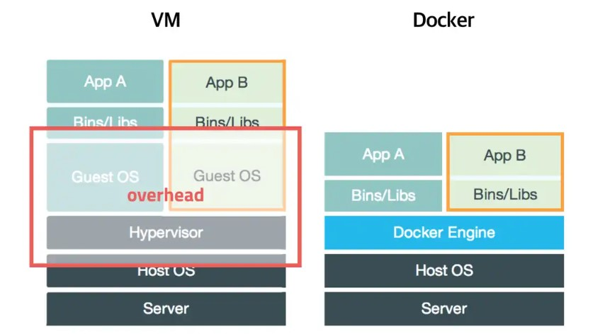
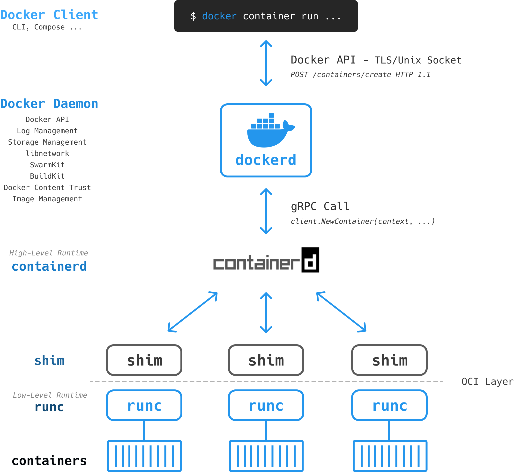

평소 Docker를 많이 사용하지만, 그 구조나 개념을 정확히는 몰라서 이참에 정리해 보았습니다.

### Docker란?

컨테이너 기반의 오픈소스 가상화 플랫폼

### 가상화란?

컴퓨터 리소스의 추상화. 하나의 물리 리소스를 여러개의 논리 리소스처럼 작동시키기나 여러 물리 리소스를 하나의 논리 리소스처럼 작동시키는 것.
ex. Docker는 하나의 물리 서버에서 여러 OS를 작동가능. K8S는 여러 물리 서버를 모아서 클러스터라는 하나의 논리 리소스 처럼 작동시킨다.

### 컨테이너란?

어떤 환경에서든 어플리케이션을 실행할 수 있도록 실행에 필요한 모든 요소들을 패키징하고 격리하는 기술.

### 컨테이너의 특징

OS레벨의 가상화를 사용하며, 프로세스를 격리시켜서 동작시키는 방식이다. OS전체를 가상화하지 않는다! 

### VM과 Docker의 차이점

#### 기존 VM

Host OS 위에서 하이퍼바이저 엔진 등을 활용하여 게스트 OS를 작동시킨다. 가상화된 하드웨어 위에 OS가 올라가서 거의 완벽하게 OS와 분리된다.
더 높은 격리 레벨을 지원하여 보안 측면에서 유리하다. 커널을 공유하지 않아 멀티 OS가 가능하다.

#### Docker

게스트 OS를 사용하지 않고, Application 실행에 필요한 파일만 올려서 컨테이너를 만든다. Host의 커널을 공유하기 때문이다.
근데, 윈도우나 MacOS 등에서 사용하는 도커 엔진의 경우에는 하나의 또다른 Linux VM을 사용한다는 점이 있다.

장점  
Host의 커널을 공유하고, 프로세스를 격리하는 방식이기 때문에, IO 처리 등이 쉬워 성능이 높아진다.

단점  
커널을 공유하기에 보안측면에서 VM보다 불리하고, Host의 운영체제와 아키텍처에 영향을 받기에 한계가 있다.
네트워크를 구성할때 호스트 레벨에서 한번더 추상화를 해야하기 때문에 까다롭다.

### Docker 이미지

컨테이너 생성과 실행에 필요한 파일, 설정들을 포함하고 있는 파일. 

### Dockerfile

원하는 컨테이너 이미지를 구성하기 위한 명령어 및 설정들을 포함하는 파일.

### Docker 레이어

컨테이너에 필요한 파일을 레이어 단위로 구별해서 구성하고, 이를 유니온 파일 시스템을 통해 하나의 파일 시스템처럼 사용한다. 이를 통해 효율적인 이미지 관리가 가능하다.  
ex. 앱의 레이어 파일이 바뀌어도 OS의 레이어는 유지 가능. 여러개의 컨테이너를 실행해도 최소한의 용량만 사용가능!

### LXC 리눅스 컨테이너

호스트에서 여러 리눅스 컨테이너를 실행하기 위한 OS 레벨 가상화 방법. namespace(전체 운영 시스템을 쪼개서 각각 고립된 환경으로 운영되는 그룹), cgroups(컨트롤 그룹, namespace로 구별된 그룹들의 환경에서 자원등을 제한하는 역할) 등을 사용한다. 초기의 도커는 LXC를 사용했지만, 멀티 플랫폼 환경에서 문제가 되어 도커는 libcontainer를 만들어 사용한다.  

### Libcontainer

도커 엔진에서 사용되는 주요 컴포넌트. 컨테이너 생성시 namespace, cgroups 를 제공하고 filesystem 도 관리한다. 

### 도커 동작 원리

Host의 커널을 공유하여 각 컨테이너에 커널을 할당하고 프로세스를 실행시킨다. 이때 각 컨테이너는 cgroups, namespace 등을 통해서 독립된 환경을 구축한다.

### 도커 엔진

  
\
Docker Daemon, Client, 컨테이너 런타임, Shim등 으로 구성된 애플리케이션. 
Docker Client에서는 REST API와 도커 소켓으로 Docker Daemon 과 통신하여 원하는 명령을 CLI나 Compose 등으로 요청하고, 
Docker Daemon는 containerd 같은 컨테이너 런타임과 통신한다. 이후 다시 runc를 통해서 컨테이너에 필요한 리소스를 준비하고 컨테이너를 생성한다.
이후에는 shim이 컨테이너의 생명주기를 관리하게 된다.

### containerd

고수준의 컨테이너 런타임. CRI(컨테이너 런타임 인터페이스)를 만족하여 k8s에서도 사용한다.

### runc

저수준의 컨테이너 런타임. containerd와 같은 고수준의 컨테이너 런타임이 관리하기도 한다.

## Source

- Docker-개념  
  [https://khj93.tistory.com/entry/Docker-Docker-%EA%B0%9C%EB%85%90](https://khj93.tistory.com/entry/Docker-Docker-%EA%B0%9C%EB%85%90)

- 초보를 위한 도커 안내서 - 도커란 무엇인가?  
  [https://subicura.com/2017/01/19/docker-guide-for-beginners-1.html](https://subicura.com/2017/01/19/docker-guide-for-beginners-1.html)

- Docker Engine, 제대로 이해하기  
  [https://gngsn.tistory.com/128](https://gngsn.tistory.com/128)