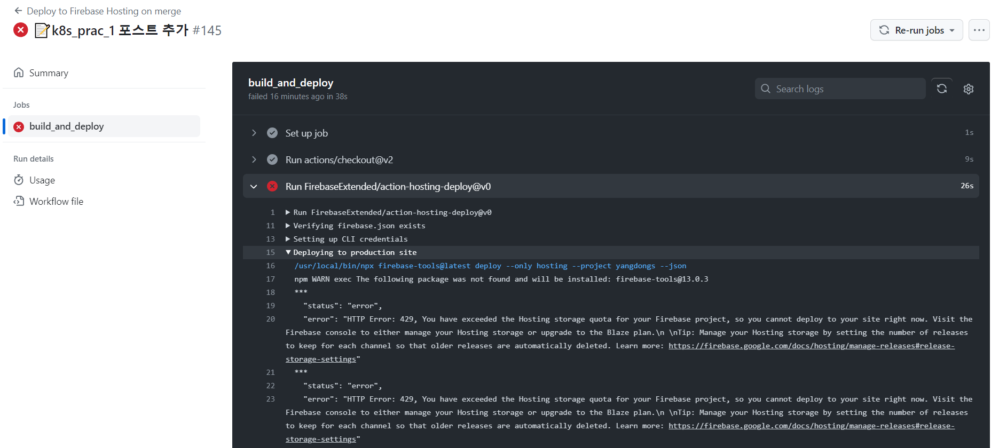
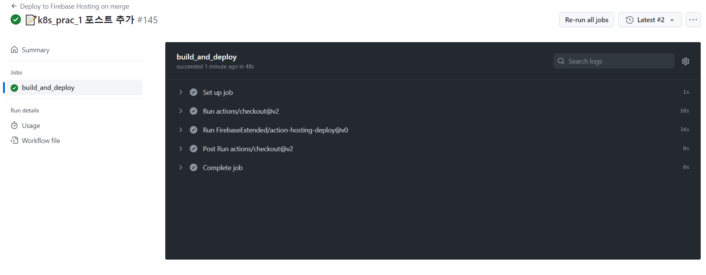

## 1. 미리 보는 결론

Firebase 콘솔에 들어가서 다음과 같이 출시 저장 용량을 제한합니다.

## 2. 문제 인식
평소 블로그 글을 쓸때, 깃허브 Actions를 사용하여 Push를 하면 자동으로 Firebase에 배포가 되도록 설정했습니다. CI/CD를 활용해 조금이나마 편리한 배포를 위해서였습니다. 😎
하지만 어느날 다음과 같이 배포가 지속적으로 실패하는 상황이 생겼습니다.

\
에러 문구에서도 확인할 수 있듯이, 호스팅 스토리지에 문제가 생긴듯 했습니다. 

## 3. 해결
바로 Firebase 콘솔을 확인합니다.  

정확한 제한은 모르지만, 10GB 정도가 한계인것 같습니다. 하지만 제 블로그 용량은 깃허브상 200MB가 채 안되는데 무엇이 문제일까요?
기록을 보니 Firebase는 이전의 기록을 사본으로 계속 보관하는것 같습니다. 다행히 출시 용량 제한 옵션이 있습니다.  
\
  
\
기록 버전을 약 5개 정도로 줄이니 예상 용량이 확 줄어듭니다.  
\

\
설정 후 반영에는 시간이 좀 걸리며, 나중에 다시 확인해보면 다음과 같이 잘 적용되었습니다.  
\

최종적으로 배포도 잘 진행이 되었습니다.  
\
