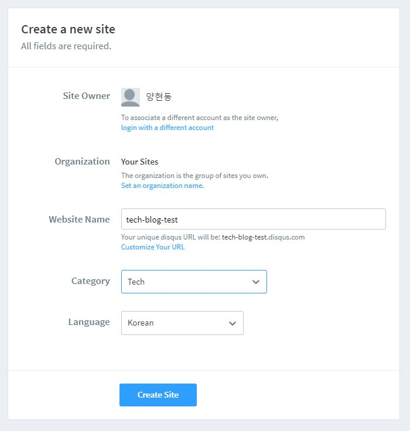

Gatsby 블로그를 만들면서 겪은 어려움 중 하나를 공유하기 위해 이 글을 썼습니다.
다른 블로그에도 Gatsby + Disqus 소개 글이 여럿 있지만, 
조금 더 구체적인 코드와 사용법을 담아내기 위해 노력했습니다. Gatsby 와 graphql 에 맞춘 코드이기 때문에 다른 환경에서는 작동하지 않을 수 있습니다.

## 1. 왜 Disqus 인가요?


\
이미 Gatsby로 블로그를 만든 여러분은 잘 알고 계실 것입니다.
Gatsby는 정적 사이트 생성 프레임워크기 때문에 백엔드가 구현되어 있지 않습니다.
따라서 댓글과 같은 기능은 직접 구현하기 힘든데, 이 문제를 해결해 주는 것이 바로
**Disqus, LiveRe, Utterances** 등의 위젯 라이브러리입니다.
이중 필자가 Disqus를 고른 이유는 다음과 같습니다.

### 1) 대중성과 접근성

LiveRe의 경우 국내 사이트 사용자, Utterances의 경우 깃허브 사용자에게 치중되어 있습니다.
Disqus는 세계적으로 이 둘보다 훨씬 많은 사용자 수를 가지고 있어 대중성이 좋다고 판단했습니다. 또한, 구글 트위터 페이스북등 다양한 계정의 접근성도 좋아 보입니다.

### 2) 트래픽이 낮을때는 광고가 붙지 않는다

사실 광고가 붙는 것은 Utterances에 비해 Disqus가 가진 단점이라 할 수 있습니다.
다만, 이는 트래픽이 높을 때만 생기기 때문에 일반적인 테크 블로그에서는 적정하다고 판단했습니다.
물론 나중에 유명해져서 광고가 너무 많이 달린다면 기쁜 마음으로 다른 라이브러리로 넘어가겠죠?

## 2. 어떻게 적용하나요?

### 1) Disqus 가입

해당 부분은 일반적인 사이트 가입과 동일하기 때문에 따로 안내하지는 않겠습니다.

### 2) 새 페이지 생성

로그인 후 홈페이지에서 Get Started! 를 누르면 새 페이지 제작이 가능합니다.  
본인이 작성한 website name은 기억해 주시기 바랍니다.



### 3) 플러그인 설치

터미널에 본인이 사용하는 npm이나 yarn에 따라 다음 명령어를 쳐주세요.

```js
npm install gatsby-plugin-disqus

yarn add gatsby-plugin-disqus
```

### 4) Gatsby react 코드 작성

우선 gatsby-config.js 부터 수정해보겠습니다.  
tech-blog-test 대신 본인의 website name을 적어주면 됩니다.

```js
module.exports = {
  plugins: [

        ⋮

    {
      resolve: `gatsby-plugin-disqus`,
      options: {
        shortname: `tech-blog-test`,
      },
    },

        ⋮

  ],
}
```
\
다음은 Disqus가 들어갈 컴포넌트입니다. 밑의 코드는 "React 기반 Gatsby로 기술 블로그 개발하기" 인프런 강좌를 기반으로한 저의 블로그 코드이므로 개인마다 상이합니다.
\
\
**post_template.tsx**  
해당 코드에서 눈여겨볼 점은 **DisqusCommentBox** 컴포넌트에 주게되는 **href, id, title** 인자들입니다.
graphql 쿼리에서 어떤 요소들에 대응되는지 확인하면 됩니다.
```js
import DisqusCommentBox from'components/Post/DisqusCommentBox'

⋮

type PostTemplateProps = {
  data: {
    allMarkdownRemark: {
      edges: PostPageItemType[]
    }
  },
  location: {
    href: string
  }
}

const PostTemplate: FunctionComponent<PostTemplateProps> = function ({

  ⋮

  return (
    <Template title={title} description={summary} url={href} image={publicURL}>
        <PostHead
          title={title}
          date={date}
          categories={categories}
          thumbnail={gatsbyImageData}
        />
        <PostContent html={html} />
        <DisqusCommentBox url={href} identifier={id} title={title}/>
    </Template>
  )
}

export default PostTemplate

export const queryMarkdownDataBySlug = graphql`
  query queryMarkdownDataBySlug($slug: String) {
    allMarkdownRemark(filter: { fields: { slug: { eq: $slug } } }) {
      edges {
        node {
          html
          id
          frontmatter {
            title
            summary
            date(formatString: "YYYY.MM.DD.")
            categories
            thumbnail {
              childImageSharp {
                gatsbyImageData
              }
              publicURL
            }
          }
        }
      }
    }
  }
`
```

\
**DisqusCommentBox.tsx**  
실제로 Disqus를 띄우게 되는 컴포넌트입니다. 위의 코드와 연계해서 설명하겠습니다.  

```js
import React, { FunctionComponent } from 'react'
import { Disqus } from 'gatsby-plugin-disqus'
import styled from '@emotion/styled'

type DisqusCommentBoxProps = {
    url: string
    identifier: string
    title: string
}

const Wrapper = styled.div`

  ⋮

`

const DisqusCommentBox: FunctionComponent<DisqusCommentBoxProps> = function({
    url,
    identifier,
    title
}) {

const config = {
    url: url,
    identifier: identifier,
    title: title,
}

    return(
        <Wrapper>
            <Disqus config={config} />
        </Wrapper>
    )
}

export default DisqusCommentBox
```
\
우선 PostTemplateProps에서 `location: { href }` 데이터로 받게 된 **href**의 경우 각 포스트 글의 실제주소를 나타내 주게 됩니다. ex.) http://localhost:8000/post_1.
이는 Disqus 태그 인수로 필요한 요소 **url**에 해당합니다.  
\
다음으로 쿼리문 중 `edges: { node: { id } }` 의 **id**는 Disqus 태그 인수 **identifier**에 해당하며, Disqus에서 각 페이지마다 독립적인 댓글 기능을 제공하는데 중요한 역할을 합니다. 때에 따라서는 **slug**를 사용해도 무방합니다. 중요한 것은 중복되지 않는 것입니다.  
\
마지막으로 쿼리문 중 `edges: { node: { frontmatter: { title } } }`의 **title**는 Disqus 태그 인수 **title**에 해당하며, 각 포스트의 제목만 넘겨주면 됩니다.  
\
위의 적용이 모두 끝났으면, 실제로 페이지를 바꾸어 가며 댓글이 서로 중복되지 않게 잘 달리는지 확인하면 됩니다. 댓글에 대한 추가적인 설정은 Disqus 홈페이지의 settings 메뉴에서 변경 가능합니다.

## 3. 요약정리

Disqus 가입 및 플러그인 설치, gatsby-config.js 수정하기.  
Disqus 태그 인수는 다음과 같이 쿼리에서 받아와서 적용해 주면 사용이 가능하다.
> **url** => `location: { href }`  
> **id** => `edges: { node: { id } }`  
> **title** => `edges: { node: { frontmatter: { title } } }`

## Source

- React 기반 Gatsby로 기술 블로그 개발하기

  [https://www.inflearn.com/course/gatsby-%EA%B8%B0%EC%88%A0%EB%B8%94%EB%A1%9C%EA%B7%B8](https://www.inflearn.com/course/gatsby-%EA%B8%B0%EC%88%A0%EB%B8%94%EB%A1%9C%EA%B7%B8)
