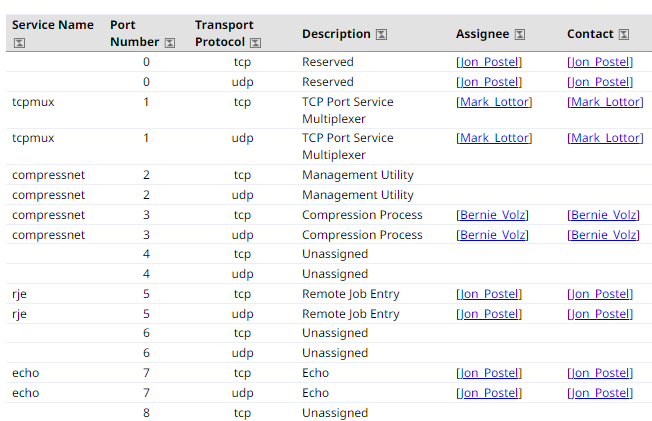
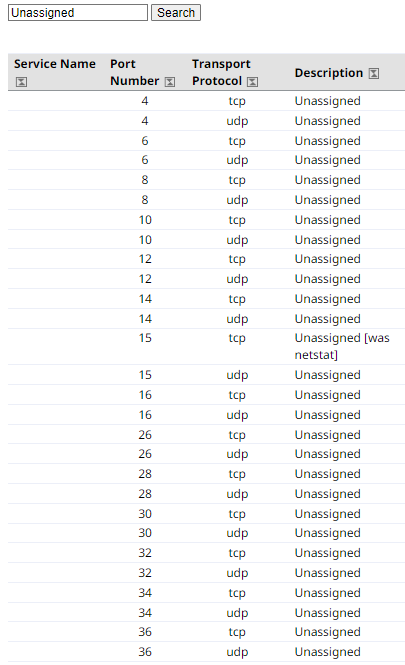
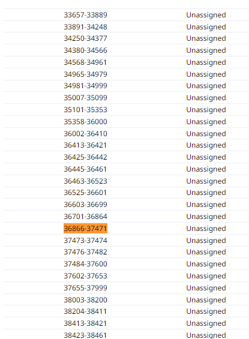

## 1. Unassigned port를 찾게된 이유

이번에 팀원, 교수님과 함께 준비하던 졸업작품 [DEV-ROOM](https://github.com/Yanghyeondong/DEV-ROOM)을 준비하면서 한가지 문제점에 도달했습니다. 바로 포트 할당의 문제입니다.

DEV-ROOM 프로젝트의 경우, 수십명의 학생에게 개별로 수업용 컨테이너를 배포하고, ssh로 연결하는 기능이 있습니다. 이때, 이를 k8s의 로드밸런스 서비스로 할당하기 위해서는 다음과 같은 2가지 선택지가 있습니다.

1. AKS, EKS 같은 서비스를 활용하여 로드밸런서마다 다른 IP를 할당받아 사용한다.
2. 로컬 리눅스 머신에 k3s 등을 설치하여 로드밸런서마다 다른 port를 할당받아 사용한다.

1번의 경우, 추후 수십명의 학생이 개별 로드밸런서와 그에 해당하는 IP를 할당하면 막대한 비용이 발생합니다. 따라서 2번을 고려하게 되었고, 어떤 Port를 사용할지 찾아보았습니다.

### TIP!

포트(port)는 컴퓨터끼리 정보 교환을 위해 사용하는 가상의 접속 위치이며, 주로 소프트웨어에서 네트워크 서비스나 특정 프로세스를 식별하는 단위로 사용됩니다. TCP, UDP 등에서 활용되며, 0~65536의 번호로 매겨저 있습니다. 
이때, 포트범위에 따라 well-known ports, registered ports, dynamic or private ports 등으로 나뉘는데, 이번 졸업작품에서는 최대한 충돌을 피하기위해 사용하고 있지 않은 포트를 대량으로 활용할 예정입니다.
각 포트에 따른 정보는 IANA에서 확인합니다.

## 3. IANA에서 포트 찾기
IANA(Internet Assigned Numbers Authority)는 인터넷 할당 번호 관리기관의 약자로 IP 주소, 최상위 도메인 등을 관리하는 단체입니다. 해당 웹 페이지[www.iana.org](https://www.iana.org/assignments/service-names-port-numbers/service-names-port-numbers.xhtml)
에서는 어떤 포트가 등록되어있는지 다음과 같이 확인가능 합니다.  
\

\
필자는 여기서 Unassigned로 필터링하여 적당한 포트를 다음과 같이 찾았습니다.  
\

\
최종적으로 결정한 포트범위는 다음과 같습니다.  
\

## Source

- 위키피디아 Port  
  [https://en.wikipedia.org/wiki/Port_(computer_networking)](https://en.wikipedia.org/wiki/Port_(computer_networking))
