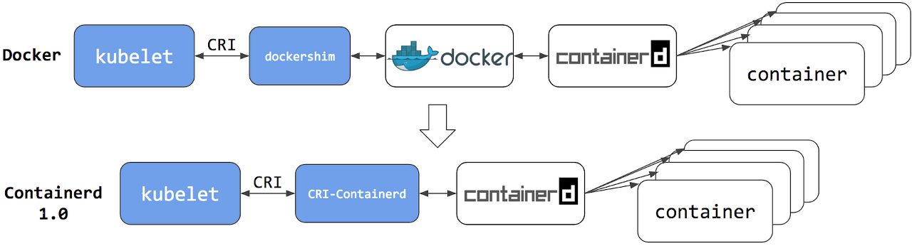

*해당 포스트는 교재 『쿠버네티스 교과서』를 활용하며,*  
*환경은 Kubernetes v1.28. Docker Desktop으로 진행합니다.* 

## 개념 요약

### 컨테이너  
애플리케이션을 실행하는 가상화된 환경

### 파드
컴퓨팅의 단위, 한개 이상의 컨테이너로 구성.  
컨테이너를 감싸는 또 다른 가상환경이다.  
k8s에서 관리되는 자신만의 가상 IP 주소를 가짐. 이를 통해 다른 파드와 통신.  
같은 파드 내의 컨테이너는 로컬 호스트로 서로 통신 가능.  

### TIP! docker vs containerd

\
본 실습에서는 containerd 가 아닌 docker 엔진을 사용함.  
1.24 부터 k8s에서는 dockershim이 사라짐. 이유? docker의 업데이트에 너무 의존하게 되서.  
\
docker를 사용할 경우, kubelet이 dockershim을 거쳐서 컨테이너를 관리한다.  
docker 명령어를 그대로 사용할수 있어 편의성이 높다.  
단, docker도 containerd를 사용하기 때문에 하위 단계에서는 차이가 없다.  

containerd를 사용할 경우, kubelet이 CRI(컨테이너 런타임 인터페이스)-containerd 를 사용하여 컨테이너를 관리한다.  중간에 호출 체인이 짧아서 리소스 사용량이 적다.  

### 왜 컨테이너를 직접 다루지 않고 파드를 거치는가?
파드가 컨테이너를 추상화 할 수 있도록 하기위해.  
k8s 파드만 관리하면 되고, 컨테이너는 k8s 외부에서 알아서 관리되도록 한다.  
컨테이너를 생성할 책임을 각 노드에 설치된 컨테이너 런타임에게 맞긴다.  

### 컨트롤러 객체
다른 리소스를 관리하는 k8s 리소스.  
API와 연동하며, 시스템의 현재 상태를 바람직한 상태로 만들려고 한다.  

### 디플로이먼트
파드를 관리하는 객체.  
특정 노드에서 파드가 유실되면 다른 노드에서 실행한다.  
디플로이먼트가 관리하는 파드는 서로 다른 노드에서 동작할수도 있다.  

## 실습

### 주요 요점들
- kubectl은 관심있는 출력에대해 질의를 지정하기에 좋다.  
- 컨테이너를 직접 실행시키는 것은 k8s가 아니다. 명령어에서도 식별자는 다른 시스템의 참조일 뿐이다.  
- CRI를 통해 노드별로 다른 컨테이너 런타임을 가지고 있더라도 동일한 방식으로 노드를 관리할 수 있다.  
- CRI 예시 : 컨테이너 생성과 삭제, 정보확인 기능 등
### 파드 생성 및 확인
```powershell
PS C:\Users\hdyang\Desktop\Project\k8s-practice> # 컨테이너 하나를 담은 파드를 실행한다
PS C:\Users\hdyang\Desktop\Project\k8s-practice> kubectl run hello-kiamol --image=kiamol/ch02-hello-kiamol 
pod/hello-kiamol created
PS C:\Users\hdyang\Desktop\Project\k8s-practice> # 파드가 준비 상태가 될 때까지 기다린다
PS C:\Users\hdyang\Desktop\Project\k8s-practice> kubectl wait --for=condition=Ready pod hello-kiamol
pod/hello-kiamol condition met
PS C:\Users\hdyang\Desktop\Project\k8s-practice> # 클러스터에 있는 모든 파드의 목록을 출력
PS C:\Users\hdyang\Desktop\Project\k8s-practice> kubectl get pods
NAME           READY   STATUS    RESTARTS   AGE  
hello-kiamol   1/1     Running   0          9s   
PS C:\Users\hdyang\Desktop\Project\k8s-practice> # 파드의 상세 정보를 확인한다
PS C:\Users\hdyang\Desktop\Project\k8s-practice> kubectl describe pod hello-kiamol
Name:             hello-kiamol
Namespace:        default
Priority:         0
Service Account:  default
Node:             docker-desktop/192.168.65.3
Start Time:       Fri, 12 Jan 2024 13:40:59 +0900
Labels:           run=hello-kiamol
Annotations:      <none>
Status:           Running
IP:               10.1.0.24
IPs:
  IP:  10.1.0.24
Containers:
  hello-kiamol:
    Container ID:   docker://227ed072b5b7e06c8ff4f4c8a534a3e19fb5517f3abcef46f701f2946358f52e
    Image:          kiamol/ch02-hello-kiamol
    Image ID:       docker-pullable://kiamol/ch02-hello-kiamol@sha256:8a27476444b4c79b445f24eeb5709066a9da895b871ed9115e81eb5effeb5496
    Port:           <none>
    Host Port:      <none>
    State:          Running
      Started:      Fri, 12 Jan 2024 13:41:01 +0900
    Ready:          True
    Restart Count:  0
    Environment:    <none>
    Mounts:
      /var/run/secrets/kubernetes.io/serviceaccount from kube-api-access-zbvt5 (ro)
Conditions:
  Type              Status
  Initialized       True
  Ready             True
  ContainersReady   True
  PodScheduled      True
Volumes:
  kube-api-access-zbvt5:
    Type:                    Projected (a volume that contains injected data from multiple sources)
    TokenExpirationSeconds:  3607
    ConfigMapName:           kube-root-ca.crt
    ConfigMapOptional:       <nil>
    DownwardAPI:             true
QoS Class:                   BestEffort
Node-Selectors:              <none>
Tolerations:                 node.kubernetes.io/not-ready:NoExecute op=Exists for 300s
                             node.kubernetes.io/unreachable:NoExecute op=Exists for 300s
Events:
  Type    Reason     Age   From               Message
  ----    ------     ----  ----               -------
  Normal  Scheduled  14s   default-scheduler  Successfully assigned default/hello-kiamol to docker-desktop      
  Normal  Pulling    14s   kubelet            Pulling image "kiamol/ch02-hello-kiamol"
  Normal  Pulled     12s   kubelet            Successfully pulled image "kiamol/ch02-hello-kiamol" in 1.932s (1.932s including waiting)
  Normal  Created    12s   kubelet            Created container hello-kiamol
  Normal  Started    12s   kubelet            Started container hello-kiamol
```
```powershell
PS C:\Users\hdyang\Desktop\Project\k8s-practice> # 파드에 대한 기본적인 정보를 확인한다
PS C:\Users\hdyang\Desktop\Project\k8s-practice> kubectl get pod hello-kiamol
NAME           READY   STATUS    RESTARTS   AGE  
hello-kiamol   1/1     Running   0          9m12s
PS C:\Users\hdyang\Desktop\Project\k8s-practice> # 네트워크 상세 정보 중 특정한 항목을 따로 지정해 출력한다
PS C:\Users\hdyang\Desktop\Project\k8s-practice> kubectl get pod hello-kiamol --output custom-columns=NAME:metadata.name,NODE_IP:status.hostIP,POD_IP:status.podIP
NAME           NODE_IP        POD_IP
hello-kiamol   192.168.65.3   10.1.0.24
PS C:\Users\hdyang\Desktop\Project\k8s-practice> # JSONPath로 복잡한 출력을 구성한다
PS C:\Users\hdyang\Desktop\Project\k8s-practice> # 파드의 첫 번째 컨테이너의 컨테이너 식별자만 출력한다
PS C:\Users\hdyang\Desktop\Project\k8s-practice> kubectl get pod hello-kiamol -o jsonpath='{.status.containerStatuses[0].containerID}'
docker://227ed072b5b7e06c8ff4f4c8a534a3e19fb5517f3abcef46f701f2946358f52e
PS C:\Users\hdyang\Desktop\Project\k8s-practice> # 파드의 첫 번째 컨테이너의 컨테이너 식별자만 출력한다
PS C:\Users\hdyang\Desktop\Project\k8s-practice> kubectl get pod hello-kiamol -o jsonpath='{.status.containerStatuses[0].containerID}'  
docker://227ed072b5b7e06c8ff4f4c8a534a3e19fb5517f3abcef46f701f2946358f52e
PS C:\Users\hdyang\Desktop\Project\k8s-practice> # 파드에 포함된 컨테이너 찾기
PS C:\Users\hdyang\Desktop\Project\k8s-practice> docker container ls -q --filter label=io.kubernetes.container.name=hello-kiamol        
227ed072b5b7
PS C:\Users\hdyang\Desktop\Project\k8s-practice>
PS C:\Users\hdyang\Desktop\Project\k8s-practice> # 해당 컨테이너 삭제하기
PS C:\Users\hdyang\Desktop\Project\k8s-practice> docker container rm -f $(docker container ls -q --filter label=io.kubernetes.container.name=hello-kiamol)
227ed072b5b7
PS C:\Users\hdyang\Desktop\Project\k8s-practice>
PS C:\Users\hdyang\Desktop\Project\k8s-practice> # 파드 상태 확인
PS C:\Users\hdyang\Desktop\Project\k8s-practice> kubectl get pod hello-kiamol
NAME           READY   STATUS              RESTARTS   AGE
hello-kiamol   0/1     ContainerCreating   1          35m
PS C:\Users\hdyang\Desktop\Project\k8s-practice>
PS C:\Users\hdyang\Desktop\Project\k8s-practice> # 이전 컨테이너 다시 찾아보기
PS C:\Users\hdyang\Desktop\Project\k8s-practice> docker container ls -q --filter label=io.kubernetes.container.name=hello-kiamol        
e802a95b8e9b
```
```powershell
PS C:\Users\hdyang\Desktop\Project\k8s-practice> # 로컬 컴퓨터의 8080 포트를 주시하다가 이 포트로 들어오는
PS C:\Users\hdyang\Desktop\Project\k8s-practice> # 트래픽을 파드의 80번 포트로 전달한다
PS C:\Users\hdyang\Desktop\Project\k8s-practice> kubectl port-forward pod/hello-kiamol 8080:80
Forwarding from 127.0.0.1:8080 -> 80
Forwarding from [::1]:8080 -> 80
```
## Source

- 『쿠버네티스 교과서』- 엘튼 스톤맨, 길벗  
  [https://github.com/gilbutITbook/kiamol](https://github.com/gilbutITbook/kiamol)