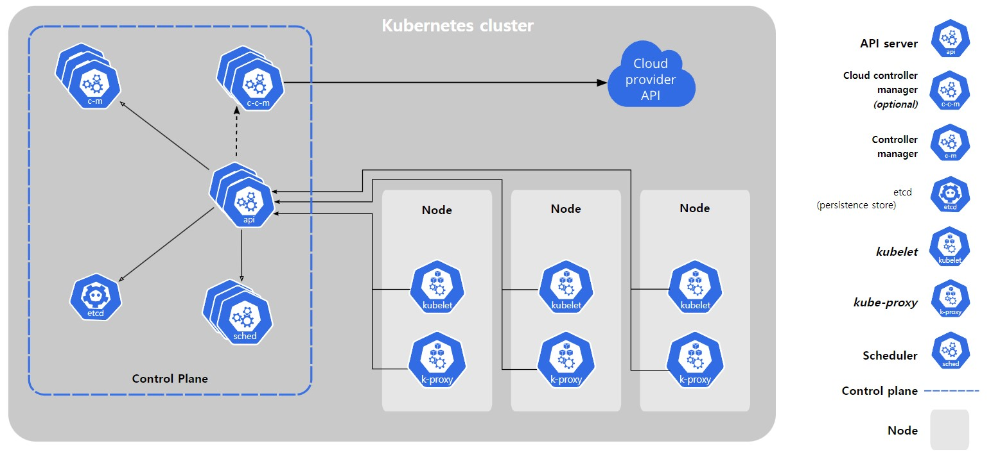
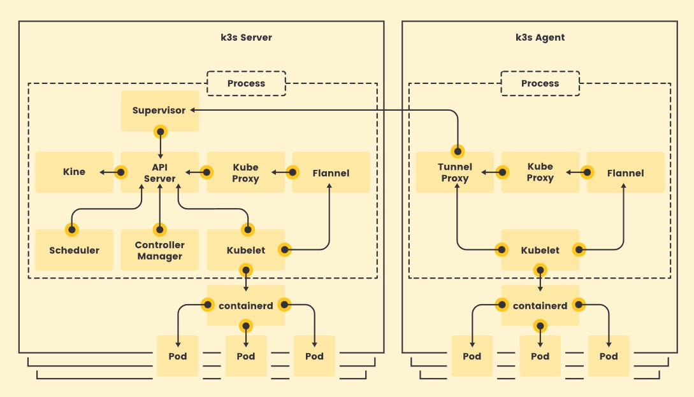

과거에 K3s와 K8s를 비교하는 글을 쓰면서 클러스터에서 각 노드의 명명구조가 조금 다르다는 것을 느꼈습니다. 이같은 차이점을 정립할겸 K8s의 구조를 정리해 보았습니다.  
\

K8s 클러스터는 여러 노드로 구성되는데, 역할에 따라 다음과 같이 구분할 수 있다.
### Control plane 컨트롤 플레인
이전에는 마스터 노드라는 이름으로 불렸으며, 클러스터 관리를 수행한다.  
API 서버, DNS 서버, 코어 시스템 컨트롤러 등이 동작한다.  
AKS와 같은 클라우드 매니지드 서비스의 경우, 컨트롤 플레인이 추상화 되어있고 직접 관리하지 않는다.  
하나의 클러스터에 여러 컨트롤 플레인을 사용할수도 있으며, 하나가 다운되면 투표를 통해 새로운 컨트롤 플레인 노드를 뽑는다.  
- **API 서버**  
  클러스터 관리 요청을 처리해준다.  
  HTTPS 프로토콜을 사용하는 REST API 엔드포인트로 구현되어 있다.  
  kubectl로 접속하거나 내부 API로 접근한다.  
  kube-apiserver 파드에서 실행된다.  
- **스케줄러**  
  파드 생성 요청시 파드를 실행할 노드를 선택한다.  
  직접 만든 스케줄러를 사용할 수도 있다.  
  kube-scheduler 파드에서 실행된다.  
- **컨트롤러 매니저**  
  코어 컨트롤러를 구동한다. 노드 상태를 관찰하며 서비스 엔드포인트를 관리한다.  
  kube-controller-manager 파드에서 실행된다.  
- **etcd**  
  k8s의 데이터 저장소. 분산 key-value DB로 구성되며, 클러스터내에 여러 복제본이 존재한다.  

#### TIP
**API** : 두 시스템(어플리케이션)이 상호작용할 수 있게 하는 매개체  
**ENDPOINT** : 컴퓨터 네트워크에 연결하고 정보를 교환하는 물리적 장치, 휴대폰 데스크톱 등. 좁은 의미에서는 커뮤니케이션 채널의 한쪽 끝에 해당하는 URI.  
**Proxy 프록시** : 서버와 클라이언트 사이에서 중계기로서 대리 통신을 수행하는 것. 빠른 액세스(캐시)나 부담 분산, 안전한 통신을 위해 사용한다.  

### Worker Node 워커 노드
이전에는 미니언이라는 이름으로 불렸으며, 클러스터가 수행하는 작업을 실제로 담당한다.  
Control plane과 연결을 유지하며 파드 실행 요청을 받거나 관리하고 상태 보고를 보낸다.  
- **kubelet (쿠블릿)**  
  노드 서버에서 구동되는 백그라운드 에이전트로, 프로세스 형태이다.  
  파드 생성 요청을 전달받고 생애주기를 관리하며, 상태 보고를 API 서버에 전달한다.  
- **kube-proxy**  
  노드 내 파드끼리 통신이나 다른 노드 속 파드와의 통신에서 트래픽 라우팅을 담당한다.  
  노드마다 하나씩 배치된다.  
- **컨테이너 런타임**  
  kubelet의 지시에 따라 파드 컨테이너를 관리한다. Docker, containerd 등을 사용하며, CRI를 준수하는 런타임을 사용할 수 있다.  

#### kubeadm (큐브어드민)
쿠버네티스 클러스터 구축 작업을 도와주는 도구.  
컨트롤 플레인 초기화, 클러스터 노드 추가, 버전 업그레이드 등의 작업을 수행한다.

## K3S 구조

k3s는 서버 노드와 에이전트 노드로 나뉜다.  
두 노드 모두 kubelet, 컨테이너 런타임(container-d)를 실행한다.  
서버 노드는 k3s server command를 실행시키며 control-plane과 datastore component(etcd로 추측됨)을 관리한다. 에이전트 노드는 k3s agent command를 실행시키며 control-plane과 datastore component가 없는 노드이다.  

## Source

- 『쿠버네티스 교과서』- 엘튼 스톤맨, 길벗  
  [https://github.com/gilbutITbook/kiamol](https://github.com/gilbutITbook/kiamol)