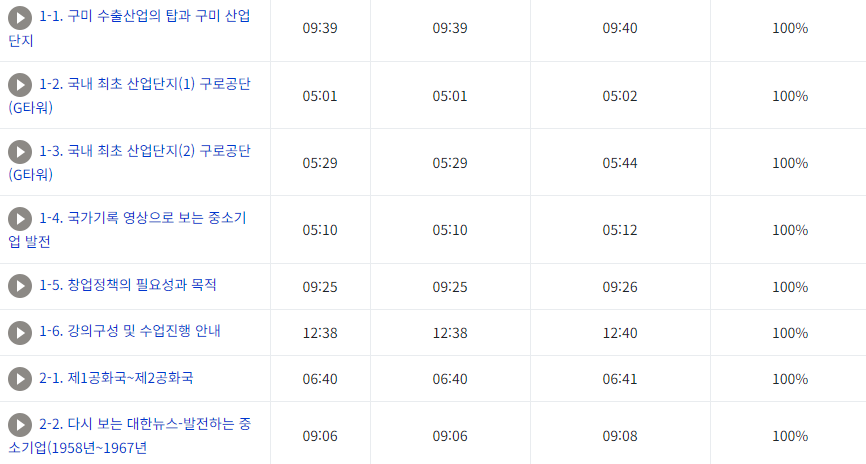

*주의!*  
*본 코드는 KMOOC 강좌를 수강하는 성실한 학생들의 편의성을 높이고자 개발되었습니다.*  
*다른 용도로 사용하였을때 책임은 본인에게 있습니다.*

## KMOOC를 듣게된 계기, 문제 인식
4학년 2학기 수업중 하나로, KMOOC를 선택했습니다. 실제 성균관대학교 교수님의 수업을 들으면 학점으로 인정해주는 매우 좋은 제도입니다. 😎 하지만 KMOOC 시스템에는 한가지 단점이 있는데요, 바로 강좌가 굉장히 짧은 단위로 여러개 분리되어 있다는 점입니다.  
\

\
평소 학교 I-campus에 있는 강의들은 1시간~1시간 30분씩 집중해서 들을 수 있는 반면에, KMOOC는 5분마다 강의를 껐다 켰다 너무 번거로웠습니다.
그래서, 자동으로 시간이 되면 다음 강의를 시청할 수 있도록 하는 프로그램을 떠올렸습니다.

## Python 코드 작성

과거 웹 크롤링 수업을 들었던 경험을 바탕으로, 셀레니움을 사용해서 다음과 같은 코드를 작성했습니다. kmooc 홈페이지가 뜨는 순간, 30초 이내로 로그인을 하시고 강좌 화면으로 이동하시면 됩니다. 그러면 이후에 자동으로 강좌가 순서대로 재생됩니다. 2024.10.18일 기준으로 정상작동을 확인하였습니다.  
많은 학생분들에게 도움이 되었으면 합니다. 😆

```python
from selenium import webdriver
from selenium.webdriver.common.by import By
from selenium.webdriver.common.action_chains import ActionChains
from selenium.webdriver.common.keys import Keys
import time
from selenium.common.exceptions import UnexpectedAlertPresentException, NoAlertPresentException

# 드라이버 설정 (크롬)
driver = webdriver.Chrome()

# 로그인 페이지로 이동
driver.get("https://www.kmooc.kr/")

# 사용자가 로그인할 시간을 줌
# 수강하고자 하는 강좌 화면까지 들어갈 것
time.sleep(30)

activity_list = driver.find_elements(By.CSS_SELECTOR, "li.activity.vod.modtype_vod")

for activity in activity_list:
    # 수업 영상 중 '완료함'이나 '완료하지 못함'이 있는지 확인
    completion_status = activity.find_element(By.CSS_SELECTOR, "span.autocompletion img").get_attribute("title")

    # '완료함'이면 패스하고 다음으로
    if '완료함' in completion_status:
        continue

    # '완료하지 못함'이면 실행
    if '완료하지 못함' in completion_status:
        # 'a' 태그 요소 클릭 (동영상 화면 열기)
        activity.find_element(By.CSS_SELECTOR, "a").click()

        # 팝업창으로 핸들 전환
        driver.switch_to.window(driver.window_handles[-1])

        # 팝업창의 정 중앙 클릭 (시작버튼)
        popup_body = driver.find_element(By.TAG_NAME, 'body')
        ActionChains(driver).move_to_element(popup_body).click().perform()

        # 이어서보기 알림창이 있는지 확인하고 처리
        try:
            alert = driver.switch_to.alert
            alert.accept()  # 알림창의 확인 버튼 클릭
        except NoAlertPresentException:
            pass  # 알림창이 없으면 무시

        time.sleep(1)

        duration_element = driver.find_element(By.CSS_SELECTOR, "span.vjs-duration-display")
        duration_text = duration_element.text.strip()

        # "8:23" 같은 시간 텍스트를 분과 초로 분리
        print(duration_text.split(':'))
        minutes, seconds = map(int, duration_text.split(':'))

        # 총 시간을 초로 변환
        total_seconds = minutes * 60 + seconds + 60

        # 해당 시간만큼 대기
        time.sleep(total_seconds)

        # 팝업창 닫기
        driver.close()

        # 원래 창으로 돌아가기
        driver.switch_to.window(driver.window_handles[0])

# 모든 작업 완료 후 브라우저 종료
driver.quit()
```

