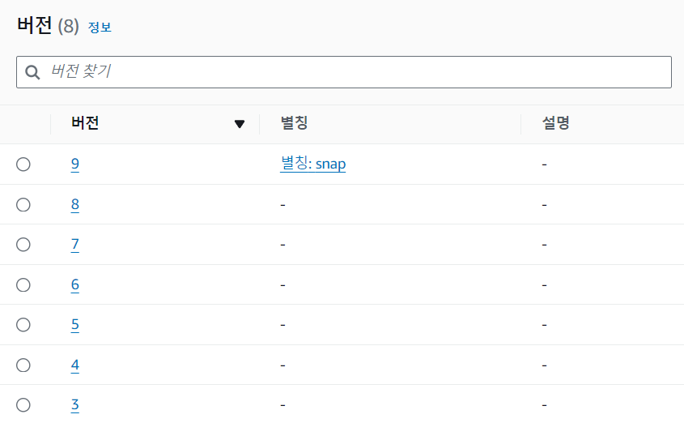

## 0. 문제 인식
졸업작품 [DevRoom](https://github.com/Yanghyeondong/DEV-ROOM)을 진행하다가, 매번 번거롭게 AWS Lambda를 배포하지 않고 CI/CD를 적용해보기로 했습니다.
하지만 SnapStart 기능을 활성화해서, 일반적인 방법으로는 바로 연결이 되지 않아 그 해결과정을 공유합니다.

## 1. 미리보는 해답과 코드
- API Gateway는 항상 별칭과 연결해서 특정 버전에 귀속되지 않도록 하자!
- `aws lambda update-alias`로 매번 새로운 버전의 snapshot에 별칭을 업데이트 해주자!
- 용량이 50MB를 넘어갈때는 `aws s3 sync`로 s3에 코드를 저장하자!

```yml
name: devroom-lambda-cicd

on:
  push:
    branches:
      - develop

jobs:
  build-and-deploy:
    runs-on: ubuntu-latest
    steps:
      - uses: actions/checkout@v4
      - name: Set up JDK 21
        uses: actions/setup-java@v4
        with:
          java-version: '21'
          distribution: 'temurin'

      - name: Copy application.properties
        run: echo "${{ secrets.APPLICATION_PROPERTIES }}" > ./backend/src/main/resources/application.properties

      - name: Build with Gradle
        run: cd backend;chmod +x gradlew;./gradlew buildZip

      - name: Configure AWS Credentials
        uses: aws-actions/configure-aws-credentials@v3
        with:
          aws-access-key-id: ${{ secrets.AWS_ACCESS_KEY_ID }}
          aws-secret-access-key: ${{ secrets.AWS_SECRET_ACCESS_KEY }}
          aws-region: ap-northeast-2

      - name: Upload S3 code
        run: aws s3 sync ./backend/build/distributions/ s3://devroombucket/lambda_snap

      - name: Update Lambda code
        run: |
          FUNCTION_NAME=devRoomLambda;
          aws lambda update-function-code --function-name $FUNCTION_NAME \
          --s3-bucket devroombucket --s3-key lambda_snap/DevRoom-Spring.zip

      - name: Update Lambda SnapStart Alias Version
        run: |
          FUNCTION_NAME=devRoomLambda;
          VERSION=$(aws lambda publish-version --function-name $FUNCTION_NAME | jq -r .Version);
          aws lambda update-alias --function-name $FUNCTION_NAME --name snap --function-version $VERSION
```


## 2. SnapStart와 API Gateway
Lambda에서 SnapStart을 활성화할 경우, 연결되어 있던 API Gateway를 우선 해제해야 합니다.  
SnapStart는 특정 버전을 기준으로 작동하기 때문입니다!

  

이후 최신 버전에다 다음과 같이 API Gateway를 연결해줘야 합니다.

  
  

## 3. yml 작성 및 설명

`.github/workflows`폴더에 yml 파일을 작성해 줍니다.  
최종 코드는 포스트 상단에 작성했으며, 한문단씩 설명하도록 하겠습니다.

### 1. develop 브랜치에 push 할시 작동한다.
```yml
name: devroom-lambda-cicd
on:
  push:
    branches:
      - develop
```
### 2. Spring 코드를 배포하기 위한 java 환경 구축
```yml
      - name: Set up JDK 21
        uses: actions/setup-java@v4
        with:
          java-version: '21'
          distribution: 'temurin'
```
### 3. 노출되면 안되는 시크릿 값을 Spring에 주입
Spring에서 사용하는 k8s 토큰등이 담겨있습니다.
```yml
      - name: Copy application.properties
        run: echo "${{ secrets.APPLICATION_PROPERTIES }}" > ./backend/src/main/resources/application.properties
```
### 4. Gradle로 Java 빌드
SpringBoot 개발시 Gradle을 사용했기에 동일하게 작성해줍니다.
```yml
      - name: Build with Gradle
        run: cd backend;chmod +x gradlew;./gradlew buildZip
```
### 5. AWS 배포를 위한 인증
중요 정보가 노출되지 않도록 깃허브 시크릿을 사용합니다.
```yml
      - name: Configure AWS Credentials
        uses: aws-actions/configure-aws-credentials@v3
        with:
          aws-access-key-id: ${{ secrets.AWS_ACCESS_KEY_ID }}
          aws-secret-access-key: ${{ secrets.AWS_SECRET_ACCESS_KEY }}
          aws-region: ap-northeast-2
```
### 6. 용량 문제가 생기는 Spring 코드를 S3에 업로드
50MB를 넘어가면 직접 업로드가 안됩니다!
```yml
      - name: Upload S3 code
        run: aws s3 sync ./backend/build/distributions/ s3://devroombucket/lambda_snap
```
### 7. S3를 소스로 해서 새로운 람다 버전 배포
```yml
     - name: Update Lambda code
        run: |
          FUNCTION_NAME=devRoomLambda;
          aws lambda update-function-code --function-name $FUNCTION_NAME \
          --s3-bucket devroombucket --s3-key lambda_snap/DevRoom-Spring.zip
```
### 8. 최신 버전의 람다에 alias를 할당.
`VERSION=$(aws lambda publish-version --function-name $FUNCTION_NAME | jq -r .Version);`으로 최신버전을 불러오는 것이 핵심입니다!
```yml
      - name: Update Lambda SnapStart Alias Version
        run: |
          FUNCTION_NAME=devRoomLambda;
          VERSION=$(aws lambda publish-version --function-name $FUNCTION_NAME | jq -r .Version);
          aws lambda update-alias --function-name $FUNCTION_NAME --name snap --function-version $VERSION
```
