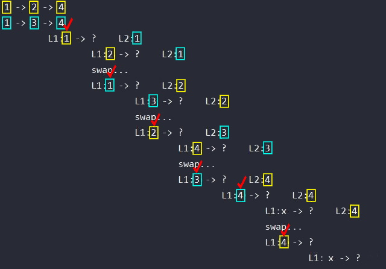

## 1. 문제 확인

[21. Merge Two Sorted Lists](https://leetcode.com/problems/merge-two-sorted-lists/)
\
간단한 **연결 리스트 병합** 문제입니다. 두 리스트는 이미 **정렬**되어 있는 것이 포인트입니다.

## 2. 코드

**코드 1**  
처리시간 79 ms
```py
class Solution:
    def mergeTwoLists(self, list1: Optional[ListNode], list2: Optional[ListNode]) -> Optional[ListNode]:

        pointer_1 = list1
        pointer_2 = list2
        ans_head = ListNode(0)
        temp_head = ans_head

        while pointer_1 and pointer_2:
            if pointer_1.val <= pointer_2.val:
                temp_head.next = pointer_1
                temp_head = temp_head.next
                pointer_1 = pointer_1.next
            else:
                temp_head.next = pointer_2
                temp_head = temp_head.next
                pointer_2 = pointer_2.next

        if not pointer_1:
            temp_head.next = pointer_2
        else:
            temp_head.next = pointer_1

        return ans_head.next
```
\
**코드 2 (개선)**  
처리시간 76 ms
```py
class Solution:
    def mergeTwoLists(self, l1: Optional[ListNode], l2: Optional[ListNode]) -> Optional[ListNode]:
        if (not l1) or (l2 and l1.val > l2.val):
            l1, l2 = l2, l1
        if l1:
            l1.next = self.mergeTwoLists(l1.next, l2)
        return l1
```

## 3. 피드백
이번에도 **코드 1**과 **코드 2**의 길이가 상당히 차이 납니다. 재귀 함수의 특성상 길이 차이가 나는 것으로 보입니다. 둘 다 시간 복잡도는 **O(n)** 이며, 실행 시간도 크게 차이 나지 않습니다.  
\
**코드 1**은 머지 소트의 병합처럼 두 리스트에 포인터를 두고 값을 비교해가며 결과 리스트에 넣게 됩니다. `ans_head = ListNode(0)` 부분을 넣어준 이유는 다음과 같습니다. 결과 리스트를 만들 때 고정된 첫 헤드를 위해서 임의 값을 줍니다. 그리고 끝에 가서 `return ans_head.next` 로 답에 해당하는 부분만 리턴합니다.  
\
**코드 2**의 경우 **재귀 함수**를 사용해서 코드는 간단합니다. 하지만 직관적인 이해는 어렵습니다. 우선 주요 아이디어는 다음과 같습니다.  
> 1. `l1.val` 이 `l2.val` 보다 클 경우 두 개를 **스왑** 한다.  
> 2. **재귀 함수**로 호출한 값을 `l1.next`에 할당하고 `l1`을 리턴한다. 
> 3. `l1`이 `None`이 될 때까지 반복한다.
이해를 돕기 위해 직접 사진으로 만들어 봤습니다.  
\
  
위의 사진에서 **노란색** 박스와 **하늘색** 박스는 주어진 **두 연결 리스트의 노드**들을 표기한 것입니다. **공백**으로 나눈 열은 **재귀의 깊이**를 의미합니다. 즉, 같은 열에서 시작하면 동일한 깊이입니다.  
\
`?` 는 재귀로 정해지는 `l1.next` 에 해당합니다. `?`와 같은 열 제일 아래에 있는 값이 백트래킹 후 리스트에 연결됩니다. 따라서 위의 사진에서 **빨간색** 체크로 되어있는 부분이 **답에 해당하는 리스트** 입니다.  
\
`if (not l1)` 조건이 있는 이유는 `l1 = None` 일 때 `l1.val` 을 호출하여 오류가 발생하기 전에 스왑이 가능하도록 해줍니다. `l1 = None` 이라도 `l2 != None` 이라면 스왑이 필요하기 때문입니다.  
\
`if l1:`의 경우 `l1`, `l2` 모두가 끝에 도달했을 때 재귀를 종료하는 역할을 합니다.
## 4. 요약정리
쉽게 푸는 방법이 있더라도, **재귀**를 응용해 조금 더 깔끔하고 명확한 코드에 도전해보자.  
스왑은 **다중 할당**을 사용하자.  
ex.) `l1, l2 = l2, l1`  
조건문이 복잡하면 **괄호**를 통해 명확히 하자.  
ex.) `if (not l1) or (l2 and l1.val > l2.val)`  
## Source

- 『파이썬 알고리즘 인터뷰』 *-박상길 지음*
- leetcode  
  [https://leetcode.com/problems/merge-two-sorted-lists/](https://leetcode.com/problems/merge-two-sorted-lists/)