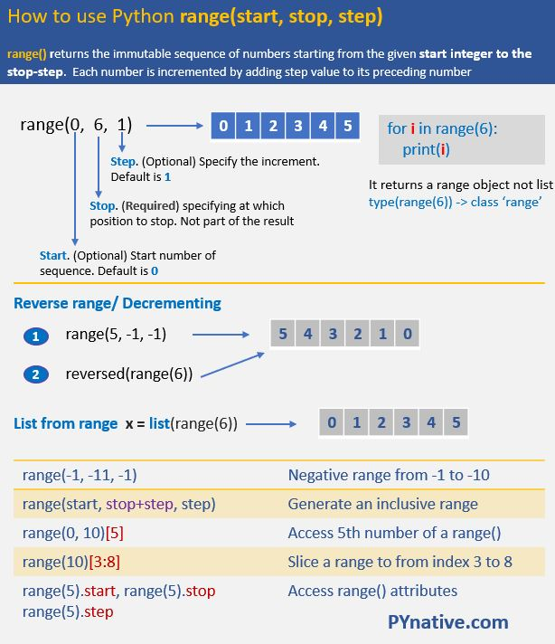

## 1. 문제 확인

[238. Product of Array Except Self](https://leetcode.com/problems/product-of-array-except-self/)
\
주어진 배열(파이썬은 리스트)에서 각 원소마다 **자기 자신을 제외한 곱**을 계산하는 문제입니다. **나눗셈을 사용하지 않고** 시간 복잡도 **O(n)** 으로 푸는 것이 포인트입니다.

## 2. 코드

**코드 1**  
처리시간 371ms
```py
class Solution:
    def productExceptSelf(self, nums: List[int]) -> List[int]:
        left_products = []
        right_products = []
        nums_len = len(nums)
        ans = []

        left_product = 1
        right_product = 1

        for i, num in enumerate(nums):
            left_product *= nums[i]
            right_product *= nums[nums_len-i-1]
            left_products.append(left_product)
            right_products.append(right_product)

        right_products.reverse()

        for i in range(nums_len):
            if i == 0:
                ans.append(right_products[1])
            elif i == (nums_len - 1):
                ans.append(left_products[nums_len-2])
            else:
                ans.append(left_products[i-1]*right_products[i+1])
        return ans
```
\
**코드 2 (개선)**  
처리시간 514 ms
```py
class Solution:
    def productExceptSelf(self, nums: List[int]) -> List[int]:
        out = []
        p = 1
        for i in range(0, len(nums)):
            out.append(p)
            p = p * nums[i]
        p = 1
        for i in range(len(nums) - 1, 0 - 1, -1):
            out[i] = out[i] * p
            p = p * nums[i]
        return out
```

## 3. 피드백
이번에는 **코드 1**과 **코드 2** 모두 시간 복잡도 **O(n)** 으로 비슷한 처리시간을 가집니다. 다만, 코드의 길이는 **코드 2**가 더 짧습니다. 공간 복잡도의 경우 **코드 1** ➜ **O(n)** , **코드 2** ➜ **O(1)** 로 **코드 2**가 더 효율적입니다(답 출력을 위한 리스트 공간은 제외).  
\
우선 **코드 1**의 경우 주요 아이디어는 다음과 같습니다.  
> 1. 자신을 제외한 곱은 자신의 **좌측 누적 곱**과 **우측 누적 곱**을 곱하면 나온다.  
> 2. 좌측 누적 곱과 우측 누적 곱은 **미리 계산해서 리스트로** 만든다.   
이렇게만 보면 이해가 잘 안 될 수도 있기에 예시를 정리하면 다음과 같습니다.  
\
`[1, 2, 6, 24]` ➜ `left_products`  
`[1, 2, 3, 4]` ➜ `nums`  
`[24, 24, 12, 4]` ➜ `right_products`  
`[24*1, 1*12, 2*4, 6*1]` ➜ `ans`  
`[24, 12, 8, 6]` ➜ `ans`  
\
한 가지 예로`nums[2]`의 값 **3**을 제외한 나머지의 곱을 찾을 때는 `left_products[1] = 2`와  `right_products[3] = 4`를 곱해서 **8**이라는 답이 나옵니다. 가장 좌측과 우측의 경우 해당 원소를 그대로 집어넣습니다.  
\
**코드 2**의 경우 따로 좌우측 누적 곱 리스트를 만들지 않고 바로 좌측 누적 곱에 해당하는 리스트에 우측 누적 곱을 곱해서 답을 도출합니다. 이것도 예시를 정리하면 다음과 같습니다. (곱하는 인덱스가 **코드 1**에 비해 한 칸씩 밀립니다)  
\
`[1, 2, 3, 4]` ➜ `nums`  
`[1, 1, 2, 6]` ➜ `out`  
`[1*(2*3*4*1), 1*(3*4*1), 2*(4*1), 6*1]` ➜ `out`  
`[24, 12, 8, 6]` ➜ `out`  
\
앞에서도 설명했듯이 **코드 2**처럼 풀게 된다면 좌우측 누적 곱을 위한 추가적인 리스트(혹은 배열)가 필요 없습니다. 따라서 공간 복잡도가 **O(1)** 로 최적화됩니다.

### 추가팁!
**코드 2**에 사용된 `range()` 함수에 대하여 잘 정리된 자료가 있어 첨부합니다. 예를 들어 위의 **코드 2**에서 `[1, 2, 3, 4]`인 리스트가 주어지면 `for i in range(len(nums) - 1, 0 - 1, -1):`의 경우 `i`의 값이 3 ➜ 2 ➜ 1 ➜ 0 이 됩니다.  (= `reversed(range(len(nums)))`)  
\


## 4. 요약정리

자신이 제외된 특정 연산을 하는 경우, 자신을 기준으로 **좌우를 분리**하여 누적 기록을 활용하자.  
시간 복잡도뿐만 아니라 **공간 복잡도**도 최적화하는 습관을 가지자.   

## Source

- 『파이썬 알고리즘 인터뷰』 *-박상길 지음*
- leetcode  
  [https://leetcode.com/problems/product-of-array-except-self/](https://leetcode.com/problems/product-of-array-except-self/)
- pynative  
  [https://pynative.com/python-range-function/](https://pynative.com/python-range-function/)