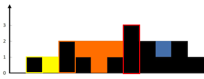
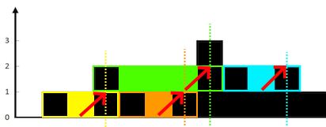

## 1. 문제 확인

[42. Trapping Rain Water](https://leetcode.com/problems/trapping-rain-water/)
\
**빗물 트래핑** 문제입니다. 일련의 높이가 주어진 리스트를 벽처럼 생각하여 **쌓인 물**을 계산합니다.  
Leetcode에 hard로 소개되어 있습니다. ~제가 처음에 못 풀어서 hard라고 한 거 아닙니다~

## 2. 코드

**코드 1**  
처리시간 - Time Limit Exceeded
```py
class Solution:
    def trap(self, height: List[int]) -> int:

        def get_trap_range(current_index, current_height):
            if current_height == 0:
                return 0
            for i in range(current_index+1, len(height)):
                if height[i] >= current_height:
                    return i-(current_index+1)
            return 0

        idx = 0
        rain = 0

        while idx < len(height):
            for h in range(0, height[idx]+1):
                trap_range = get_trap_range(idx, h)
                rain += trap_range
            idx += 1
            
        return rain
```
\
**코드 2 (개선)**  
처리시간 214ms
```py
class Solution:
    def trap(self, height: List[int]) -> int:

        def get_left_side(heights, max_index):
            rain = 0
            left_max = 0
            for i in range(0, max_index):
                if heights[i] >= left_max:
                    left_max = heights[i]
                else:
                    rain += (left_max - heights[i])
            return rain

        total_rain = 0
        max_index = height.index(max(height))
        total_rain += get_left_side(height, max_index)
        total_rain += get_left_side(height[::-1], len(height)-max_index)

        return total_rain
```
\
**코드 3 (개선)**  
처리시간 132ms
```py
class Solution:
    def trap(self, height: List[int]) -> int:
        stack = []
        volume = 0

        for i in range(len(height)):
            while stack and height[i] > height[stack[-1]]:
                top = stack.pop()

                if not len(stack):
                    break

                distance = i - stack[-1] - 1
                waters = min(height[i], height[stack[-1]]) - height[top]

                volume += distance * waters

            stack.append(i)
        return volume
```
## 3. 피드백

우선 첫 번째로 짠 **코드 1**은 인덱스를 순회하며 각 높이마다 다음 지점까지의 물이 담긴 거리를 계산했습니다. 다만,  **Time Limit Exceeded** 로 테스트 케이스를 통과하지 못했습니다. 시간 복잡도가 O(n^2)이기 때문에 어느 정도 예상은 했지만, O(n) 방법을 생각하는 데는 시간이 좀 걸렸습니다.  
\
두 번째로 시도한 **코드 2**의 방법인 **최댓값 포인터**의 경우 시간 복잡도 O(n) 이내로 가능했습니다. 해당 풀이의 주요 아이디어는 다음과 같습니다.  
> 1. **가장 높은 지점**을 찾는다.  
> 2. 좌측부터 포인터를 통해 **최댓값**을 갱신해 나간다.  
> 3. 좌측 **최댓값**과 **현재 높이**의 **차이** 만큼 빗물을 더한다.  
> 4. 이를 가장 높은 지점까지 반복한다.  
> 5. 뒤집어서 다시 한번 반복한다(우측도 구하기 위해).  
위의 방법이 가능한 이유를 그림으로 설명하면 다음과 같습니다. ~직접 만드느라 힘들었습니다~




빨간색 기둥 (가장 높은 지점) 전까지 각 기둥과 그 사이의 물을 확인해보면 다음을 만족합니다.
> 가장 높은 지점과 각 기둥들 사이에는 좌측 최댓값의 높이까지 항상 물이 차있다.
노란색 기둥의 경우 노란색 부분의 물은 항상 높이 1을 유지하며, 주황색 기둥의 경우 주황생 부분의 물은 항상 높이 2를 유지합니다다. 따라서 리스트를 순회하며 **좌측 최댓값 - 현재 높이** 를 해주면 좌측에 쌓인 물의 양을 알 수 있습니다. (*위의 그림에서는 순서대로 1 + 1 + 2 + 1 입니다.*) 이후 이를 리스트를 뒤집어서 다시 한번 해주면 우측의 물의 양도 알 수가 있습니다. 단, 이때 가장 높은 지점이 2개인 경우 ex.)`[2, 0, 2]` 하나의 인덱스를 기준으로 뒤집어서 줄 필요가 있습니다. `get_left_side(height[::-1], len(height)-max_index)`. 왜냐하면 `.index()`함수는 항상 앞에서부터 인덱스를 찾기 때문입니다. 추가적으로 좌우에서 동시에 투 포인터를 이동시키는 방법도 책에 소개되어 있습니다.  
\
마지막으로 『파이썬 알고리즘 인터뷰』에서 소개된 **코드 3**의 경우 스택을 사용합니다. 현재의 높이가 이전의 높이보다 높을 때, 격차만큼 물 높이를 채우게 됩니다. 얼핏 보면 이중 반복문이라서 O(n^2)처럼 보이지만, 전체적으로는 한 번만 보게 되므로 O(n) 이내로 가능했습니다. 다만, 스택을 사용하는 코드 자체가 직관적으로 이해하기는 힘듭니다.  


  

## 4. 요약정리

문제에서 항상 만족하는 조건을 통해 **반복할 필요가 없는 연산**을 고민해보자. (시간 복잡도를 위해)  
ex.) 가장 높은 지점과 각 기둥들 사이에는 좌측 최댓값의 높이까지 항상 물이 차있다.  

혹은, 다른 자료구조 ex.) **스택** 등을 고민해보자.


## Source

- 『파이썬 알고리즘 인터뷰』 *-박상길 지음*
- leetcode  
  [https://leetcode.com/problems/trapping-rain-water/](https://leetcode.com/problems/trapping-rain-water/)