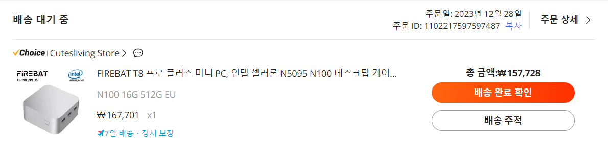
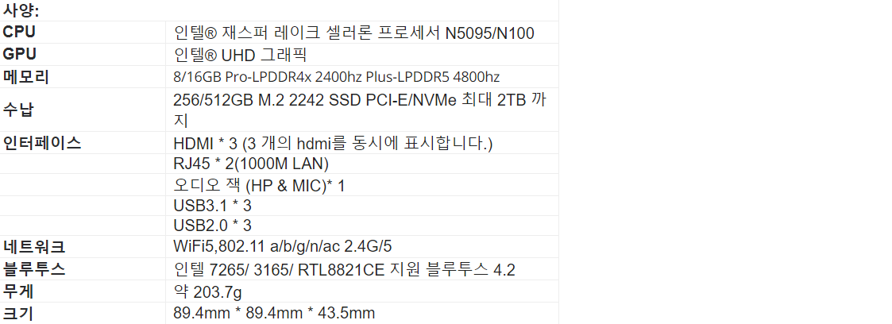
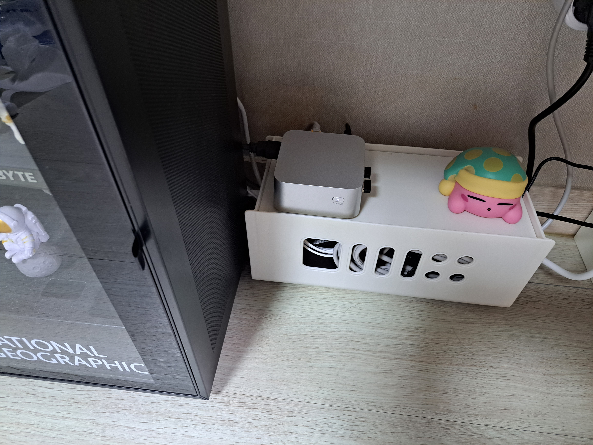
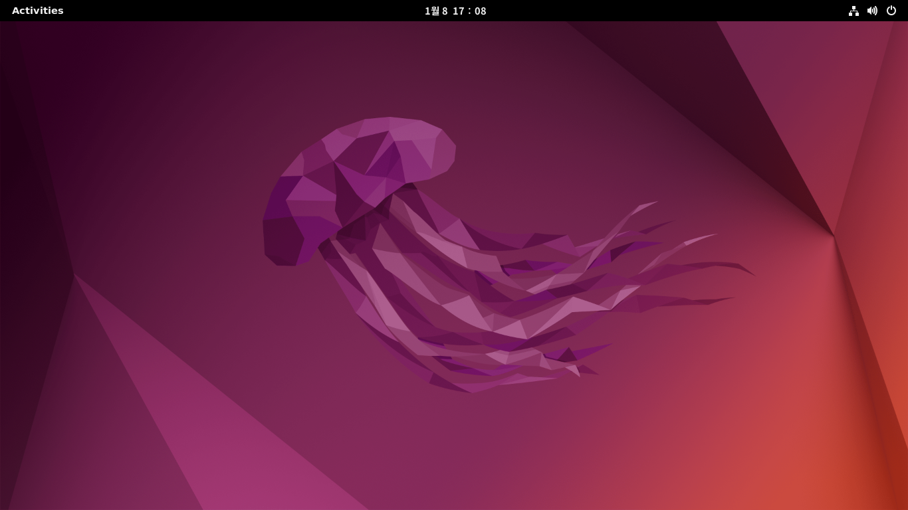

## 1. Mini PC 주문
주문은 알리익스프레스에서 진행했습니다.
다행이 관세 기준인 150$는 넘지않네요.

  

## 2. 스펙
  
램 16GB, SSD 512GB로 넉넉하게 설정했습니다.

## 3. 설치 및 셋팅
기본적인 케이블과 HID 장치를 연결해줍니다.
  

## 4. 우분투 설치
기본적인 설치 방법은 다음을 참고하였습니다.  
[우분투-부팅-usb-설치-방법-우분투-설치-파티션-설정](https://amkorousagi-money.tistory.com/entry/%EC%9A%B0%EB%B6%84%ED%88%AC-%EB%B6%80%ED%8C%85-usb-%EC%84%A4%EC%B9%98-%EB%B0%A9%EB%B2%95-%EC%9A%B0%EB%B6%84%ED%88%AC-%EC%84%A4%EC%B9%98-%ED%8C%8C%ED%8B%B0%EC%85%98-%EC%84%A4%EC%A0%95)

파티션 설정시, 기존에있는 windows를 없애기 위해 something else 항목을 선택하여 직접 파티션을 설정해줘야 합니다. 필요한 파티션의 종류는 다음과 같습니다.  
1. **efi 파티션**  
   없으면 부팅이 안됩니다. 꼭 설정을해야 하며, 용량은 500MB 내외로, primary 디스크로 설정하면 됩니다.
2. **swap 파티션**  
   메모리와 디스크간의 스왑을 위해 설정하며, 필수는 아니지만 설정하면 좋습니다. 저는 SSD 용량이 넉넉하여 4GB로 설정했습니다.
3. **ext4 / 파티션**  
   커널, root등 실제 리눅스에 필요한 파일들이 설치되는 파티션입니다. 경로는 / 로 설정하면 되고, 용량은 나머지 전부를 사용했습니다.

## 설치 완료

ssh연결 방법은 다음 포스트에서 다루겠습니다.

## Source

- [우분투-부팅-usb-설치-방법-우분투-설치-파티션-설정](https://amkorousagi-money.tistory.com/entry/%EC%9A%B0%EB%B6%84%ED%88%AC-%EB%B6%80%ED%8C%85-usb-%EC%84%A4%EC%B9%98-%EB%B0%A9%EB%B2%95-%EC%9A%B0%EB%B6%84%ED%88%AC-%EC%84%A4%EC%B9%98-%ED%8C%8C%ED%8B%B0%EC%85%98-%EC%84%A4%EC%A0%95)
