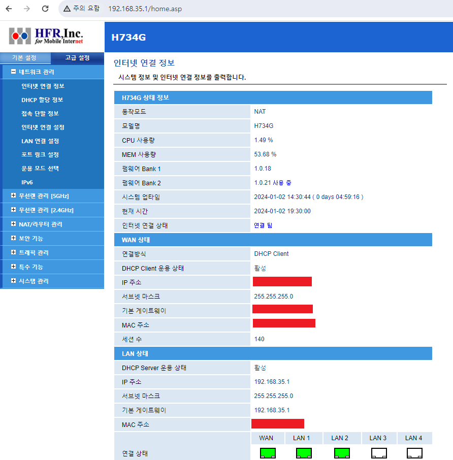

## 1. 네트워크 정보 확인
Ubuntu의 네트워크 설정에 앞서, 기본적인 네트워크 정보를 찾아놓습니다. 앞선 포스트에서 설명하였던 포트포워딩에 해당하는 IP 정보, 게이트웨이 IP, DNS 서버 IP 등을 기록합니다.  
\

\

\

## 2. Ubuntu 네트워크 설정
간편한 GUI 기준으로 설명하겠습니다. 우분투에서 우측 상단의 네트워크 버튼을 누르고, 세부설정에 들어가 현재 연결되어있는 네트워크의 톱니바퀴를 누릅니다.  
\
  
현재 네트워크의 MAC 주소 및 DNS 서버를 확인해 줍니다.  
\
  
IPv4 세부설정에서 Manual을 선택합니다. 이후 아래 정보칸에 본인의 고정된 DHCP IP, 서브넷 마스크, 게이트웨이 IP, DNS 서버 IP를 입력합니다. Routes의 경우 자동으로 설정해놓아도 됩니다.  
\
  
\
  

## 3. ssh 접속 확인

ssh로 포트포워딩에 해당하는 IP로 잘 접속되는 것을 확인할 수 있습니다.  
   
