*해당 포스트는 성균관대학교 컴퓨터네트워크 수업 중 진행된 TCP 개선 과제를 정리한 것입니다.*

## 1. 목표 설정
Ubuntu 커널 TCP Reno 모듈을 개선한 커스텀 모듈을 만들고,  
Mininet 에뮬레이터로 다양한 환경에서의 성능을 측정한다.

### 환경 설정
- Ubuntu 20.04 LTS
- Mininet  
  Mininet 테스트 토폴로지 환경은 아래 보고서 사진 참고.

### 성능 평가 지표
- Link Utilization (모든 연결의 bandwidths 총합)
- Fairness (Jain's fairness index)
- Latency (rtt avg)

### Mininet이란?
Network Emulator로서, 하나의 호스트 안에서 가상 네트워크 환경을 구성하고 통신이 가능하다.  
[https://github.com/mininet/mininet](https://github.com/mininet/mininet)  
\
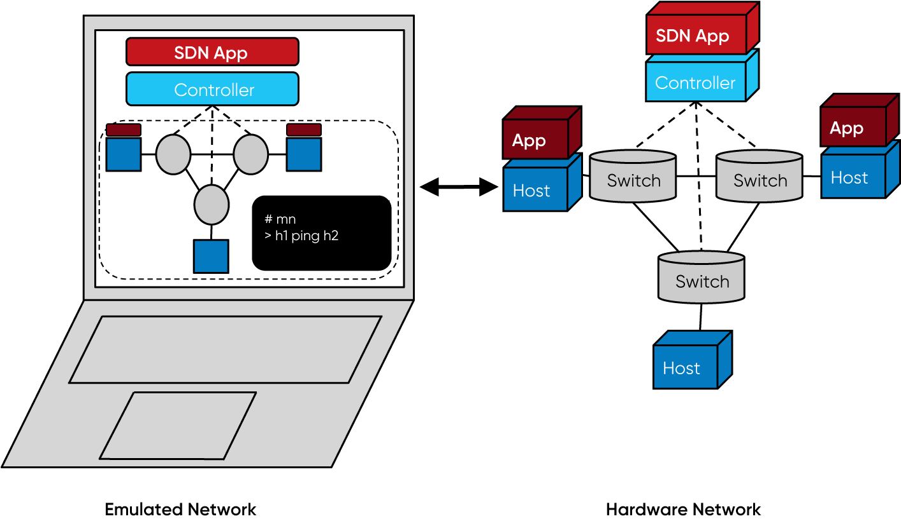  
\
설치 코드
```bash
git clone https://github.com/mininet/mininet.git
PYTHON=python3 util/install.sh -fnv
sudo mn
```
## 2. 보고서 정리

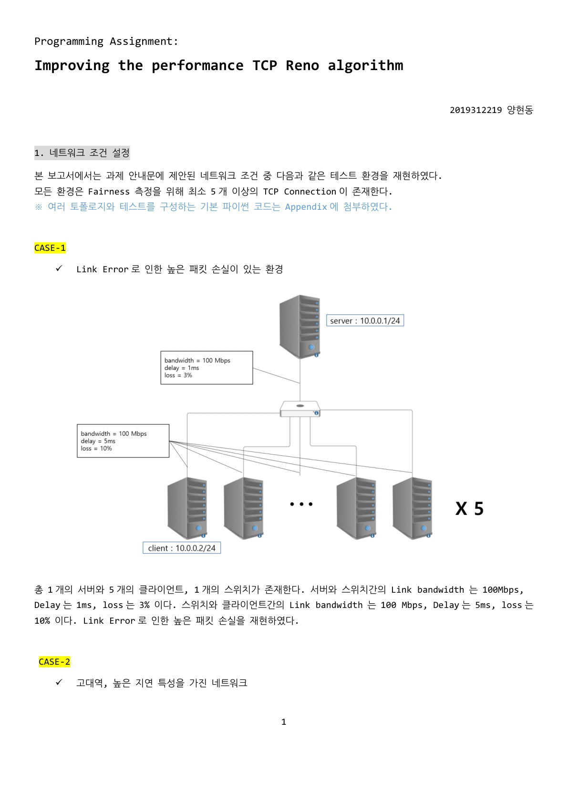
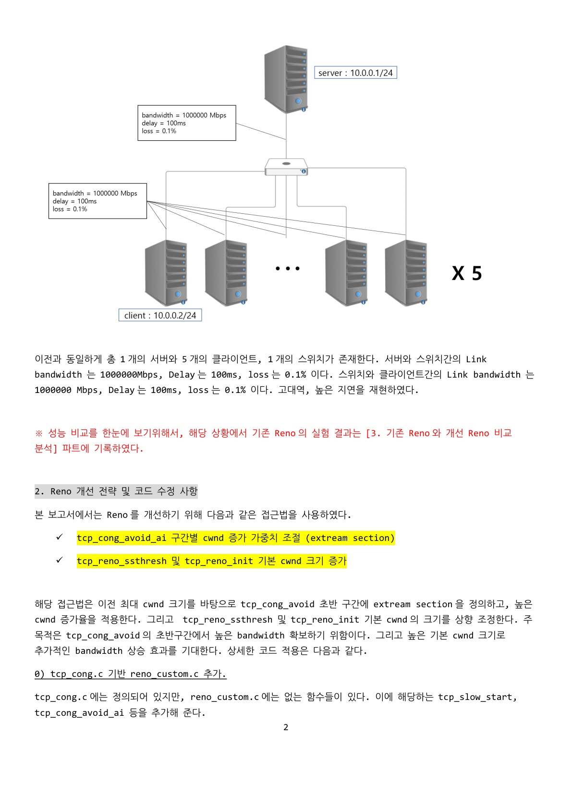
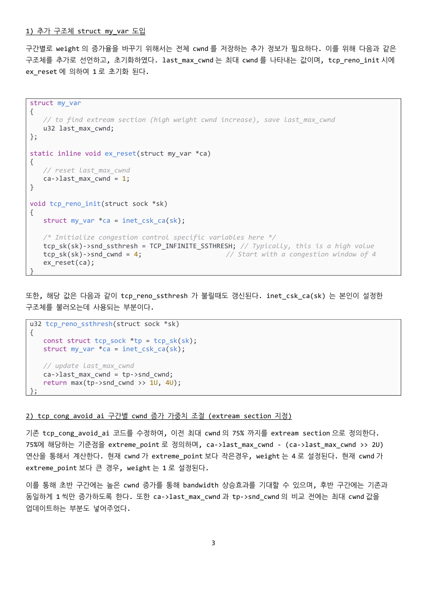
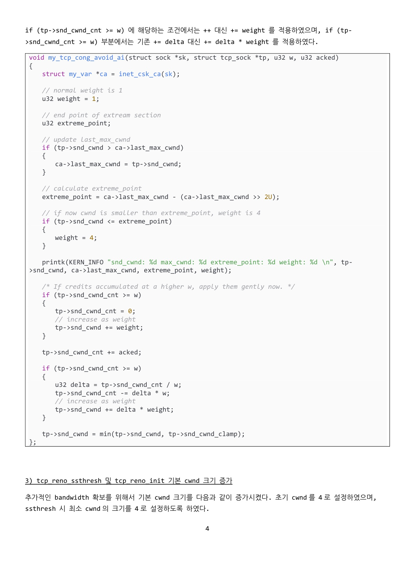
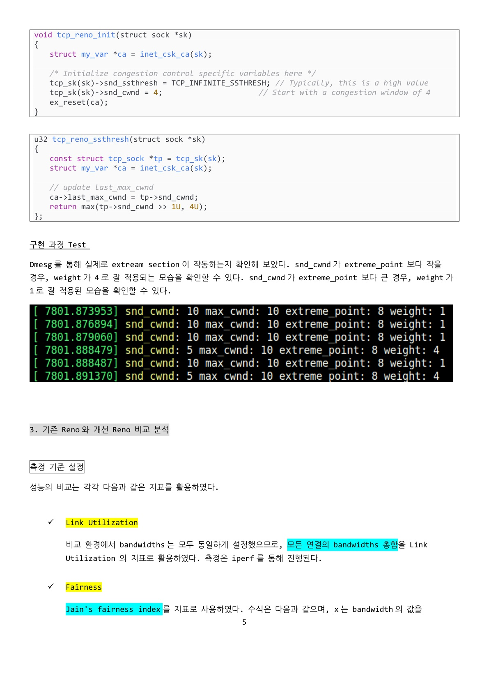
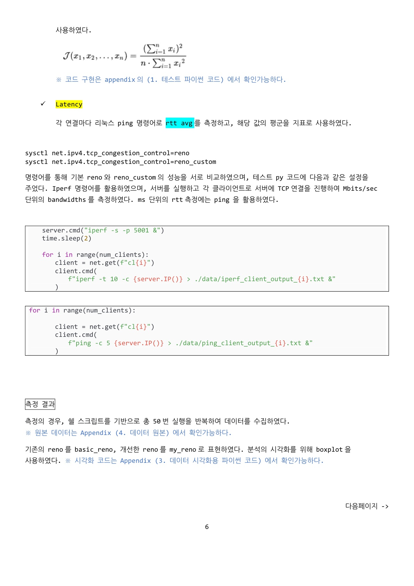
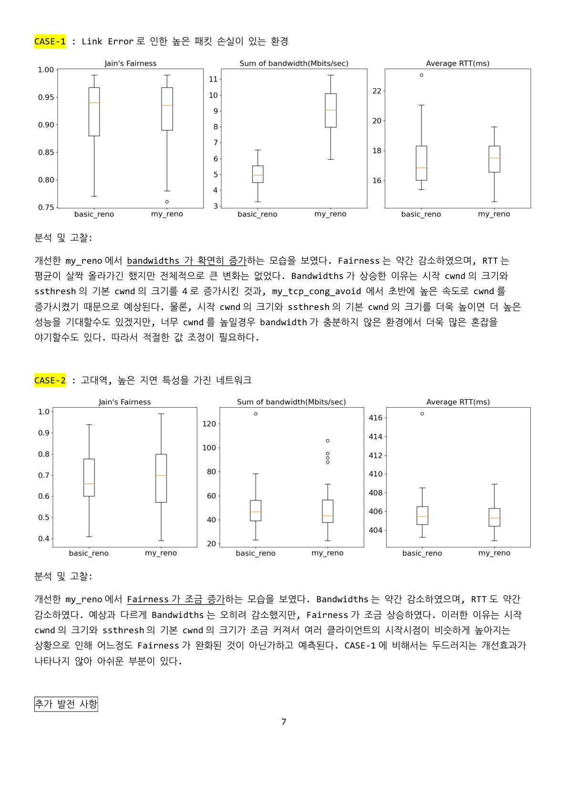
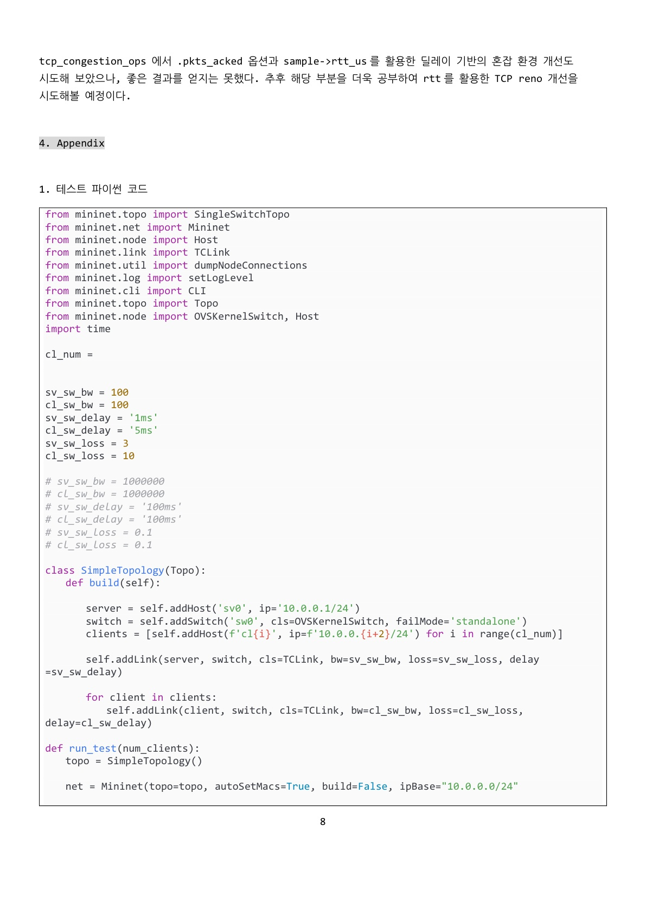
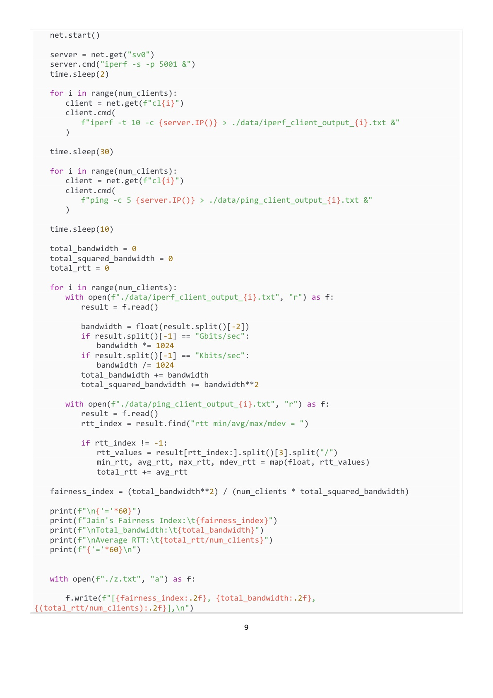
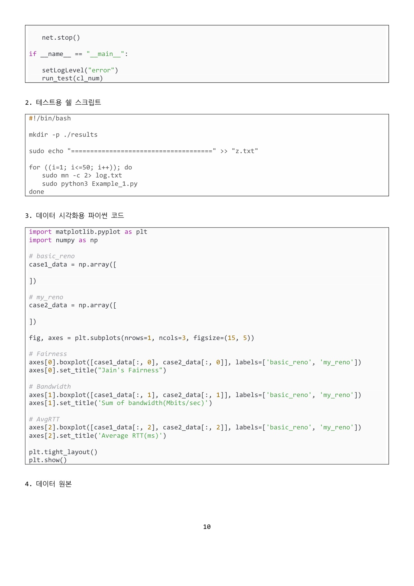
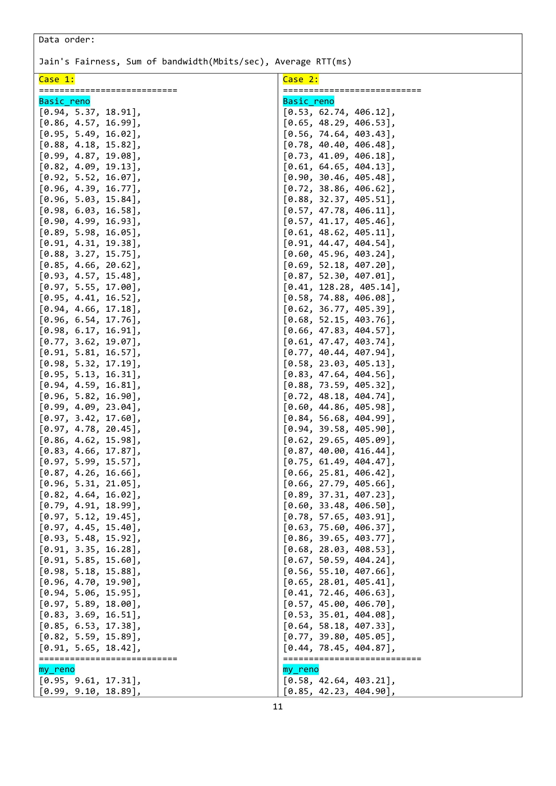
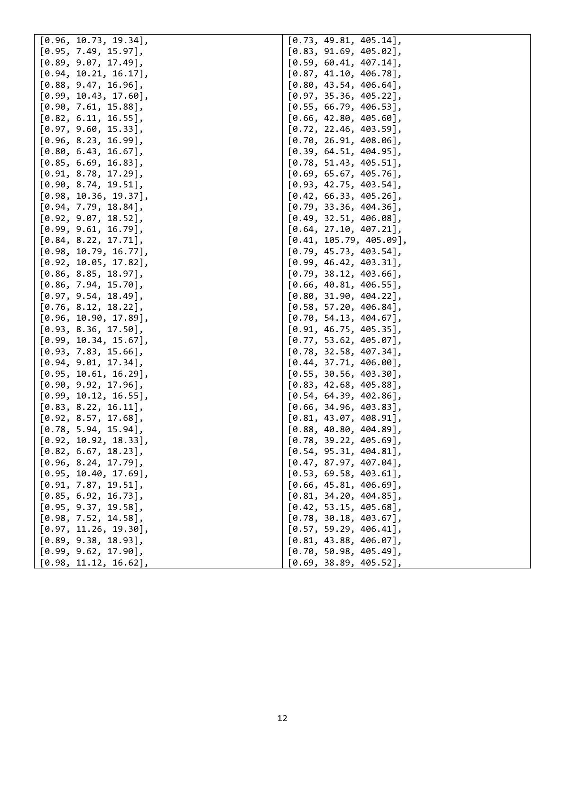


## Source

- Mininet Github  
  [https://github.com/mininet/mininet](https://github.com/mininet/mininet) 
