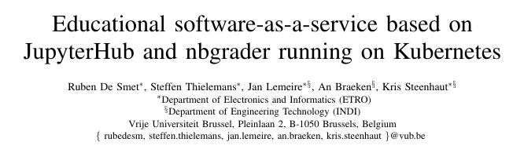
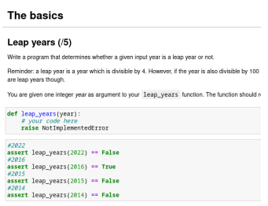
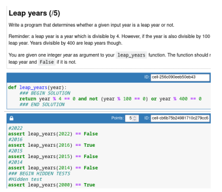

최근 졸업작품 [DEVROOM](https://github.com/DEVROOM-OFFICIAL)의 중간보고서를 작성하면서, 여러 선행 연구 논문들을 리서치했습니다.  
여러 논문중에서도, 비교적 최신이면서 저희 프로젝트와 방향성이 유사한 논문을 리뷰해 봅니다.

## 0. 논문 정보

[https://ieeexplore.ieee.org/document/9969419](https://ieeexplore.ieee.org/document/9969419)  

## 1. 논문 개요
- **벨기에 Brussel 대학**에서 기존에 운영하던 **ETROpy** PaaS 서비스는 프로그래밍 숙제 연습에만 초점을 맞춰 강의 실습용으로는 부적절. 이 외에도 다양한 한계점 존재.
- 위의 문제를 해결하기 위해, **Jupyter Hub** 기반의 SaaS 교육용 서비스 제안.
- **Jupyter Notebook**을 기반으로 개인별 온라인 웹 프로그래밍 환경 제공.
- **K8s**를 통해 **Jupyter Hub**를 배포 및 운영. 개인마다 파드와 볼륨 제공.
- 과제 생성과 채점의 편의성을 위해 **nbgrader**을 활용.
- 퍼블릭 클라우드, 온프레미스 둘 다 사용 가능.
- Brussel 공학부 수업에서 실제로 2년간 SaaS 솔루션을 운용, 교사와 학생의 피드백이 긍정적.

### Tip!
#### Jupyter Notebook이란?
오픈 소스 웹 애플리케이션으로, 파이썬이나 R, Julia, Ruby 코드를 웹 화면에서 실행하고 그 결과를 확인할 수 있다.  
#### nbgrader란?
Jupyter Notebook 기반의 교육 도구로, 과제 관리 및 자동 채점이 가능하다.

## 2. 환경 설계 및 실험
### 온프레미스 구축
**16-core AMD EPYC 7302 + 128GB RAM** 서버 4대를 **K8s**로 연결 및 관리.  
**2TB SSD** 3대를 Ceph 분산 솔루션으로 구성.
### K8s 자원 생성
Jupyter Hub의 배포판 중 **Z2J** (**Zero to JupyterHub**)를 K8s에 배포. 사용자 마다 모두 자신의 볼륨과 포드를 할당받게 된다. 각 사용자의 성능은 4GB RAM과 1 CPU로 제한하였다. FailOver 발생 시 파드는 자동으로 재시작된다.
### 교수와 학생 인증 방식
Jupyter Hub에서 **외부 OAuth 서비스**를 사용 가능.  
본 논문에서는 **Azure Active Directory** 서비스를 활용하였다.
### 교수와 학생 정보 관리
기존에 사용하던 **Canvas** 시스템의 API를 활용해 **JupyterHub** DB와의 동기화를 진행.

### 교수 Jupyter Notebook nbgrader 문제 출제 예시 화면

교수는 문제에 대한 설명과 답안, 그리고 정답 채점을 위한 테스트 케이스를 **nbgrader**에서 위와 같이 작성한다. 주석 사이에 실제 정답을 기입하며, 학생에게는 아래 예시 화면과 같이 정답이 보이지 않는다. 히든 테스트 케이스도 설정 할 수 있다. 점수 배점도 설정 가능하다. 이후 해당 **ipynb Notebook** 파일을 학생에게 게시한다.
### 학생 Jupyter Notebook nbgrader 문제 풀이 예시 화면

학생은 게시된 ipynb Notebook 파일에서 문제에 맞게 정답을 기입한다. 이후 해당 Notebook 파일은 다시 교수에게 전해져 채점이 진행된다.

### Brussel 대학 SaaS 솔루션 실험 대상 과목 
- Engineering: The engineering track (알고리즘적 사고에 중점)
- Engineering: Architecture: The architecture engineering track (시각화에 중점)
- Engineering Technology: The engineering technology track (실제 구현과 실습에 중점)
 
## 3. 최종 평가 및 결론
학생들이 IDE와 같은 툴 설치나 환경 설정에 신경 쓰지 않고, 실습 자체에 집중할 수 있었다. 기존의 **ETROpy**나 **PyCharm**에 비해 훨씬더 개선된 접근성을 보였다. 또한 **nbgrader**를 적용하면서 과제의 채점도 훨씬 간단해졌으며, 교수자의 성적 입력 또한 편리해졌다. 현재는 **nbgrader**와 **JupyterLab**의 통합까지 진행 중이며, 이는 추후 더 많은 교육기관에서의 활용도 기대할 수 있다.

## 4. DevRoom 프로젝트에서의 활용
비록 이 논문을 보기 전에 DevRoom 프로젝트를 실행하기는 했지만,  
여러 부분에서 다음과 같이 굉장히 유사한 모습을 보입니다.
- K8s로 개인별 파드와 볼륨을 연결해 준 점
- 웹 기반의 프로그래밍 환경을 제공한 점
- 외부 OAuth를 사용한 점. 
- 교육에 도움이 되는 교수, 학생을 위한 여러 부가기능을 고민한 점
- 온프레미스와 퍼블릭 클라우드 요소 두 개 다 사용 가능한 점
다만, 몇 가지 부분에서는 차이점도 다음과 같이 존재합니다.

1. 웹 기반 프로그래밍에서 Jupyter NoteBook 대신 Web SSH와 VScode를 사용한 점
2. OAuth 서비스 제공 업자의 차이
3. 과제 제출, 채점 등의 부가기능  
\
우선 1번의 경우, 자유도의 측면에서는 우리가 사용한 **Web SSH**와 **VScode**가 더 우세하다고 생각합니다다. 하지만, 간단한 Python 프로그래밍의 경우 **Jupyter NoteBook**이 더 가벼울 것으로 추정되며, **nbgrader**까지 활용할 수 있다는 장점이 있습니다. 이는 추후 DevRoom 구현 부분에서 Jupyter NoteBook 옵션을 추가해 주는 것으로 보충이 가능할 것입니다.  
\
2번의 경우, 논문은 **Azure Active Directory**, DevRoom은 **AWS Congito**를 사용하였습니다. 둘 다 유명한 CSP 기업이기 때문에 크게 차이점은 없을 것으로 생각되며, 단순히 선호의 차이라 생각합니다. 다만, 특정 서비스에 귀속된다는 점은 주의할 필요가 있습니다.  
\
3번은 1번과 이어지는 부분입니다. 논문에서는 **nbgrader**와 같은 오픈소스를 통해 교육과 관련된 부가기능을 제공합니다. 하지만 아직 DevRoom은 이러한 서비스가 구현되어 있지 않다. 추후 이를 참고하여 부족한 기능들을 구현하면 될 것으로 예상됩니다.

## Source

- Educational software-as-a-service based on JupyterHub and nbgrader running on Kubernetes  
  [https://ieeexplore.ieee.org/document/9969419](https://ieeexplore.ieee.org/document/9969419)
