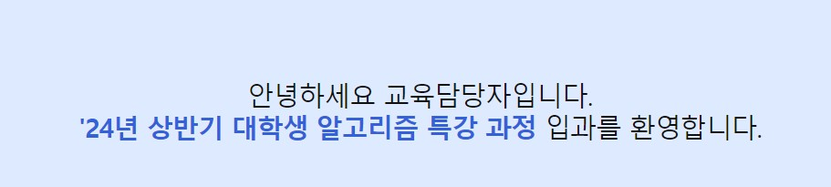
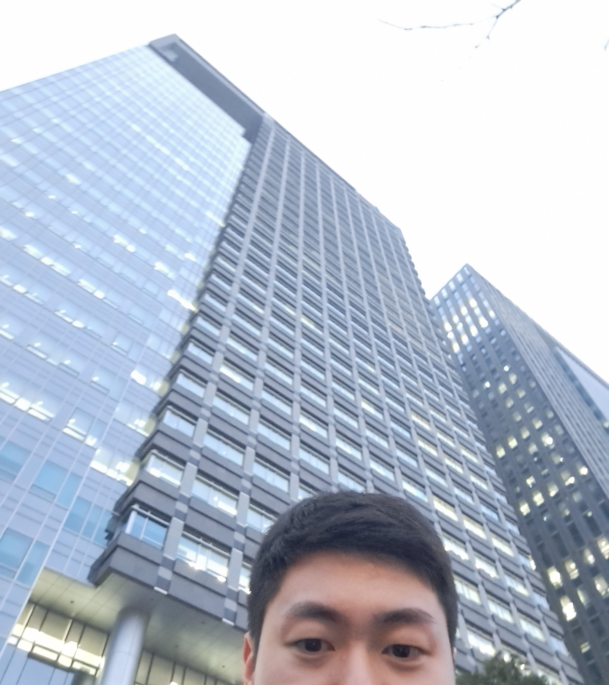
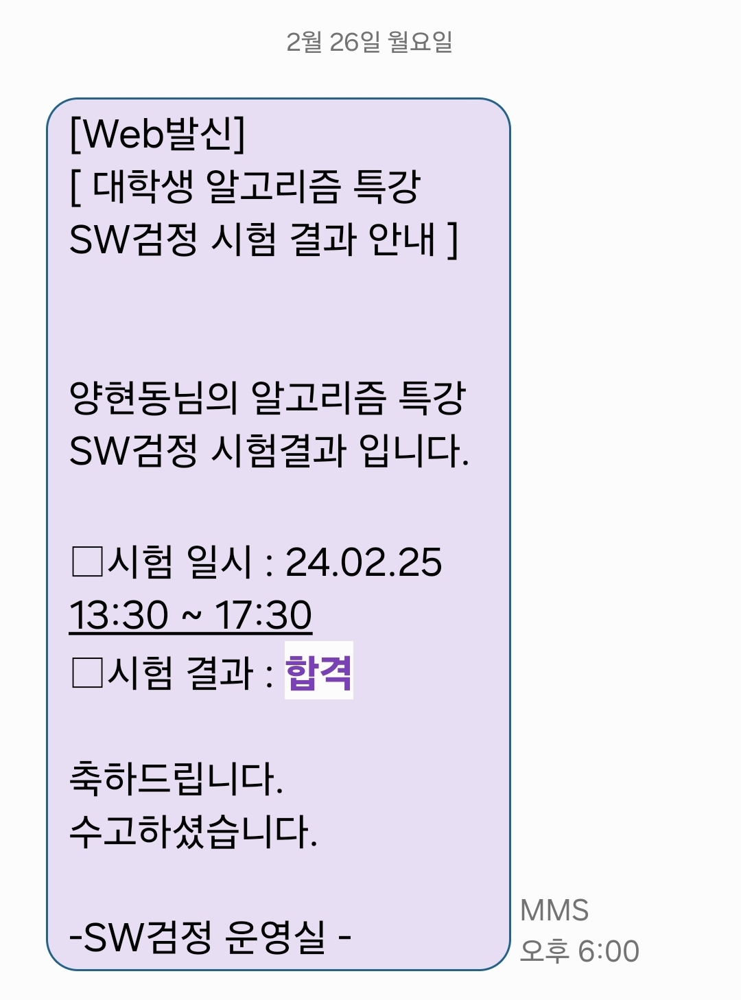

이제 4학년으로 올라가면서, 취직에 대한 고민이 점점 생기기 시작했습니다.  
특히, 코딩테스트는 어디에 지원하든 꼭 필요한 역량이였기에, 삼성 SDS 알고리즘 특강에 지원했습니다.  
사실 특강 자체는 이미 끝난지 한달이 되어가지만, 정리겸 다시 한번 복기해봅니다!

## 특강 지원 및 입과

이번 2024년도 상반기 SDS 알고리즘 특강 지원에서는 딱히 코딩테스트가 필요없었습니다. 서류만 제출하였는데, 그렇기에 오히려 걱정한 부분도 있었습니다. 지금까지 Leetcode만 풀었는데 ~~만들고 손도 안댄~~ 백준계정을 제출하고 딱히 저를 어필할만한 부분이 없었다고 느꼈기 때문입니다. 하지만 다행이 입과에는 성공했습니다.

## 본사 방문과 교육

\
교육은 약 2주가 안되는 기간동안 오프라인으로 진행했습니다. 아침에 제 학교 자취방에서 약 1시간 반가량 이동해서 도착하는 것은 상당히 힘들었습니다. 버스는 괜찮은데 2호선이.... 하지만 도착하고 나서는 굉장히 유익하고 재밌는 시간이었습니다.  
\
강사님들도 전부 능력있으신 분들이고, 강의도 원론적인 개념부터 백준 풀이까지 골고루 잘 배울수 있었습니다. 다만, 항상 기다려 지는건 수업보단 점심이였습니다😎. 식당이 진짜로 넓고, 메뉴도 다양하고 맛있었습니다. 항상 점심 먹기전 메뉴판에서 한 5분은 고민했던것 같습니다. 그리고 식후에는 항상 폴바셋에 가서 음료도 마셨습니다. 블루베리스무디하고 딸기 바나나 주스 추천입니다!🥤

## Pro 검정

이번 특강의 목표이자 꽃이기도 한 Pro 자격증 시험은 총 2번을 봤습니다. 4번 응시가 가능했는데, 저는 첫 시험에서 떨어지고 2번째 시험은 일정 때문에 Pass, 그리고 3번째 시험에서 합격했습니다. 응시 언어는 C++ 였습니다. 평소에 코딩테스트는 파이썬만 써서 특강 초반부터 많이 걱정을 했는데, 시간이 4시간으로 충분하기 때문에 STL만 적당히 외우고가면 크게 문제는 없을듯 합니다!

보안조약때문에 시험에 대한 것을 올리지는 못하지만, 제 결론은 다음과 같습니다.  
1. 강사님이 찝어주시는 빈출 유형 잘 공부하자.
2. 수업에서 배운 내용이 많이 나온다. 허투로 흘리지 말자.

합격 안내는 문자로 날라왔습니다!

## 앞으로 할일

Pro 자격증이 있으면 삼성SDS 공채 특전 및 인턴에서도 코테 면제가 가능합니다. 비록 2주 정도 밖에 못다녔지만, 정말 좋은 회사라는 생각이 들었습니다. 그래서 인턴과 공채 둘다 꼭 지원해볼 생각입니다!
