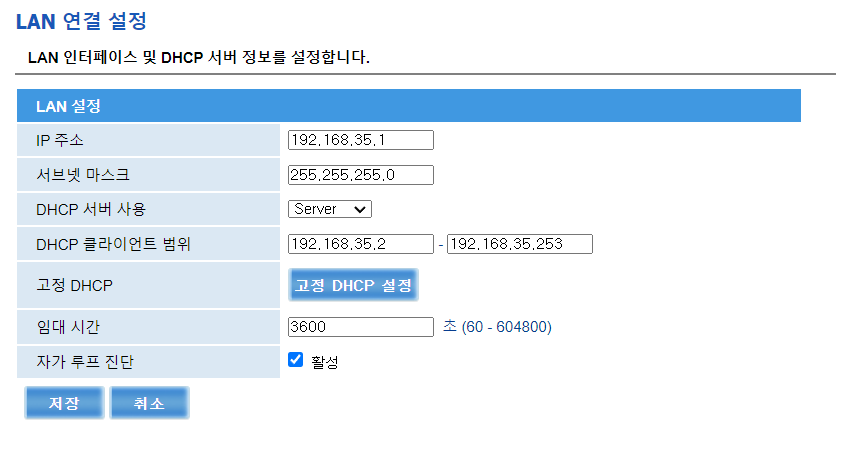

## 1. 공유기 관리 페이지 접근
관리 페이지의 경우, 브라우저에 공유기(라우터)의 IP를 그대로 입력하면 접근이 가능합니다.  
본인 라우터의 IP는 ipconfig 등을 통해 확인이 가능합니다. 필자는 192.168.35.1 이였습니다.  
\
  
SK Giga wave2 공유기의 관리 페이지는 다음과 같이 생겼습니다.
\
  

## 2. 고정 DHCP 설정
DHCP는 네트워크 상에서 해당 장비(호스트)의 IP 부분을 지정해주는 역할을합니다.  
공유기의 경우, NAT에 해당하며, 해당 공유기가 구성하는 서브 네트워크 안에서의 host IP 파트를 지정해주는 DHCP가 작동하고 있습니다. 해당 DHCP에서 본인이 고정하고자 하는 IP를 설정해줍니다. 고정 DHCP를 사용하는 이유는, NAT에서 시간의 경과나 재부팅등으로 인해 우리가 설정할 ssh 대상 PC의 IP가 변하지 않도록 만들기 위함입니다. 
\
  

**IP 주소**의 경우, 해당 공유기에서 사용하는 범위에 맞는 IP로 임의 설정해 줍니다. 필자의 경우 192.168.35.2 ~ 192.168.35.253 입니다.  
\
  
**MAC 주소**의 경우, ssh 서버를 실행할 PC에서 확인하거나 공유기 관리 페이지에서 확인합니다.  
\
  

## 3. 포트포워딩 설정
마지막으로, 외부에서도 해당 ssh 서버에 IP로 접근할 수 있도록 포트포워딩을 설정해 줍니다.  
내부 IP 주소는 위에서 임의로 설정한 IP 주소를 사용하며, 외부 포트는 임의의 포트, 내부 포트는 ssh에서 기본적으로 사용하는 22로 설정해줍니다.  
\
  

## 설정 완료

우분투에서의 ssh서버 및 네트워크 설정은 다음 포스트에서 다루겠습니다.

