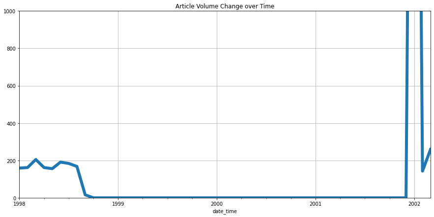

*본 포스트는 CNET 사이트를 Web Scraping 으로 수집하고 분석한 결과입니다. 모든 데이터의 저작권은 **© 2023 CNET** 에게 있습니다.*  

## Executive Summary
### Name

양현동

### Target Web Site

CNET: &nbsp;&nbsp;&nbsp;&nbsp;&nbsp;&nbsp;&nbsp; https://www.cnet.com  


```python
from IPython.display import Image
Image(f"{src_folder}/cap.png", height=900)
```


    

    


### Reasons Why I Chose the Web Site

**cnet.com**은 세계적인 IT기술과 가전제품을 대상으로 news, review 등을 제공하는 사이트임.  

어릴 때 해당 TV 채널을 재미있게 보기도 하였고, 본인의 전공과도 밀접하기에 선정하였음.  

선정한 카테고리: &nbsp;&nbsp;**services & software**

### Total Number of Web Articles Collected

51860 건

### Data Time Range

1995년 6월 22일 ~ 2023년 1월 14일 (약 **28**년)

### Key Findings and Lessons

- news, review 사이트 특성상 유명 기업과 실제 제품이 많이 등장하였음.  

- read time (article을 읽는데 걸리는 예상 시간) 값이 실제 article 길이와 정비례하는 동향.  
  기계적 계산이 아닌 사람이 선정하는 것으로 예측함.

- 시간대별 Keyword trend의 경우, 과거부터 현재까지 성장 & 축소되는 기업, 서비스를 확인가능.

- Clustering의 경우 서비스 분야, 기업별로 클러스터가 구성됨.     
같은 분야 내 기업들의 경쟁과 제품이 잘 관찰됨.  
과거의 기업들이 한 클러스터로 묶이는 흥미로운 결과를 보임.  

### Major Challenges

- 과거 article은 AOL, Netscape, IM 등 현재 보기 힘든 기업, 제품들이 포함되어 배경지식이 필요하였음.  

- 온라인 article 등록 기간 중 2달간의 집중적인 등록 기간이 존재함.  
이로 인해 Time Series 에서 특이한 결과가 도출되었음.  

- Clustering의 경우 기업별로 분류가 잘 되는 것도 있지만 전반적으로 분포가 불균형하고,  
큰 cluster 내에서 여러 주제가 섞이는 경우가 많았음.   

### Future Work

- sentiment 분석은 발표 시간상 제외하였으나, 대부분 article에 대하여 polarity 점수가 낮은 경향이 보였음. 홍보성 글이 많음에도 이러한 결과를 보이는 이유가 흥미롭고, 분석할 가치가 있음.  

- stemmer의 경우 기업이나 제품의 명칭을 훼손하는 경우가 있어서 사용하지 않음. ex. apple->appl, windows->window  
동사 같이 최대한 영향이 없는 부분에만 적용시킨다면 더 좋은 결과가 나올 여지가 있음.  

- deal과 같은 홍보성 글을 제외한다면 전체 데이터를 좀 더 객관적으로 만들 수 있을 것이라 판단됨.  

- Computing 등 다른 카테고리에 적용하면 더 다양한 기술 분석이 가능할 것이라 생각함. ex. AI, Cloud

## Installing Necessary Packages


```python
! pip install nltk scikit-learn==1.0.2 textblob pyldavis==3.3.1
```

## Loading Data
```python
from google.colab import drive

drive.mount('/content/drive')
path = "/content/drive/My Drive/PythonCoaching"
my_folder = "hyeondong0686/project"
src_folder = f"{path}/{my_folder}/src"
outcome_folder = f"{path}/{my_folder}/outcome"
```
```python
import pandas as pd
pd.set_option('display.max_colwidth', 300)

df = pd.read_csv(f"{src_folder}/html_data.csv", sep="\t")
df = df.dropna(subset=["title", "body"], axis=0)
df.reset_index(drop=True, inplace=True)

df.date_time = df.date_time.astype("datetime64")
df
```

예시: https://www.cnet.com/tech/services-and-software/no-internet-thats-fine-you-can-still-use-google-maps-on-your-phone/


```python
df.info()
```

    <class 'pandas.core.frame.DataFrame'>
    RangeIndex: 51860 entries, 0 to 51859
    Data columns (total 8 columns):
     #   Column     Non-Null Count  Dtype         
    ---  ------     --------------  -----         
     0   file_name  51860 non-null  object        
     1   title      51860 non-null  object        
     2   subtitle   48462 non-null  object        
     3   author     45173 non-null  object        
     4   date_time  51860 non-null  datetime64[ns]
     5   read_time  34272 non-null  object        
     6   genre      51860 non-null  object        
     7   body       51860 non-null  object        
    dtypes: datetime64[ns](1), object(7)
    memory usage: 3.2+ MB
    

**author, subtitle, read_time** 컬럼이 일부 비어있음. 특히 옛날 article에서 비어있는 경우가 많음.

---

## Popular Keywords Ranking


```python
import nltk
nltk.download(['punkt', 'averaged_perceptron_tagger', 'stopwords'])

df["title_words"] = df.title.apply(lambda x: nltk.word_tokenize(x))
df["tagged_title_words"] = df.title_words.apply(lambda x: nltk.pos_tag(x))
df["body_words"] = df.body.apply(lambda x: nltk.word_tokenize(x))
%time df["tagged_body_words"] = df.body_words.apply(lambda x: nltk.pos_tag(x))

df_sub = df.dropna(subset=["subtitle"], axis=0).copy()
df_sub.reset_index(drop=True, inplace=True)
df_sub["subtitle_words"] = df_sub.subtitle.apply(lambda x: nltk.word_tokenize(x))
df_sub["tagged_subtitle_words"] = df_sub.subtitle_words.apply(lambda x: nltk.pos_tag(x))
```
```python
from IPython.display import Image
from wordcloud import WordCloud 

def draw_wordcloud(counter, image_file_name, max_words=100):
    wc = WordCloud(background_color="white", max_words=max_words, width=800, height=500)
    wc.generate_from_frequencies(counter)
    wc.to_file(image_file_name)
    display(Image(filename=image_file_name))
```


```python
from collections import Counter

def get_counter(dataframe, category='title', stopwords=[], target_tag=None):
    counter = Counter()
    
    for l in dataframe['tagged_'+category+'_words']:
        word_set = set()

        for t in l:
            word = t[0].lower()
            tag = t[1]
            if word in stopwords:
                continue

            if target_tag is None:
                word_set.add(word)

            else:
                if tag.startswith(target_tag):
                    word_set.add(word)
                else:
                    continue

        counter.update(word_set)
        
    return counter
```


```python
from nltk.corpus import stopwords
global_stopwords = nltk.corpus.stopwords.words("english") 

import string
local_stopwords = [c for c in string.punctuation] +\
                  ['‘', '’', '—', '…', '“', '”', "``", "''", '--', "'s", "n't", "'re", "n't", "'ve"] +\
                  ['software', 'service', 'services', 'tech', 'technology']
```

설정한 카테고리가 /tech/services-and-software/ 임을 고려하여 **'software', 'service', 'services', 'tech', 'technology'** 는 제외시킴.

### Overall Popular Keywords


```python
counter_all = get_counter(df, category='body', stopwords=global_stopwords+local_stopwords)
counter_all.most_common(50)
```


    [('new', 31456),
     ('also', 31254),
     ('said', 30970),
     ('company', 28014),
     ('one', 25401),
     ('people', 20427),
     ('users', 20219),
     ('like', 20135),
     ('web', 19333),
     ('time', 19205),
     ('would', 19133),
     ('last', 18011),
     ('use', 17970),
     ('year', 17877),
     ('online', 17487),
     ('first', 17425),
     ('get', 17320),
     ('could', 17064),
     ('internet', 17057),
     ('make', 16974),
     ('site', 15831),
     ('according', 15643),
     ('see', 15188),
     ('may', 14888),
     ('companies', 14849),
     ('way', 14395),
     ('many', 13953),
     ('two', 13932),
     ('including', 13736),
     ('well', 13306),
     ('still', 13223),
     ('even', 13128),
     ('million', 12868),
     ('information', 12796),
     ('using', 12528),
     ('today', 12468),
     ('want', 12088),
     ('available', 11974),
     ('business', 11958),
     ('google', 11827),
     ('access', 11625),
     ('much', 11444),
     ('network', 11428),
     ('free', 11411),
     ('next', 11382),
     ('work', 11276),
     ('take', 11272),
     ('cnet', 11255),
     ('month', 11073),
     ('microsoft', 11017)]


body에 해당하는 상위 50위 words 확인해 봄.  

IT 서비스 카테고리인 만큼 web, network 등의 기술 단어,  

회사와 고객에 해당하는 company, users, business 등의 단어,  

제품 홍보에 해당하는 new, available, free 등이 보임.    

특정 기업으로는 google, microsoft가 등장하긴 하지만 이외에 특별히 인상 깊은 단어는 없음.  


```python
draw_wordcloud(counter_all, f"{outcome_folder}/week6_wordcloud_all.png", 100)
```


    

    


---


## Read Time Analysis


```python
df_rt = df.dropna(subset=["read_time"], axis=0).copy()
df_rt.reset_index(drop=True, inplace=True)

df_rt['word_num'] = df_rt.body_words.apply(lambda x: len(x))
df_rt['body_len'] = df_rt.body.apply(lambda x: len(x))
df_rt['read_time_int'] = df_rt.read_time.apply(lambda x: int(str(x).replace(' min','')))
```


```python
df_rt.plot(kind='scatter', y='read_time_int',x='word_num', legend=True, figsize=(15, 8))
df_rt.plot(kind='scatter', y='read_time_int',x='body_len', legend=True, figsize=(15, 8))
```


    <matplotlib.axes._subplots.AxesSubplot at 0x7fbac7e57f10>


    

    


    

    


데이터에 대한 질문

1. **Read time**과 article의 **길이**는 정비례하는가?
2. **Read time**은 작성 시 시스템이 **자동**으로 계산하는 것인가?

표를 그려본 결과 각 Read time에 대하여 body의 길이, word의 개수 모두 유사한 양상을 보이며, 대부분 선형적인 증가를 보임.  

다만, 추세선을 많이 벗어난 몇몇 예시가 보임.  


```python
df_rt[(df_rt['read_time_int'] < 20) & (df_rt['body_len'] > 40000)]
```
https://www.cnet.com/tech/services-and-software/best-web-hosting/  
\
기자가 직접 Read time을 정한다 (근거)
 - 기계적 계산이라고 하기엔 분포가 너무 넓음.   
 - 추세선에서 많이 벗어난 예외가 몇몇 있음.  
 - 자동 계산이 된다면 Null이 있을 이유가 없음.  

But, 선형적 증가가 뚜렷이 보이므로 어느 정도 계산에 따른 가이드라인이 존재할 것임.  

결론: **사이트 작성 시스템에서 어느 정도 예측값만 추천 해주고, 선정은 기자가 직접 할 것으로 예상함**


---


## Time Series Analysis


```python
df.date_time.min(), df.date_time.max()
```


    (Timestamp('1995-06-22 15:32:00'), Timestamp('2023-01-14 13:46:00'))


사이트에 article가 게재된 기간은 1995년 6월 22일부터 2023년 1월 14일로서 약 **28년**의 time range를 가짐. 


```python
import numpy as np

count = pd.Series(data=1, index=df.date_time).resample(rule="m").count()

count.mean(), count.std()
```


    (156.20481927710844, 316.5899025261833)


월별 게재 건수의 평균은 약 **156** 건, 표준편차는 약 **316** 으로 분석됨.  

표준편차에서 확연한 이상이 보이며, 원인 분석결과 특정 기간 동안 순식간에 많은 article이 등록된 것임.


```python
count.plot(kind="line", title="Article Volume Change over Time", figsize=(15,7), grid=True, lw=3, ylim=(0,6000))
```


    <matplotlib.axes._subplots.AxesSubplot at 0x7fbac6dacca0>


    

    


```python
count.plot(kind="line", xlim=('1998-01-01', '2002-03-01'),ylim=(0, 1000), title="Article Volume Change over Time", figsize=(15,7), grid=True, lw=6)
```


    <matplotlib.axes._subplots.AxesSubplot at 0x7fbac6db6070>


    

    


대략 **1998-09-01 ~ 2001-12-31** 기간 동안 article들이 온라인에 올라오지 않다가, **2001-11-31 ~ 2002-02-28**에 일괄적으로 등록됨.  

과거 종이 신문을 온라인 신문으로 옮겨오는 과정에서 발생한 문제로 예상.  

해당 범위는 추후 그래프 분석에서 편향을 최소화하기 위해 제외함.  


```python
df_trim = df[df.date_time >= '2002-03-01'].copy()
df_trim.reset_index(drop=True, inplace=True)
```

### Keyword trend analysis


```python
def get_plot(dataframe, keys, term, xlimit=('2002-03-01', '2022-12-31'), ylimit=(0, 12000), relative=False):

    if not relative:
        dataframe['word_num'] = dataframe.body_words.apply(lambda x: len(x))

        for key in keys:
            dataframe[key] = dataframe.body_words.apply(lambda x: [y.lower() for y in x].count(key))
            df_resample = dataframe.set_index('date_time')[key].resample(term).sum()
            df_resample.plot(kind='line', xlim=xlimit, ylim=ylimit, y=key, legend=True, figsize=(20, 10), lw=5, style='.-').legend(fontsize = 20)
    else:
        dataframe['word_num'] = dataframe.body_words.apply(lambda x: 0.0)

        for i in range(dataframe.index.size):
            for key in keys:
                tmp = dataframe.loc[i, 'word_num']
                dataframe.loc[i, 'word_num'] = tmp + float([y.lower() for y in dataframe.loc[i, 'body_words']].count(key))

        df_word_num = dataframe.set_index('date_time')['word_num'].resample(term).sum()

        for key in keys:
            dataframe[key] = dataframe.body_words.apply(lambda x: float([y.lower() for y in x].count(key)))
            df_resample = dataframe.set_index('date_time')[key].resample(term).sum()
            for i in range(df_word_num.index.size):
                if df_word_num[i] > 1.0:
                    df_resample[i] = df_resample[i]/df_word_num[i]
            df_resample.plot(kind='line', y=key, legend=True, figsize=(20, 10), lw=5, style='.-', xlim=xlimit).legend(fontsize = 20)
```

#### Trend analysis plot


```python
companys = ['facebook', 'amazon', 'apple', 'netflix', 'google']
get_plot(dataframe=df_trim, keys=companys, term='y', relative=True)
```


    

    


미국의 5대 Big Tech 기업 **FAANG** 의 키워드 등장 빈도를 나타낸 그래프. y축 값은 word 개수의 상대적 비율을 의미하여 총합이 1이 됨.  

초반에는 **Google**과 **Apple**이 우세하다가 2006년을 기점으로 **Facebook**이 급성장. 2007년 아이폰1 출시 등 모바일 시장의 확대로 예측됨.  

2022년 최근에는 점유율이 서로 비슷하게 바뀌었음. 특히 Covid19의 영향으로 **Amazon**과 **Netflix**가 성장한 것으로 예측됨.  


```python
companys = ['ie', 'netscape', 'chrome']
get_plot(dataframe=df_trim, keys=companys, term='y', relative=True, xlimit=('2002-03-01', '2015-12-31'))
```


    

    


**웹 브라우저** 소프트웨어 변천사  
Netscape(Aol 인수) -> IE(Microsoft) -> chrome(Google) 순서의 점유율 변화를 보여줌.  
2007년 Netscape Navigator 9 출시, 2008년 Netscape 지원 종료로 인해 변동 양상을 보임.  


---


## Document Clustering


```python
cluster_stopwords = ['gets', 'get', 'takes', 'take', 'says', 'say', 'said']
```


```python
from sklearn.feature_extraction.text import TfidfVectorizer

vectorizer = TfidfVectorizer(use_idf=True, norm="l2", stop_words=global_stopwords+local_stopwords+cluster_stopwords, max_df=0.7)
X = vectorizer.fit_transform(df.body)
```


```python
X.shape
```


    (51860, 135760)


총 **51,860** 개의 articles 와 **135,762** 개의 words 가 존재함

### K-Means Clustering

### Step 1. Choose the number of clusters


```python
k = 8
```

### Step 2. Initialize a model object for k-means clustering


```python
from sklearn.cluster import KMeans

kmeans = KMeans(n_clusters=k, random_state=1)
kmeans
```


    KMeans(random_state=1)


### Step 3. Fit the model using the input data


```python
%time kmeans.fit(X)
```

    CPU times: user 2min 11s, sys: 2.5 s, total: 2min 14s
    Wall time: 1min 25s
    


    KMeans(random_state=1)


### Step 4. Examine the clustering outcome

The focus of this step should be on identifying the characteristics of each cluster. 


```python
df["cluster"] = kmeans.labels_
count_k = df.cluster.value_counts()
count_k
```


    6    22665
    1    11953
    4     3855
    2     3350
    3     2801
    0     2557
    5     2479
    7     2200
    Name: cluster, dtype: int64


8개의 클러스터를 찾았을때 비교적 잘 구분된 결과를 확인할 수 있었음.


```python
clusters = count_k.index
```


```python
# 1
counter = get_counter(df[df.cluster == clusters[0]], stopwords=global_stopwords+local_stopwords+cluster_stopwords)
counter.most_common(20)
```


    [('short', 1894),
     ('net', 1466),
     ('new', 1071),
     ('web', 1060),
     ('online', 991),
     ('site', 675),
     ('internet', 470),
     ('google', 431),
     ('million', 424),
     ('microsoft', 408),
     ('launches', 361),
     ('security', 341),
     ('privacy', 335),
     ('data', 318),
     ('ibm', 310),
     ('court', 302),
     ('free', 299),
     ('deal', 289),
     ('ceo', 283),
     ('oracle', 281)]


**1.   인터넷, 서버 기업 + 법 단어**
 - net, web, site, online 같은 인터넷 분야 관련 단어
 - google, microsoft, ibm, oracle 등의 기업  
 - security, privacy, data 등 개인정보 관련 단어
 - court 와 같은 법정 단어  

개인정보 범죄, 금융 문제, 기업과 정치권 관계등으로 예상.  

```python
# 2
counter = get_counter(df[df.cluster == clusters[1]], stopwords=global_stopwords+local_stopwords+cluster_stopwords)
counter.most_common(20)
```


    [('twitter', 1380),
     ('app', 1012),
     ('apple', 791),
     ('new', 753),
     ('iphone', 508),
     ('ios', 506),
     ('youtube', 488),
     ('google', 468),
     ('video', 467),
     ('android', 429),
     ('apps', 395),
     ('web', 353),
     ('social', 309),
     ('free', 288),
     ('mobile', 281),
     ('facebook', 273),
     ('launches', 260),
     ('firefox', 245),
     ('day', 244),
     ('instagram', 243)]


**2.   모바일 기업 + 소셜 네트워크**
 - social, mobile 핵심 단어
 - apple, google, twitter, facebook, instagram 등의 기업  
 - iphone, ios, android, youtube 등 제품과 서비스


```python
# 3
counter = get_counter(df[df.cluster == clusters[2]], stopwords=global_stopwords+local_stopwords+cluster_stopwords)
counter.most_common(20)
```


    [('google', 3226),
     ('search', 412),
     ('new', 233),
     ('chrome', 224),
     ('android', 222),
     ('maps', 208),
     ('google+', 160),
     ('gmail', 138),
     ('app', 135),
     ('apps', 104),
     ('web', 99),
     ('adds', 91),
     ('mobile', 89),
     ('users', 88),
     ('view', 87),
     ('street', 78),
     ('results', 77),
     ('youtube', 76),
     ('play', 76),
     ('glass', 75)]


**3.   Google 기업 + 제품**
 - chrome, android, google+, gmail, youtube 등 제품과 서비스


```python
# 4
counter = get_counter(df[df.cluster == clusters[3]], stopwords=global_stopwords+local_stopwords+cluster_stopwords)
counter.most_common(20)
```


    [('microsoft', 1640),
     ('windows', 966),
     ('office', 225),
     ('vista', 203),
     ('10', 197),
     ('new', 192),
     ('8', 184),
     ('ie', 149),
     ('update', 123),
     ('security', 109),
     ('7', 103),
     ('browser', 88),
     ('xp', 78),
     ('mac', 68),
     ('web', 67),
     ('ms', 66),
     ('apps', 65),
     ('gates', 65),
     ('pc', 61),
     ('app', 58)]


**4.   microsoft 기업 + 제품**
 - windows(xp, vista, 7, 8, 10), office, ie 등 제품과 서비스
 - 창업주 gates 
 - 경쟁자 mac


```python
# 5
counter = get_counter(df[df.cluster == clusters[4]], stopwords=global_stopwords+local_stopwords+cluster_stopwords)
counter.most_common(20)
```


    [('amazon', 1141),
     ('netflix', 548),
     ('tv', 307),
     ('watch', 232),
     ('prime', 223),
     ('streaming', 198),
     ('vs.', 177),
     ('new', 163),
     ('online', 159),
     ('nfl', 152),
     ('week', 142),
     ('today', 140),
     ('livestream', 136),
     ('kindle', 124),
     ('video', 123),
     ('hulu', 116),
     ('apple', 104),
     ('plus', 99),
     ('free', 89),
     ('hbo', 88)]


**5.   영상 스트리밍 서비스 기업**
 - video, streaming 핵심 단어
 - amazon(prime), netflix, hulu, apple(tv plus), hbo 등의 기업, 서비스


```python
# 6
counter = get_counter(df[df.cluster == clusters[5]], stopwords=global_stopwords+local_stopwords+cluster_stopwords)
counter.most_common(20)
```


    [('facebook', 2282),
     ('zuckerberg', 166),
     ('new', 150),
     ('app', 119),
     ('users', 116),
     ('mobile', 105),
     ('ads', 97),
     ('news', 96),
     ('privacy', 92),
     ('ipo', 80),
     ('instagram', 80),
     ('data', 79),
     ('messenger', 75),
     ('video', 73),
     ('feed', 64),
     ('report', 64),
     ('social', 63),
     ('apps', 61),
     ('twitter', 59),
     ('ad', 54)]


**6.   facebook 기업 + 제품**
 - facebook, instagram(합병), messenger 등 제품과 서비스
 - 창업주 zuckerberg 
 - 주가 이슈와 관련된 ipo(기업 주식 공개), 개인정보 이슈와 관련된 privacy


```python
# 7
counter = get_counter(df[df.cluster == clusters[6]], stopwords=global_stopwords+local_stopwords+cluster_stopwords)
counter.most_common(20)
```


    [('yahoo', 1144),
     ('aol', 894),
     ('new', 156),
     ('search', 123),
     ('deal', 120),
     ('short', 96),
     ('microsoft', 95),
     ('warner', 90),
     ('time', 81),
     ('im', 80),
     ('ceo', 70),
     ('netscape', 59),
     ('online', 56),
     ('web', 56),
     ('net', 56),
     ('messaging', 54),
     ('google', 54),
     ('report', 52),
     ('mayer', 52),
     ('instant', 48)]


**7.   과거의 기업**
 - yahoo, aol, warner(aol 합병), netscape 등 과거에 유명했던 기업 + microsoft, google 현재 까지도 유명한 기업
 - im(Instant Messenger) = aol 서비스 이름

그 당시 IT 생태계가 하나의 클러스터로 묶이는 흥미로운 결과.   


```python
# 8
counter = get_counter(df[df.cluster == clusters[7]], stopwords=global_stopwords+local_stopwords+cluster_stopwords)
counter.most_common(20)
```


    [('music', 837),
     ('spotify', 317),
     ('apple', 214),
     ('napster', 199),
     ('new', 118),
     ('streaming', 117),
     ('net', 110),
     ('pandora', 102),
     ('radio', 90),
     ('itunes', 77),
     ('mp3.com', 76),
     ('free', 75),
     ('youtube', 75),
     ('deal', 67),
     ('labels', 67),
     ('app', 56),
     ('sony', 53),
     ('online', 52),
     ('google', 50),
     ('short', 49)]


**8.   음원 스트리밍 관련 기업 + 서비스**
 - music, streaming 핵심 단어
 - spotify, itunes, napster, pandora, youtube(music), sony, mp3.com 등의 기업, 서비스


---


## CNET 분석 정리
 - Keywords Ranking
 - Read Time
 - Time Series & Keyword trend
 - Document Clustering


---


## Source
- 성균관대학교 SW Coaching 프로그램  
- 이강표(Kang-Pyo Lee) 박사님 강의  
- [www.cnet.com](https://www.cnet.com/)

<!--
1주 Web Scraping 기초
2주 Web Scraping 심화
3주 Pandas Dataframe 다루기
4주 텍스트 데이터 처리
5주 문서 클러스터링 및 토픽 모델링
6주 개인 프로젝트 발표
-->