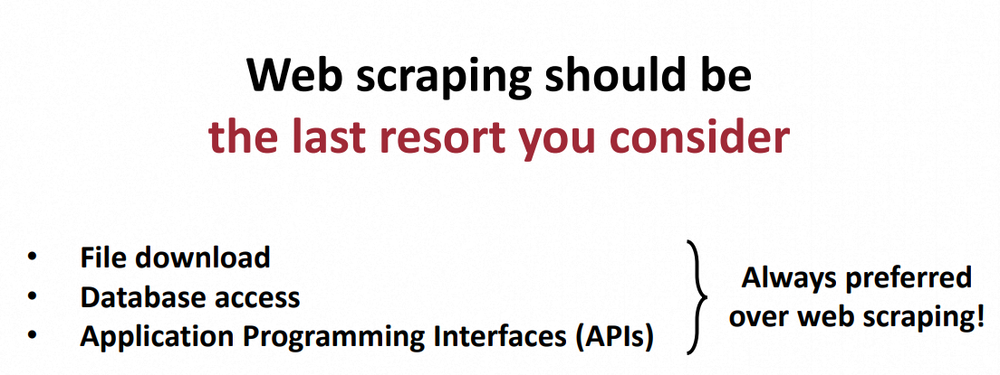
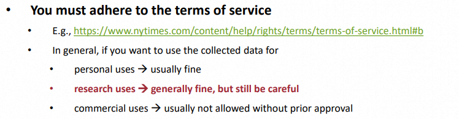
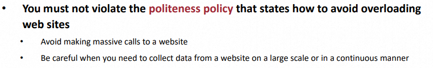
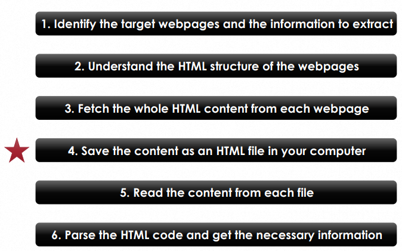

*본 포스트는 IOWA 대학 **이강표**(Kang-Pyo Lee) 박사님의 허락을 구하고 강의를 정리한 것입니다.*  
*강의 사진, 코드의 저작권은 모두 이강표 박사님께 있습니다.*


## 1. 강의 정리
**Web scraping**  
=  웹사이트에서 data를 추출하는 data scraping 기법.  
\
**언제 유용한가?**  
= 웹사이트에서 직접적으로 정보를 추출해야 할 때.  
ex.) Google search results, New York Times news articles ...

### ⭐ 중요한 점 ⭐
**Web scraping**은 **최후의 수단**으로 사용합니다.  
아래와 같이 더 좋은 방법이 있을 경우 그것을 사용하는 것이 좋습니다.  
>   
\
웹사이트에서 모은 데이터의 **사용(저작권)** 을 주의해야 합니다.  
데이터 수집 허락 **≠** 데이터 사용 허락  
>   
\
데이터를 수집할 때도 **politeness policy** 를 지켜야 합니다.  
scraping 빈도와 양을 조절하며 매너를 지킬 필요가 있습니다.
>   
\
웹사이트 페이지는 언제든지 바뀌거나 사라질 수 있습니다.  
따라서 HTML 파일을 **저장**해 놓는 것이 좋습니다.  
>  


## 2. 코드 코칭
*코드 전문은 분량상 제외하였으며, 피드백 위주로 정리하였습니다. Colab 환경을 기반으로 합니다.*  
\
이번 코드는 UN 신문 웹사이트 [https://news.un.org/en/story/2021/02/1085812](https://news.un.org/en/story/2021/02/1085812) 에서 필요한 데이터를 불러오고 저장하는 일련의 과정을 수행합니다.  
\
다음은 **BeautifulSoup**와 **requests**를 사용한 html 불러오기입니다.   
```py
import requests
from bs4 import BeautifulSoup

url = "https://news.un.org/en/story/2021/02/1085812"
r = requests.get(url)
soup = BeautifulSoup(r.content, "html.parser")
```
\
위의 웹사이트에서 기사에 사용된 사진 element를 불러올 때 2가지 방법이 있습니다.  
**코드 1**
```py
soup.find("picture").find("img")
```
**코드 2**
```py
soup.find_all("img")[1]
```
각 웹페이지에 따른 호환성을 생각하면 **코드 2**가 더 바람직합니다.  
\
**코드 1**의 경우 **hierarchy**를 통해 부모의 element를 분석해서 자식 img를 받아옵니다. 이는 다른 페이지에서도 성공할 확률이 높습니다. 하지만 **코드 2**의 경우 단순히 페이지에서 2번째 사진을 불러오므로 다른 페이지에서 잘 작동한다고 보장하기가 어렵습니다.  
\
위와 같이 **hierarchy**를 사용한 데이터 불러오기의 또 다른 예시입니다.
```py
soup.find("div", {"class": "views-element-container block block-views block-views-block-content-related-block-related-stories"}).find_all("h3")
```
\
다음은 파이썬 정규식을 통해 웹페이지 이미지의 이름을 가져오는 코드입니다.  
[https://global.unitednations.entermediadb.net/..../image1170x530cropped.jpg](https://global.unitednations.entermediadb.net/assets/mediadb/services/module/asset/downloads/preset/Libraries/Production+Library/16-01-2020-ZIM_20191203_WFP-Matteo_Cosorich_9596.jpg/image1170x530cropped.jpg)  

**코드 1**
```py
img_file_name = re.search('[^/]+[.]jpg$', img_url).group()
img_file_name
```
**코드 2**
```py
img_file_name = re.findall("/([\w]+\.jpg)$", img_url)[0]
img_file_name
```
각 정규식 표현이 정확히 어떻게 작동하는지는 이어지는 다른 포스트에서 다시 다루도록 하겠습니다.  
\
위에서 **코드 1**과 **코드 2**의 차이점만 살펴본다면, `()` 사용의 유무가 있습니다. **코드 2** 처럼 찾고자 하는 정규 표현식에서 **패턴**을 괄호로 정의해 준다면, 더 직관적이고 편리하게 원하는 문자열을 얻을 수 있습니다. 

## 3. 느낀 점
**Web scraping**을 배우는 것도, 전문가에게 자신의 코드를 **피드백** 받는 것도 처음인 신선한 경험입니다. 남은 5주 동안의 SW Coaching 에서 최대한 많은 것을 배워가도록 노력해야겠습니다.  
이런 기회를 마련해준 이강표 박사님께 감사의 말씀을 드립니다 😊.


## Source
- 성균관대학교 SW Coaching 프로그램  
- 이강표(Kang-Pyo Lee) 박사님 강의  

<!--
1주 Web Scraping 기초
2주 Web Scraping 심화
3주 Pandas Dataframe 다루기
4주 텍스트 데이터 처리
5주 문서 클러스터링 및 토픽 모델링
6주 개인 프로젝트 발표
-->