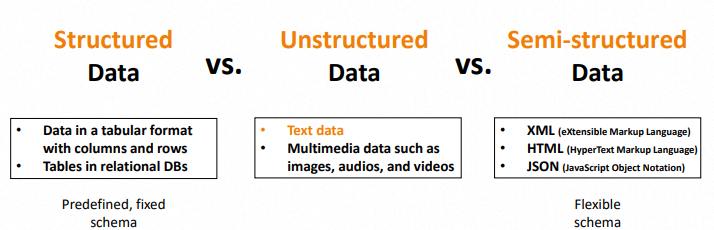
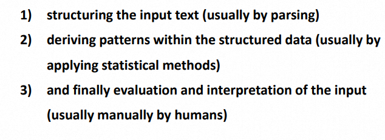
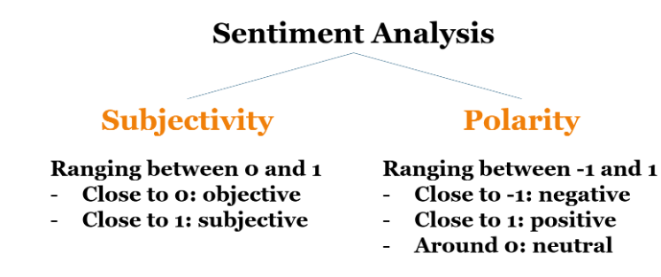
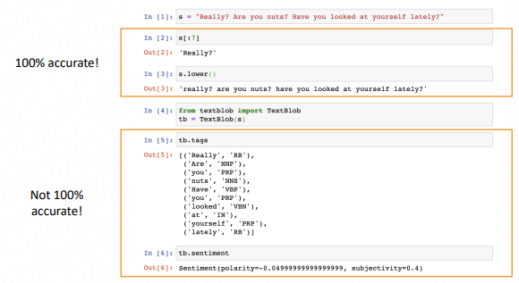

*본 포스트는 IOWA 대학 **이강표**(Kang-Pyo Lee) 박사님의 허락을 구하고 강의를 정리한 것입니다.*  
*강의 사진, 코드의 저작권은 모두 이강표 박사님께 있습니다.*


## 1. 강의 정리
~~설 연휴로 포스팅이 좀 밀렸습니다 😏~~  
\
**Text analytics** 핵심  
= 텍스트에서 정보를 추출하는 것 (deriving information from text)  
\
\
**Types of Data**  
= Text data는 Unstructured data에 해당한다
  
\
\
**Text analytics** 단계  
\
  
\
\
**Part-of-Speech (PoS) Tagging**  
= 단어를 문법적 특징으로 분리하여 Tagging.  
Tag 잘 정리된 사이트. [https://cs.nyu.edu/~grishman/jet/guide/PennPOS.html](https://cs.nyu.edu/~grishman/jet/guide/PennPOS.html)  
\
\
**ngrams** 활용  
= 의미 있는 새로운 결과물도 만들어 내지만, 필요 없는 노이즈도 많이 생기게 된다.  
해당 부분을 잘 고려하자.  
\
\
**Counter()** 활용  
= 파이썬에 내장되어 있는 `Counter()`를 사용한다. 이때, 각 Text 마다 단어가 여러 번 나온다면 그대로 count 할지, 1번으로 통합해서 count 할지 잘 정하도록 하자.  
\
\
**Sentiment Analysis** 활용  
= 많이 사용되기는 하지만, 현재 기준으로 생각보다 정확도가 높지는 않다.  
 


### ⭐TIP!⭐
**Text analytics**는 **자연어**에 대한 분석이므로 100%의 정확도를 보여주지 **않는다!**  
=오차나 노이즈가 항상 존재한다  
ex.) Part-of-Speech (PoS) Tagging, Sentiment Analysis

  

## 2. 코드 코칭
*코드 전문은 분량상 제외하였으며, 피드백 위주로 정리하였습니다. Colab 환경을 기반으로 합니다.*  

### 리스트 컴프리헨션, startswith() 활용
`nltk`의 `pos_tag`를 사용하면 각 word와 그에 해당하는 tag를 묶은 튜플을 얻게 됩니다. 여기서 `nouns`만 뽑아내고 싶은 경우, `startswith()`와 **리스트 컴프리헨션**으로 간단하게 구현가능합니다. 
```py
df["tagged_words"] = df.words.apply(lambda x: nltk.pos_tag(x))
df["nouns"] = df.tagged_words.apply(lambda x: [word for word, tag in x if tag.startswith("NN")])
```
`startswith()`를 사용한 이유는 다음의 tag를 모두 담기 위함입니다.    
> NN	= Noun, singular or mass  
> NNS	= Noun, plural  
> NNP	= Proper noun, singular  
> NNPS	= Proper noun, plural  

### 함수 최적화
저번 글과 비슷하게, 시간이 오래 걸리는 함수들은 불필요하게 낭비되는 곳이 없는지 확인합니다.  
```py
# Bad
df["polarity"] = df.text.apply(lambda x: TextBlob(x).sentiment.polarity)
df["subjectivity"] = df.text.apply(lambda x: TextBlob(x).sentiment.subjectivity)
```
```py
# Good
df["sentiment"] = df.text.apply(lambda x: TextBlob(x).sentiment)
df["polarity"] = df.sentiment.apply(lambda x: x.polarity)
df["subjectivity"] = df.sentiment.apply(lambda x: x.subjectivity)
```

### Stopwords
stopwords를 만들 때는 아래와 같이 `global`, `local`를 구분하여 만들어 주는 것이 좋습니다. `global_stopwords`의 경우 `nltk.corpus.stopwords`를 활용하며, `local_stopwords`은 `string.punctuation`을 활용합니다.  
\
특히 본인이 직접 결과를 보면서 필요 없다고 판단되는 것들을 직접 `local`에 추가시켜주어야 합니다.    
```py
global_stopwords = nltk.corpus.stopwords.words("english") 
local_stopwords = [c for c in string.punctuation] +\
                  ['‘', '’', '—', '…'] +\
                  ['https', "'s", "n't"] # My own stopwords in this model
```


## 3. 느낀 점
`nltk`의 여러 새로운 기능들과 `TextBlob()`의 **polarity, subjectivity** 분석이 상당히 재미있었습니다. 실제로 현업에서도 인기 있는 분석들을 직접 활용 해보니 신기하면서도 왠지 모를 성취감도 생겼습니다. 개인적으로 모으고 있는 **CNET** 사이트 데이터에도 이를 빨리 적용시켜 보고 싶습니다 😋.


## Source
- 성균관대학교 SW Coaching 프로그램  
- 이강표(Kang-Pyo Lee) 박사님 강의  

<!--
1주 Web Scraping 기초
2주 Web Scraping 심화
3주 Pandas Dataframe 다루기
4주 텍스트 데이터 처리
5주 문서 클러스터링 및 토픽 모델링
6주 개인 프로젝트 발표
-->