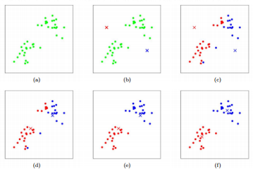
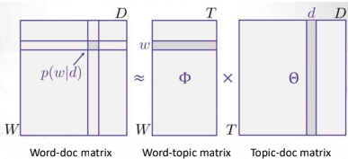
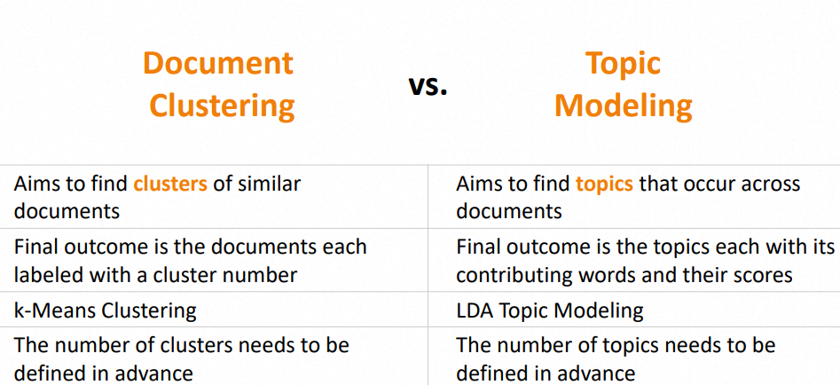
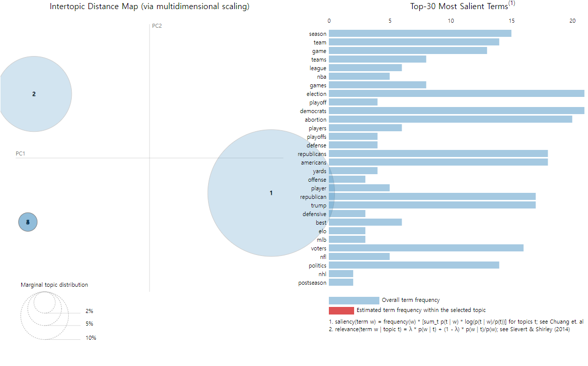

*본 포스트는 IOWA 대학 **이강표**(Kang-Pyo Lee) 박사님의 허락을 구하고 강의를 정리한 것입니다.*  
*강의 사진, 코드의 저작권은 모두 이강표 박사님께 있습니다.*


## 1. 강의 정리

### k-Means Clustering  

**특징:**  
- simplest, most commonly used  
- 데이터에서 특정 영역을 대표하는 centroids 를 활용.  
\
**과정:** 
1. K개의 cluster에 대한 K개의 centroids 들을 랜덤 하게 설정  
2. 다음의 3,4번을 반복
3. 각 데이터 포인트에 대해 centroids 사이의 거리를 계산하여 가장 가까운 centroid에 할당.
4. 같이 할당된 데이터 포인트들 사이에서 평균을 구해 centroid 를 업데이트.
5. 더 이상 centroids 가 변하지 않을 경우 종료.  
\
  
\
**장점:**  
- 상대적으로 이해하고 적용하기 쉬움.  
- 처리 시간이 짧음.  
- 큰 데이터에도 사용이 용이.  
**단점:**  
- random initialization 에 의존하게 된다.  
- 간단한 형태의 cluster 만 캡쳐가 가능하다.  
- cluster 에 대해 all directions 의 important 똑같다. 즉, 가중치가 동일하다.  
- 적절한 클러스터 개수 k 를 사용자가 직접 정해줘야 한다.  

### Topic Modeling  

**개념:**  
- abstract(추상적), latent(숨겨진) 토픽을 찾아내서 model 제작. 이를 바탕으로 document 분류.    
- Latent Dirichlet Allocation (LDA)가 좋은 예시.  
\
**Latent Dirichlet Allocation (LDA)핵심**  
- document는 특정 토픽 내의 단어들을 조합하여 만들어진다고 가정.  
- topics 를 찾기 위해 document, words 를 reverse engineers 한다.  

  

- document, words matrix 에 topics 라는 새로운 축을 추가해 decompose 한다.  
  = singular valuede composition (SVD)


### ⭐TIP!⭐

Topic Modeling 과 k-Means Clustering 모두 **Unsupervised Learning** 임!  
\
문서 클러스터링 및 토픽 모델링 비교
 

## 2. 코드 코칭
*코드 전문은 분량상 제외하였으며, 피드백 위주로 정리하였습니다. Colab 환경을 기반으로 합니다.*  
\
이번 코드 코칭은 피드백보다는 **설명 위주**로 진행하였습니다.  

### TF-IDF 활용  

document에서 너무 자주 등장하는 단어의 경우, 별로 유의미하지 않음에도 **TF**(Term Frequency) 가중치가 높아집니다. 이로 인해 정말로 중요한 단어들이 가려지게 됩니다.  
\
이를 방지하기 위해  **IDF**(Inverse document frequency)를 사용합니다.  
**IDF**는 해당 단어가 등장하는 documents의 개수에 inverse function을 취합니다.  
따라서 자주 등장하는 단어일수록 가중치를 낮추는 효과를 보입니다.  
```py
vectorizer = TfidfVectorizer(use_idf=True)
X = vectorizer.fit_transform(corpus)
```
위의 코드에서 `use_idf`를 통해 IDF기능을 사용합니다.

### Normalized Term Frequencies

특정 document가 엄청 길기 때문에 단어가 많이 카운트된다면, 가중치 선정이 불공평해집니다.  
따라서 **Normalize** 는 document의 길이를 고려하여 단순히 긴 문서의 편향을 낮춥니다.  
```py
vectorizer = TfidfVectorizer(norm="l2")
X = vectorizer.fit_transform(corpus)
```
위의 코드에서 `norm`를 통해 **Normalize** 기능을 사용합니다. 옵션은 다음과 같습니다.  
- l2: Sum of squares of vector elements is 1
- l1: Sum of absolute values of vector elements is 1

### Corpus-Specific Stopwords

IDF와 비슷한 맥락으로, 문서 전체에서 특정 비율 이상으로 나타나는 단어를 Stopwords로 제외하는 기능입니다.  
> `max_df` (float in range [0.0, 1.0] or int, default=1.0):  
> When building the vocabulary ignore terms that have a document frequency strictly higher than the given threshold. For example, if max_df is set to 0.9, all terms that appear in over 90% of the documents will be excluded.
```py
vectorizer = TfidfVectorizer(max_df=0.9)
X = vectorizer.fit_transform(corpus)
```
위의 코드에서 `max_df=0.9` 부분에 해당합니다.  

### K-means
다음은 총 5개의 클러스터로 데이터 프레임의 body를 분류하는 코드입니다.  

```py
from sklearn.feature_extraction.text import TfidfVectorizer
from sklearn.cluster import KMeans

vectorizer = TfidfVectorizer(use_idf=True, norm="l2", stop_words="english", max_df=0.7)
X = vectorizer.fit_transform(df.body)

k = 5

kmeans = KMeans(n_clusters=k)
%time kmeans.fit(X)

df["cluster"] = kmeans.labels_
df[["text", "cluster"]]
```
`df["cluster"] = kmeans.labels_` 부분은 데이터 프레임에 `cluster`라는 새로운 colum을 만들어 주고 해당 raw 데이터의 cluster 번호를 채워줍니다.  
\
아래의 코드를 실행시켜 보면 각 클러스터가 얼마만큼씩 있는지 알려줍니다.  
당연히 분포가 고르면 고를수록 균형이 잘 잡혀있는 좋은 결과입니다.  
```py
df.cluster.value_counts()
```

### LDA Topic Modeling  

총 5개의 토픽으로 데이터 프레임의 body를 분류하는 코드입니다.  

```py
from sklearn.decomposition import LatentDirichletAllocation as LDA

num_topics = 5

lda = LDA(n_components=num_topics)
%time lda.fit(X)
```
\
LDA의 결과를 보고 싶다면 다음과 같은 함수를 실행시켜 주면 됩니다.  
해당 함수는 토픽 내 각 단어들의 가중치들을 보여줍니다. 가중치가 높을수록 해당 토픽과 깊은 연관이 있다는 뜻이며, 잘 분류되었다고 볼 수 있습니다.  

```py
def show_topics(model, feature_names, num_top_words):
    for topic_idx, topic_scores in enumerate(model.components_):
        print("***Topic {}:".format(topic_idx))
        print(" + ".join(["{:.2f} * {}".format(topic_scores[i], feature_names[i]) for i in topic_scores.argsort()[::-1][:num_top_words]]))
        print()
```
\
만약 시각화를 하고 싶다면, 다음과 같이 `pyLDAvis`를 사용해 주면 됩니다.  
```py
import pyLDAvis
import pyLDAvis.sklearn
pyLDAvis.enable_notebook()

pyLDAvis.sklearn.prepare(lda, X, vectorizer)
```
  

## 3. 느낀 점
k-Means Clustering, Topic Modeling 분석을 써보면서 세상에는 정말로 똑똑한 사람들이 많다는 생각을 했습니다. 이렇게 강력한 분석을 간단하게 이용할 수 있도록 미리 다 만들어 두었다는 점이 대단했기 때문입니다. 😅   
이번에는 간단한 원리와 과정만 알아보긴 했지만, 그래도 여러 가지를 많이 배운 느낌입니다. 나중에 좀 더 수학적, 공학적으로 깊은 이해를 위해 노력해야겠습니다. 😭 

## Source
- 성균관대학교 SW Coaching 프로그램  
- 이강표(Kang-Pyo Lee) 박사님 강의  

<!--
1주 Web Scraping 기초
2주 Web Scraping 심화
3주 Pandas Dataframe 다루기
4주 텍스트 데이터 처리
5주 문서 클러스터링 및 토픽 모델링
6주 개인 프로젝트 발표
-->