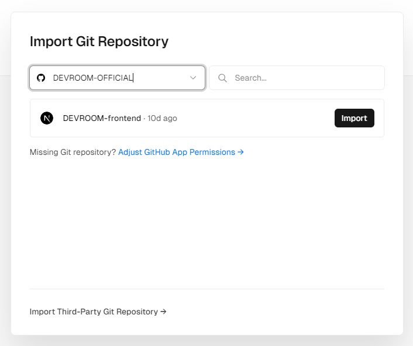
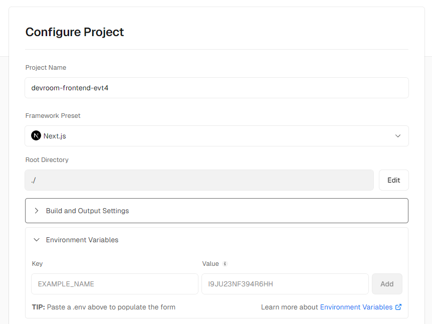
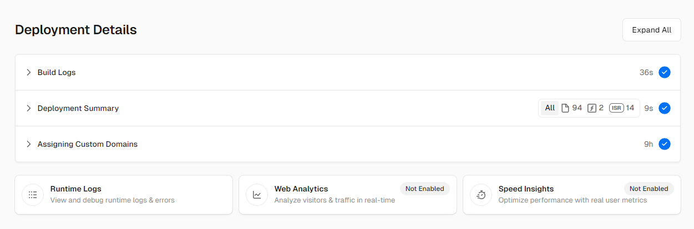
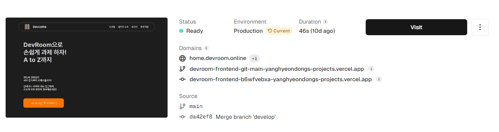

졸업작품 [DEVROOM](https://github.com/DEVROOM-OFFICIAL/DEVROOM-backend)을 진행하면서, 기존에 [@Taegon21](https://github.com/Taegon21)님이 개발하시던 프론트엔드를 이어받게 되었습니다. 그래서 이를 재배포하는 과정과 도중에 생긴 문제점을 정리해 보았습니다.

## 1. 왜 AWS S3는 안되는가?
사실 처음에는 AWS의 S3에 정적페이지를 배포하려고 했습니다.  
이미 백엔드에서 AWS를 사용하고 있기도 했고, 관리의 측면에서 통합이 좋을 것 같다 생각했기 때문입니다. 하지만 한 가지 문제가 발생했는데요, 바로 페이지 라우팅의 문제였습니다.  
S3에서 정적 페이지를 제공하기 위해서는 `next.config.mjs` 에서 `output: 'export',` 옵션을 넣어주어야 합니다. 그래야지 정적페이지가 담긴 최종 폴더가 나오기 때문입니다. 하지만, 문제점은 다음과 같이 에러가 뜨는 것입니다.

```powershell
> Build error occurred
Error: Page "/notice/[id]" is missing "generateStaticParams()" so it cannot be used with "output: export" config.
    at C:\Users\Hyeondong\Desktop\project\DEVROOM-frontend\node_modules\next\dist\build\index.js:1294:59   
    at process.processTicksAndRejections (node:internal/process/task_queues:95:5)
    at async Span.traceAsyncFn (C:\Users\Hyeondong\Desktop\project\DEVROOM-frontend\node_modules\next\dist\trace\trace.js:154:20)
    at async Promise.all (index 8)
    at async C:\Users\Hyeondong\Desktop\project\DEVROOM-frontend\node_modules\next\dist\build\index.js:1172:17
    at async Span.traceAsyncFn (C:\Users\Hyeondong\Desktop\project\DEVROOM-frontend\node_modules\next\dist\trace\trace.js:154:20)
    at async C:\Users\Hyeondong\Desktop\project\DEVROOM-frontend\node_modules\next\dist\build\index.js:1095:124
    at async Span.traceAsyncFn (C:\Users\Hyeondong\Desktop\project\DEVROOM-frontend\node_modules\next\dist\trace\trace.js:154:20)
    at async build (C:\Users\Hyeondong\Desktop\project\DEVROOM-frontend\node_modules\next\dist\build\index.js:366:9)
```

에러를 요약하면, 모든 페이지를 `generateStaticParams()` 를 통해 결정해주어야 한다는 것입니다.  
인터넷에서 해결책을 찾아보니, 백엔드 측에서 이러한 페이지 목록을 받아오는 방법 등이 있다고 합니다. 하지만, **이를 다시 개발하자니 너무나도 수정할 부분이 많이 생기기 때문에**, 차선책을 찾았습니다. 그 결과 Vercel 배포의 경우에는 굳이 build를 하지 않고도 배포가 가능했습니다. 그래서 Vervel을 선택하게 되었습니다.

## 2. Vercel 연결 설정
우선 배포하고자 하는 깃헙 repo와 연결을 설정해 줍니다.
\
  
로컬 개발에서 사용했던 `.env` 값들을 넣어줍니다.  
당연하게도 해당 값들은 깃헙 repo 등에 노출되면 안 됩니다.
\
  
잘 배포 되는 것을 확인할 수 있습니다.
\
  
최종적으로 배포 상태를 확인할 수 있습니다!
\
  

