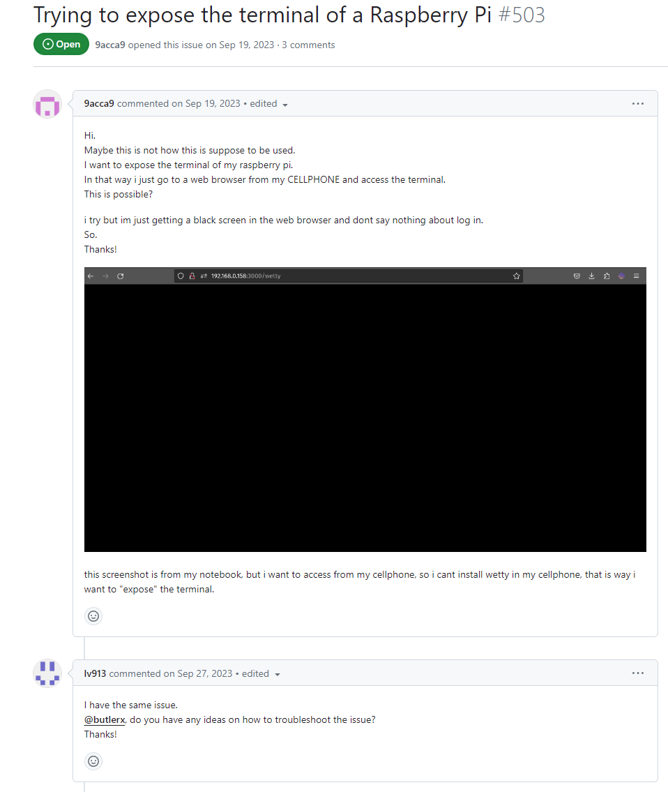
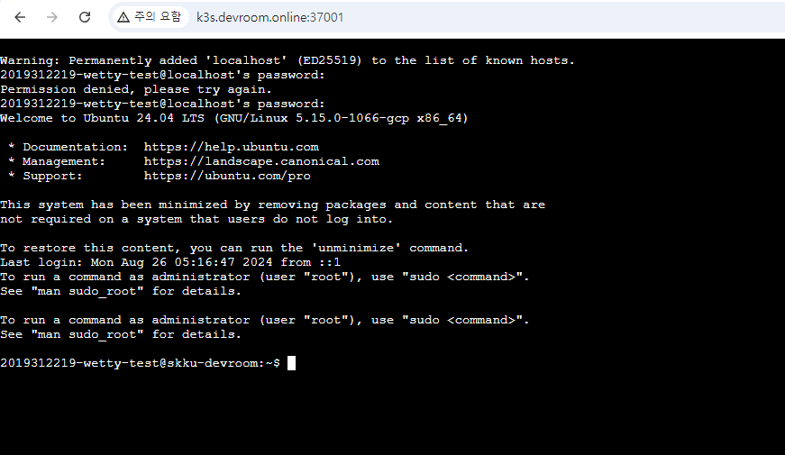

졸업작품 [DEVROOM](https://github.com/DEVROOM-OFFICIAL/DEVROOM-backend)을 진행하면서, 학생들의 교육용 컨테이너에 조금 더 쉽게 접근할 방법을 고민했습니다. 그러다가 Web 브라우저로 사용 가능한 SSH 가 편리할 것 같다는 생각이 들어서 한 번 찾아보았습니다. **Apache Guacamole, WeTTY, webssh** 등 여러 후보들이 나왔는데, 전 그중에서도 **WeTTY**로 구축해 보았습니다.

## 0. WeTTY란?
Web + TTY 를 목표로 하는 프로젝트로서,  
WeTTY를 ssh 호스트 쪽에 설치하면 사용자는 외부에서 web 형태로 ssh를 사용할 수 있습니다.  
깃허브 주소: [https://github.com/butlerx/wetty](https://github.com/butlerx/wetty)
</br>  


## 1. 미리 보는 결론

다음과 같이 설치 & 실행하면 됩니다.  
중요한 점은 **python 3.12 이전 버전 ex. 3.11, 3.10**을 사용하는 것, **WeTTY 2.5.0 이전 버전**을 사용하는 것입니다.  


```bash
# ssh에 필요한 서버는 미리 준비되어 있어야한다!
sudo apt update -qq
sudo apt install -qq -y openssh-server
service ssh start

# user도 사전에 준비
username="demo"

# 필요 패키지 설치
sudo apt install -qq -y build-essential curl software-properties-common openssh-client

# python 3.11 버전 설치
sudo add-apt-repository ppa:deadsnakes/ppa
sudo apt update -qq
sudo apt install -qq -y python3.11 python3.11-venv python3.11-distutils

sudo update-alternatives --install /usr/bin/python3 python3 /usr/bin/python3.11 1

# Python 3.11을 기본으로 설정
PYTHON_PATH=$(which python3.11)
if [ -n "$PYTHON_PATH" ]; then
    sudo update-alternatives --set python3 /usr/bin/python3.11
else
    echo "Python 3.11 이 없습니다."
    exit 1
fi

echo 'export PYTHON=/usr/bin/python3.11' >> ~/.bashrc
source ~/.bashrc

# WeTTY 설치 및 실행
su - $username <<EOF
python3 --version

# 필수 패키지 및 WeTTY 설치
curl -sL https://raw.githubusercontent.com/nvm-sh/nvm/master/install.sh | bash && source ~/.profile
source ~/.nvm/nvm.sh
nvm install 20
node -v

# WeTTY 설치 및 실행
mkdir -p ~/bin && source ~/.profile
npm -g i wetty@2.5.0

wetty -h

# 접속 URL 출력
echo https://$(curl -s4 icanhazip.com):3000

# WeTTY 시작
wetty --host 0.0.0.0 --port 3000 --title $username --base / --ssh-host localhost --ssh-user $username --ssh-port 22 --ssh-auth password
```

## 2. 문제 확인
현재 Ubuntu 에서 apt install로 python3를 설치하면 3.12 버전이 설치됩니다.  
다만, python 3.12 버전은 중요한 변화점이 있었는데, 바로 `distutils`가 삭제되었습니다.  
하지만 WeTTY는 아직 `distutils`을 사용하기 때문에, 다음과 같은 오류가 발생합니다.

```bash
npm error code 1
... 생략
npm error Traceback (most recent call last):
npm error   File "/home/2019312219-wetty-test/lib/node_modules/wetty/node_modules/node-gyp/gyp/gyp_main.py", line 42, in <module>
npm error     import gyp  # noqa: E402
npm error     ^^^^^^^^^^
npm error   File "/home/2019312219-wetty-test/lib/node_modules/wetty/node_modules/node-gyp/gyp/pylib/gyp/__init__.py", line 9, in <module>
npm error     import gyp.input
npm error   File "/home/2019312219-wetty-test/lib/node_modules/wetty/node_modules/node-gyp/gyp/pylib/gyp/input.py", line 19, in <module>
npm error     from distutils.version import StrictVersion
npm error ModuleNotFoundError: No module named 'distutils'

```

따라서, python 버전을 낮춰줄 필요가 있습니다. 우선 python 이전 버전은 기존의 `apt install` 로는 설치가 불가하기에, 다음과 같이 코드를 추가해 줍니다.  
```bash
sudo add-apt-repository ppa:deadsnakes/ppa
sudo apt update -qq
sudo apt install -qq -y python3.11 python3.11-venv python3.11-distutils
```

이렇게 하면 3.11 버전이 설치됩니다. 하지만 여기서 끝이 아닙니다. npm이 해당 버전을 사용하도록 다음과 같이 설정해줍니다.

```bash
# Python 3.11을 기본으로 설정
PYTHON_PATH=$(which python3.11)
if [ -n "$PYTHON_PATH" ]; then
    sudo update-alternatives --set python3 /usr/bin/python3.11
else
    echo "Python 3.11 이 없습니다."
    exit 1
fi

echo 'export PYTHON=/usr/bin/python3.11' >> ~/.bashrc
source ~/.bashrc
```

이제 이렇게하면 설치는 가능해집니다! 하지만 새로운 문제가 기다립니다.  
WeTTY에 접속해도 까만색 화면만 뜨는 것인데요, 이것은 공식 레포 이슈에서 확인이 가능했습니다.  
</br>  
  


위의 해결책대로 일단 버전을 낮춰줍니다.

```bash
npm -g i wetty@2.5.0
```

이제 잘 작동합니다! 😎

